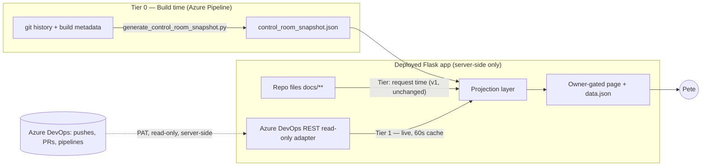

# Control Room v2 — Live Repository Sync: Architecture and Requirements

_Owner: Pete Carter · Authored: 2026-07-19 by Claude Code (design only) ·
Implementer: assigned by Pete (planned: a Sonnet session) ·
Base: branch `work/2026-07-19-control-room`, v1 commit `09d3c1945564491be1b28f7b085dda20d7e0c677`_

---

## 1. Goal and problem statement

Pete's direction: *"as the actual files and repository get updated, the dashboard
gets updated — whenever a push or merge goes through, I'm looking at the most
up-to-date stuff."* And: *"very user friendly, but has everything I need."*

### What v1 already does

The v1 Control Room reads governance/initiative/decision files **at request
time** from the deployed application's own copy of the repository. Because the
Azure pipeline ships `docs/**` inside every deployment artifact, **every merge
to `main` that deploys automatically refreshes those sections**. No change
needed there.

### The three real freshness gaps v2 must close

| # | Gap | Cause |
|---|---|---|
| G1 | "Recent changes" is unavailable in production | Deployment artifacts exclude `.git`, so `git log` fails at runtime |
| G2 | Pushes, merges, active PRs, and pipeline runs are invisible until (and unless) they deploy | The deployed app only knows its own artifact; it cannot see the Azure DevOps repository |
| G3 | No answer to "is what I'm looking at current?" | Nothing compares the deployed commit against the live `main` tip, and sources don't advertise their freshness |

### Design answer — three freshness tiers



- **Tier 0 — Build-time snapshot** (closes G1): a pipeline step captures git
  history and build identity into `control_room_snapshot.json` *before* `.git`
  is stripped, and ships it in the artifact.
- **Tier 1 — Live Azure DevOps read adapter** (closes G2 + G3): a server-side,
  read-only, least-privilege REST integration shows branch tips, active/recent
  PRs, and pipeline runs in near-real-time (60 s cache), and computes
  **deployment drift** ("deployed artifact vs. `main` tip").
- **Tier 2 — Freshness UX** (closes G3 for the human): every section states its
  source tier and "as of" time; a status band answers "am I current?" at a
  glance; the page auto-refreshes politely.

The read-only boundary is unchanged: v2 adds **zero** write capability, zero
mutation endpoints, zero agent commands. All new access is read-only.

---

## 2. Freshness model (what updates when)

| Dashboard section | Source | Updates when… | Freshness label shown |
|---|---|---|---|
| Overview, Initiatives, Documents, Decisions, Traceability | Repo files in the artifact (v1, unchanged) | a merge to `main` deploys | "As of deploy · build N · <date>" |
| Recent changes | **Tier 0 snapshot** (prod) / live git (dev) | every deployment | "As of deploy · build N" / "Live git" |
| Repository activity (NEW): branch tips, pushes, active + recently completed PRs | **Tier 1 ADO adapter** | every poll (≤60 s after any push/merge) | "Live · fetched HH:MM:SS" |
| Pipeline runs (NEW): last N runs, status, result, source SHA | **Tier 1 ADO adapter** | every poll | "Live · fetched HH:MM:SS" |
| Deployment drift (NEW): deployed SHA vs `main` tip | Tier 0 (deployed SHA) × Tier 1 (`main` tip) | every poll | "Up to date" / "Deployed is N commits behind main" |
| Delivery health | merges Tier 0 + Tier 1; falls back to baseline-recorded facts (v1) | per tier | per row |

**Key truthfulness rule carried forward:** if Tier 1 is not configured or a
fetch fails, its sections render "Not configured" / "Unavailable" / "Stale
(last success HH:MM)" — never silently hidden, never manufactured green, and
one failed tier never blanks the others.

---

## 3. Component design

### 3.1 Tier 0 — `scripts/generate_control_room_snapshot.py` (NEW)

A dependency-free Python script run by the pipeline **after tests, before
CopyFiles**:

```yaml
# azure-pipelines.yml — insert after the "Run application and security tests" step
- script: python scripts/generate_control_room_snapshot.py
  displayName: Generate Control Room snapshot
  env:
    BUILD_BUILDID: $(Build.BuildId)
    BUILD_SOURCEVERSION: $(Build.SourceVersion)
    BUILD_SOURCEBRANCH: $(Build.SourceBranch)
```

Writes `control_room_snapshot.json` at the **repo root** (ships in the artifact
because CopyFiles includes `**/*`; it is *not* under `static/`, so Flask never
serves it publicly — it reaches the browser only through the owner-gated
projection).

Schema (versioned; unknown fields ignored on read):

```json
{
  "schema_version": 1,
  "generated_at": "2026-07-19T18:20:00Z",
  "build": {
    "id": "112",
    "source_version": "<40-char sha>",
    "source_branch": "refs/heads/main"
  },
  "commits": [
    {"commit": "abc1234", "full": "<40-char sha>", "date": "2026-07-19",
     "author": "Pete Carter", "subject": "Merge pull request 75 ..."}
  ]
}
```

- Commits: `git log -30 --date=short` with the same `%x1f`-separated format v1
  uses. If `git` fails in CI, write the file **without** the `commits` key and
  exit 0 (never fail the build over the dashboard).
- Add `control_room_snapshot.json` to `.gitignore` (generated artifact, never
  committed).
- `control_room_projection.recent_changes()` order of preference: local git
  (dev, most current) → snapshot file (production) → truthful unavailable.
  Label which source was used.

### 3.2 Tier 1 — `services/azure_devops_read.py` (NEW)

A narrow, **read-only**, server-side adapter over the Azure DevOps REST API
(api-version 7.1). Standard library only (`urllib.request`) — no new
dependency, matching the project rule.

**Configuration (all optional — absent ⇒ tier renders "Not configured"):**

| Env var | Meaning |
|---|---|
| `PEERSLATE_ADO_READ_PAT` | Personal Access Token, **read-only scopes: Code (Read) + Build (Read)** only |
| `PEERSLATE_ADO_ORG_URL` | e.g. `https://dev.azure.com/peerslate19` |
| `PEERSLATE_ADO_PROJECT` | e.g. `portfolio-site` |
| `PEERSLATE_ADO_REPO` | e.g. `portfolio-site` |

**Credential rules (binding on the implementer):**
- The implementer writes only the env-var *names*. The PAT *value* is created
  and configured by Pete in Azure App Service settings / local `.env`. The
  implementing agent must never request, read, echo, or commit the value.
- The PAT is used server-side only (Basic auth header), never logged (redact
  headers from any error/debug output), never included in the projection JSON,
  and never reaches any template or client bundle.
- On HTTP 401/403, render "Credential invalid or expired" — do not retry-loop,
  do not include response bodies in the UI.

**Read endpoints used (all GET):**

| Purpose | REST call |
|---|---|
| Branch tips (main + `work/*`) | `.../_apis/git/repositories/{repo}/refs?filter=heads/&api-version=7.1` |
| Latest `main` commits (top 30) | `.../_apis/git/repositories/{repo}/commits?searchCriteria.itemVersion.version=main&searchCriteria.$top=30&api-version=7.1` |
| Active PRs | `.../_apis/git/repositories/{repo}/pullrequests?searchCriteria.status=active&api-version=7.1` |
| Recently completed PRs (top 10) | same with `searchCriteria.status=completed&$top=10` |
| Pipeline runs (top 10) | `.../_apis/build/builds?$top=10&api-version=7.1` |

**Adapter contract (mirrors v1 provider conventions):**

```python
def fetch_repository_activity() -> dict:
    """Returns {"status": "ok"|"not_configured"|"unavailable"|"stale",
                "fetched_at": iso8601 | None,
                "branches": [...], "commits_main": [...],
                "prs_active": [...], "prs_completed": [...],
                "pipeline_runs": [...],
                "note": str | None}"""
```

- **Timeouts:** 5 s per call. **Caching:** in-process TTL cache, 60 s. On fetch
  failure with a cached value ≤10 min old, return the cache with
  `status="stale"` and its original `fetched_at`; older or absent ⇒
  `status="unavailable"`.
- **Isolation:** each REST call fails independently; partial data is returned
  with per-collection status, consistent with v1's "one failed provider never
  erases the others."
- **Drift computation** (in the projection layer, not the adapter):
  `deployed_sha` from the Tier 0 snapshot vs. `main` tip from Tier 1.
  Outcomes: `up_to_date` / `behind (N commits, list the subjects)` /
  `unknown` (either side missing). Never guess.

### 3.3 Tier 2 — UX requirements (user-friendly pass)

Design language: unchanged Deep Navy Gold, `.cr-*` scoped CSS, standalone
template. Additions:

1. **Status band** (NEW, top of Overview — the "am I current?" answer):
   - Card A "Production": deployed commit (short SHA + subject), build id,
     deploy date — from Tier 0.
   - Card B "Repository": `main` tip, active PR count, last push time — from
     Tier 1 (or "Not configured").
   - Card C "Drift": `Up to date` (teal) / `Deployed is N commits behind main`
     (marigold, listing the pending subjects) / `Unknown` — never colour-only,
     always words.
2. **Repository activity section** (NEW, between Delivery health and Recent
   changes): active PRs (id, title, source→target, author, created); recently
   completed PRs; branch list with tips; pipeline runs (id, result, SHA,
   finish time). Every row links to the Azure DevOps web page for that PR/run.
3. **Per-section freshness chips**: every section header gets a small chip —
   `As of deploy · build 112` or `Live · 18:42:07` or `Stale · last success
   18:31` — using the existing pill component (text + glyph, not colour alone).
4. **Auto-refresh**: the page re-fetches `data.json` every 90 s and re-renders
   *only* the Tier 1 sections and freshness chips client-side (server-rendered
   fallback remains canonical; a full reload stays available via the Refresh
   button). Pause polling when `document.hidden`; resume + immediate fetch on
   visibility. No polling storm: single timer, no overlap (skip if a fetch is
   in flight).
5. **"Since you last looked"** (client-side only): store the last visit
   timestamp in `localStorage` (`cr-last-visit`); highlight decisions,
   initiative-state changes, and PRs newer than it with a subtle "New" pill.
   Purely presentational; no server state.
6. **Plain-English first**: section intros in one sentence; IDs and SHAs stay
   secondary (mono, muted). Keep the existing skip link, keyboard order,
   `aria-live="polite"` on the refreshed timestamp, and reduced-motion rules.

---

## 4. Functional requirements

| ID | Requirement |
|---|---|
| FR-1 | A pipeline step SHALL generate `control_room_snapshot.json` (schema §3.1) in every build, without ever failing the build. |
| FR-2 | In production, Recent Changes SHALL render from the snapshot and label the deployed build; in dev it SHALL prefer live git and say so. |
| FR-3 | With Tier 1 configured, the dashboard SHALL show branch tips, latest `main` commits, active and recently completed PRs, and the last 10 pipeline runs, each with a link to Azure DevOps. |
| FR-4 | The dashboard SHALL compute and display deployment drift (`up to date` / `behind by N` / `unknown`) from Tier 0 × Tier 1. |
| FR-5 | Every section SHALL display its freshness tier and "as of" timestamp. |
| FR-6 | Tier 1 data SHALL be cached ≤60 s and auto-refreshed by the page every 90 s while visible; a stale cache SHALL be labelled stale with its original fetch time. |
| FR-7 | Tier 1 unconfigured ⇒ a "Not configured" state naming the four env vars (names only) and linking to this spec; fetch failure ⇒ "Unavailable"/"Stale" per §3.2. |
| FR-8 | All v1 behavior (owner gating, sections, sources, truthfulness states) SHALL be preserved. |

## 5. Non-functional requirements

| ID | Requirement |
|---|---|
| NFR-1 | **Read-only:** no new HTTP methods beyond GET; the adapter calls no ADO write API; the existing `test_only_get_methods_are_registered` and `test_projection_never_touches_the_database_service` guards stay green and gain an ADO twin (assert the adapter source contains no POST/PUT/PATCH/DELETE usage). |
| NFR-2 | **Credentials:** per §3.2 — PAT server-side only, least-privilege (Code Read + Build Read), never logged/rendered/committed; implementer never handles the value. |
| NFR-3 | **Fail-safe:** ADO outage, timeout, or bad credential can never 500 the page or blank Tier 0/repo-file sections. |
| NFR-4 | **No new dependencies:** standard library only (urllib, json, time). |
| NFR-5 | **Performance:** page render adds ≤1 cached Tier-1 lookup; a cold Tier-1 fetch is bounded by 5 s timeouts and must not block Tier 0 rendering (fetch per-section with independent try/except). |
| NFR-6 | **Accessibility:** WCAG 2.2 AA — new sections use the same semantic table/list patterns, text-plus-glyph status, visible focus, reduced-motion compliance; auto-refresh must not steal focus or scroll position. |
| NFR-7 | **Security posture unchanged:** owner-gated 404 boundary, noindex headers, absence from sitemap/nav; snapshot file must not be reachable via any public route (add a test that `GET /control_room_snapshot.json` is 404). |

## 6. Testing requirements (extend `tests/test_control_room.py`)

1. **Snapshot:** generator writes valid schema from a git checkout; projection
   prefers live git in dev, snapshot when git is absent (patch `subprocess.run`
   to fail), truthful unavailable when both missing; malformed snapshot ⇒
   unavailable, no exception.
2. **Adapter:** all env vars absent ⇒ `not_configured`, zero network calls
   (patch `urllib.request.urlopen`, assert not called); mocked 200s ⇒ parsed
   collections; mocked timeout/500 ⇒ `unavailable`; cache hit within TTL ⇒ one
   underlying call; 401 ⇒ credential message without body leakage; **no PAT
   substring in any log record or projection JSON** (explicit assertion).
3. **Drift:** equal SHAs ⇒ up_to_date; snapshot SHA ∈ history behind tip ⇒
   behind-by-N; missing either side ⇒ unknown.
4. **Read-only:** route table still GET-only; adapter source contains no write
   verbs; snapshot URL publicly 404.
5. **Regression:** full suite + both guardrail suites green.

## 7. Acceptance criteria

1. After any merge to `main` deploys, Recent Changes and the Production card
   show the new build within one page load — no manual steps.
2. With Tier 1 configured, a push or PR in Azure DevOps is visible on the
   dashboard within ≤ 90 s (poll) without redeploying.
3. The Drift card correctly distinguishes up-to-date / behind / unknown in a
   demonstrated test of each state.
4. With Tier 1 unconfigured, the dashboard is fully functional and every live
   section says "Not configured" with setup pointers.
5. All §6 tests pass; full suite and guardrails green; no new dependency; no
   credential value anywhere in the repo, logs, or client payloads.
6. Desktop/mobile/dark screenshots captured; keyboard-only walkthrough of the
   new sections verified.

## 8. Explicitly out of scope (unchanged non-goals)

- Any write/mutation capability, approvals, deploy buttons, agent commands.
- Azure DevOps **service hooks/webhooks** into the app (inbound public endpoint
  + auth surface not justified when 60–90 s polling meets the need). Recorded
  as a possible v3 if near-instant push visibility ever matters.
- Work-item (Boards) integration — no Boards usage exists in this project.
- A database or background worker for the dashboard.

## 9. Implementation plan for the implementer (suggested phases)

1. **Phase 1 (no credentials needed):** snapshot generator + pipeline step +
   `recent_changes` fallback + Production card + tests. Ships value alone.
2. **Phase 2:** ADO read adapter + Repository activity section + drift card +
   "Not configured" states + tests. Pete sets the PAT after merge.
3. **Phase 3:** freshness chips, auto-refresh, "since you last looked",
   accessibility pass, screenshots, docs update (ARCHITECTURE.md §4 table and
   traceability matrix rows for FR/NFR above).

**Handoff base:** branch `work/2026-07-19-control-room`; v1 HEAD
`09d3c1945564491be1b28f7b085dda20d7e0c677`; spec commit is the current branch
tip. Per `docs/AI_WORKFLOW.md`, the implementer continues this branch only with
an explicit handoff (Pete's assignment message naming branch + SHA satisfies
this), or branches afresh from it. One active writer at a time.

## 10. What Pete does (and only Pete)

1. When Phase 2 lands: create the read-only PAT (scopes: **Code – Read**,
   **Build – Read**; set an expiry) in Azure DevOps, then set
   `PEERSLATE_ADO_READ_PAT`, `PEERSLATE_ADO_ORG_URL`, `PEERSLATE_ADO_PROJECT`,
   `PEERSLATE_ADO_REPO` in the Web App settings (and optionally local `.env`).
   No agent should ever see the PAT value.
2. Decide the governance path for the Control Room package (unchanged from the
   v1 completion report §I).
