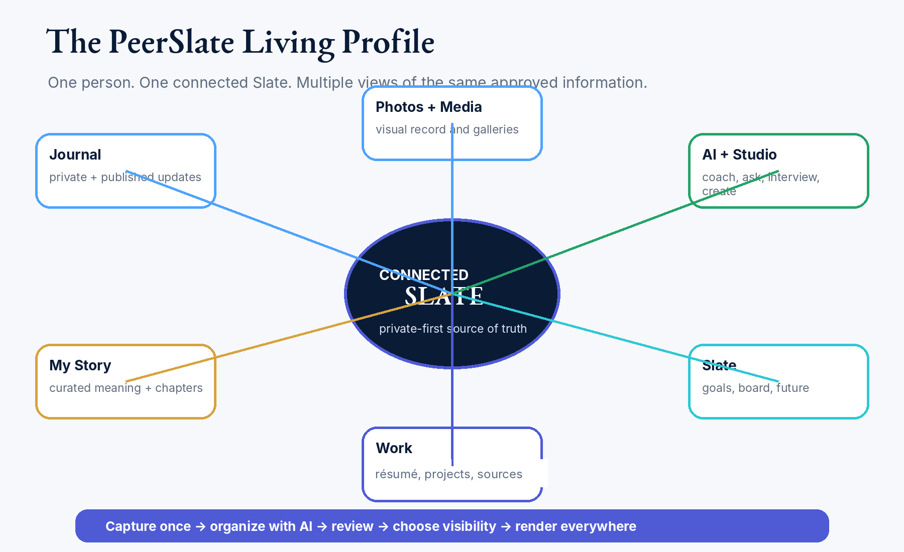
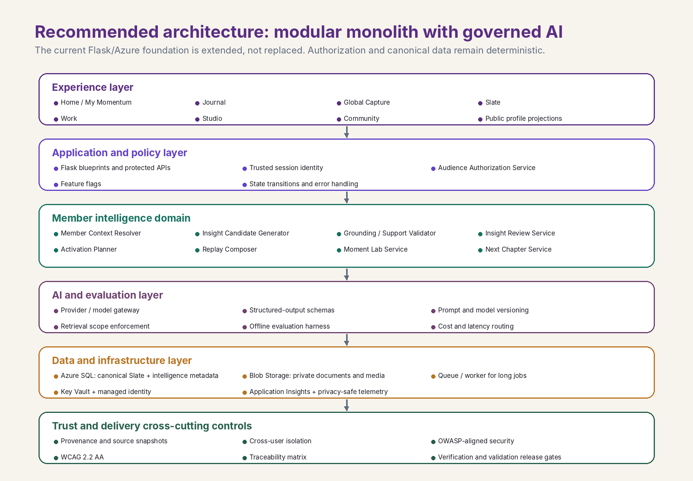
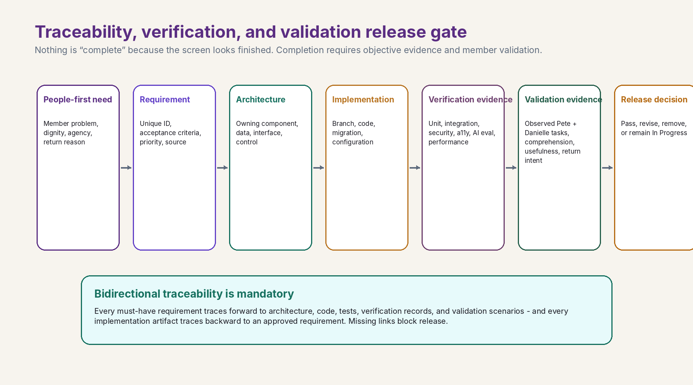
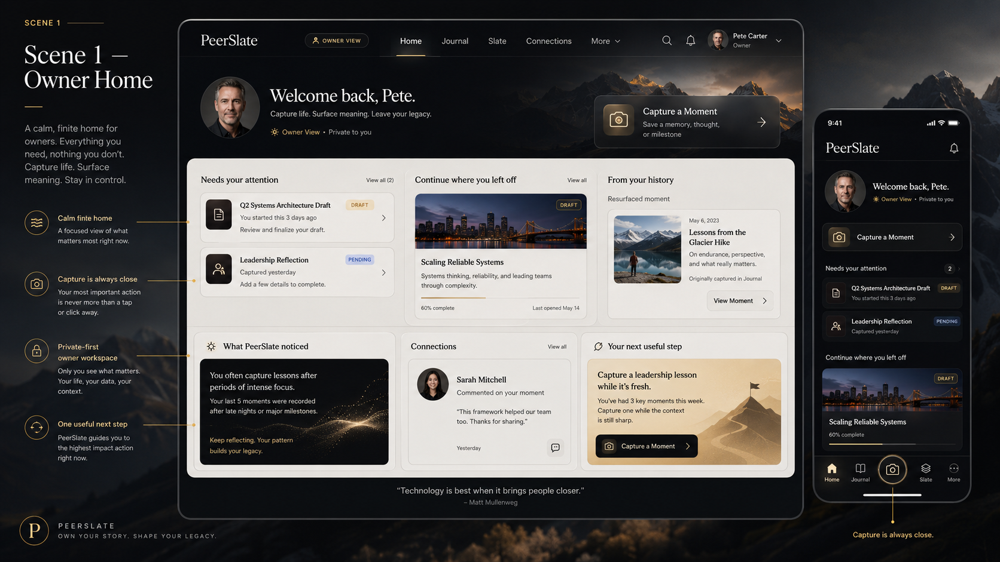
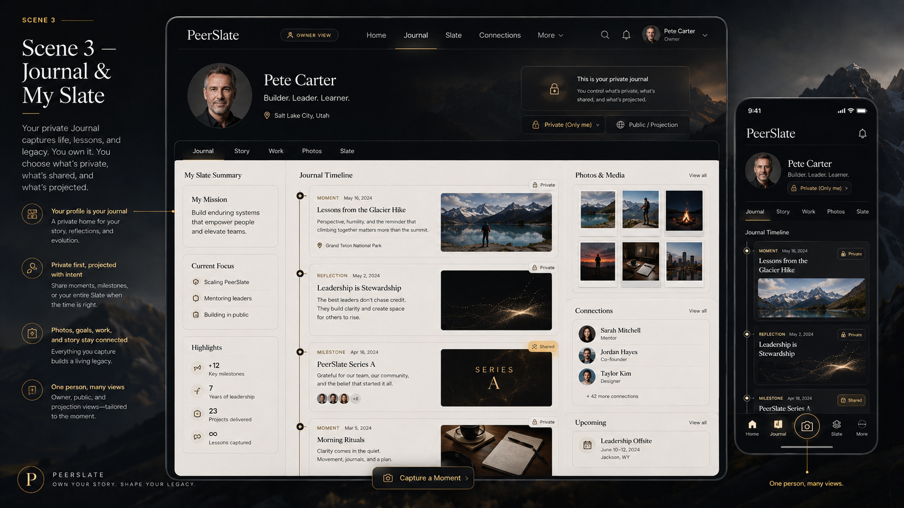
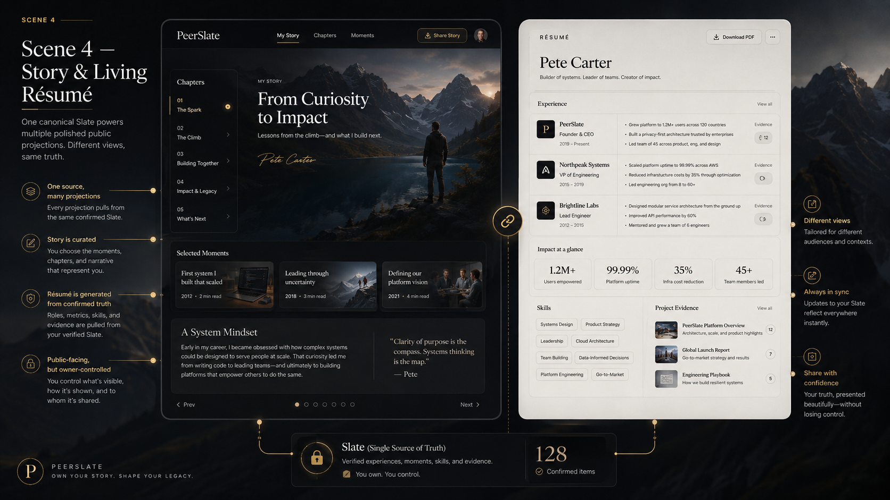
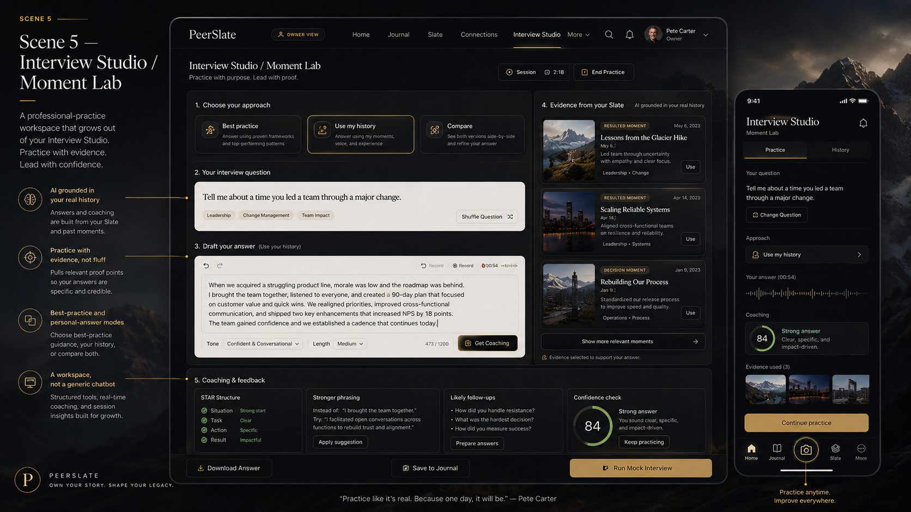

<!--
Controlled Markdown authority materialized from frozen owner-approved DOCX.
Source: docs/governance/PeerSlate_Company_and_Product_Bible_v2.9.docx
Source SHA-256: 1BB3DF535B2A7478D36C539521D64E452A01B163FEBE367615A96F345459224F
Generated by tools/convert_authority_docx_to_markdown.py.
-->

PEERSLATE

# PeerSlate Company and Product Bible

## A focused constitution aligned to the verified production foundation, current owner work, and governed next steps

| VERSION | v2.9 - Work-first Slate Studio and Canonical Journal Authority (CURRENT) |
| --- | --- |
| DATE | July 24, 2026 |
| STATUS | CURRENT AND LOCKED - APPROVED BY THE OWNER ON JULY 24, 2026; SUPERSEDES v2.8 |
| SOURCE SYNTHESIS | v2.8 universal Capture/one-Journal authority + Project Croatia work-first Slate Studio direction and Slice 1 gate |

| DOCUMENT INTENT This release preserves PeerSlate's constitutional foundation and the universal Capture, one-Journal, trusted-return, Story, Projects, privacy, authorization, and AI-proposal covenants while establishing Slate Studio as the private work-first experiential center. It changes no runtime behavior by itself. |
| --- |

Approval note: v2.9 is CURRENT and LOCKED. Pete approved and directed its Azure activation on July 24, 2026. It supersedes v2.8, which remains preserved as history; retains the verified production, universal Capture, one-Journal, visual-integrity, Story, Projects, connected-system, privacy, authorization, and AI-proposal covenants; and makes the work-first relationship controlling: Journal preserves canonical member history; Slate Studio is the private experiential workspace where members build, practice, explore, and shape possible futures; the public Slate presents approved output; and Community connects selected output.

# Document control and use

| LOCKED | Authority: v2.9 is CURRENT and controlling. Pete approved and directed its Azure activation on July 24, 2026, so it supersedes v2.8. Prior Bible versions, including v2.8, remain preserved as historical decision records. |
| --- | --- |

| LOCKED | Preservation: The v1.5.1 source is preserved in full. Detailed material proposed for relocation is listed in the companion Editorial Review. |
| --- | --- |

| CURRENT | Purpose: Define durable company and product direction; constrain design and engineering; authorize initiatives; and establish the minimum assurance rules every release must follow. |
| --- | --- |

| CURRENT | Companion controls: The Product Strategy and Architecture Roadmap carries sequencing and progress. Initiative packages carry detailed requirements, designs, architecture allocations, tests, evidence, and release decisions. |
| --- | --- |

## How to use this Bible

The Bible is PeerSlate’s constitution. It should answer why the company exists, whom the product serves, what promises may not be broken, what the product is and is not, how the connected Slate works, and how decisions are judged. It should not be the daily backlog, a complete test laboratory, a cloud-resource inventory, or a prompt library.

- Use the Bible to authorize and constrain. Every initiative must cite the principles and top-level requirements that apply.

- Use the Roadmap to sequence. It identifies the next architectural and product stages, dependencies, release gates, and current status.

- Use initiative packages to specify. Each material feature receives its own problem statement, scope, requirements, prototype, architecture allocation, acceptance criteria, test plan, rollout, and rollback.

- Use evidence packages to prove. Tests, verification records, validation sessions, migration evidence, accessibility results, security findings, monitoring, and release notes demonstrate completion.

- The authoritative repository is the operational source of truth for current code, deployment, initiative status, and evidence. The Bible governs durable direction; repository pointer files must identify the current Bible, Roadmap, active initiatives, and production baseline without duplicating their full content.

| CHANGE-CONTROL RULE If a new idea changes the mission, member covenant, product principles, product boundaries, canonical object model, or mandatory assurance standard, update the Bible. If it changes sequencing, update the Roadmap. If it changes one feature, update that initiative package. If it proves what was built, store it as evidence. |
| --- |

## The PeerSlate product operating system

| Layer | Controlled artifact | What belongs there | Change rate |
| --- | --- | --- | --- |
| 1. Constitution | Company and Product Bible | Mission, promise, principles, boundaries, connected-product model, member covenant, top-level requirements, decision rules | Rare and deliberate |
| 2. System | Experience System; Architecture and Data Standard; Trust Standard; Delivery and Assurance Playbook | Reusable design, content, IA, architecture, data, AI, security, privacy, accessibility, development, testing, and measurement standards | Deliberate |
| 3. Initiative | Initiative Library | Brief, PRD, user journeys, shall requirements, prototypes, architecture changes, acceptance criteria, traceability, release/rollback plan | Frequent |
| 4. Evidence | Evidence packages and release records | Test results, verification, validation, deployment, security, accessibility, migration, monitoring, known limitations, release notes | Created continuously |
| Decision history | Decision and Change Register | ADRs, superseded decisions, rationale, approvals, open issues, version history | Append-only |

## Status language

| Status | Meaning |
| --- | --- |
| LOCKED | Approved governing direction; change requires explicit decision and recorded rationale. |
| CURRENT | Active direction or implementation standard; may evolve through controlled review. |
| OPEN | A material decision is unresolved; no implementation assumption may silently close it. |
| LATER | Compatible with the vision but outside the current build sequence. |
| TABLED | The idea is preserved but has no current design, prototype, or build authorization. |
| PROPOSED | Draft language awaiting approval. |

# Document map

Use this map to identify the governing section. Word’s Navigation pane can also jump directly between headings.

Executive direction

1. Company North Star

2. Product thesis and category

3. Governing product principles

4. Product boundaries

5. One connected Slate

6. Experience model and information architecture

7. Signature experiences and product ecosystem

8. Identity, audience, privacy, and ownership

9. AI, sources, and member intelligence

10. Connection, community, and public expression

11. Design, content, storytelling, and quiet delight

12. Technical direction and architectural constraints

13. Product Delivery and Assurance Loop

14. Top-level mandatory requirements

15. Roadmap charter and immediate direction

16. Metrics, learning, and business direction

17. Governance and decision rights

18. Canonical vocabulary

19. Locked, open, later, and tabled decisions

20. Review agenda

Appendices (including mandatory startup, owner-understanding, visual-integrity, and connected-system standards)

# Executive direction

| Your work should not disappear. Capture it once. Use it when it matters. |
| --- |

PeerSlate is a private-first, voice-first, AI-enabled system that helps people capture the work and life they are building, understand what it means, improve how they communicate it, and deliberately choose what becomes visible to someone else. The member is the primary beneficiary. Recruiter, manager, collaborator, and public value are downstream outcomes that may never distort the owner experience.

The strongest product direction is not “TikTok for careers” and not “LinkedIn, but more personal.” PeerSlate should combine the ease of modern capture, immediate personal relevance, progressive depth, private ownership, and professional credibility while rejecting addictive mechanics, public performance pressure, manufactured popularity, and application-volume incentives.

PeerSlate's next coherence objective is not more destinations. It is a stronger visible trunk. Journal remains the canonical memory infrastructure and complete private chronology; Slate Studio becomes the work-first experiential center where the member actively builds, practices, explores, and shapes possible futures. Every major room should feel like a focused use of the same member-owned life record. The product shall preserve each room's distinct purpose while revealing truthful origin, authorized relationships, audience or truth state, and one best continuation. Connection is created through canonical references and member-directed actions, not copied facts, generic promotion modules, or a new navigation forest.

| GOVERNING DECISION Every page should feel like a different use of the same life. |
| --- |

| CURRENT PRODUCT FOCUS Build one coherent owner system with two unmistakable modes: a private owner workspace and a public or permissioned Slate. Prove Capture anywhere → Save Moment → immediate private Journal → optional governed projection with two real accounts before expanding public surfaces, career matching, or marketplace concepts. |
| --- |

| Private owner workspace Capture, Journal, review, organize, practice, reflect, correct, export, delete, and control. This is the engine of the product. | Public or permissioned Slate Journal, Story, Work, selected progress, approved media, approved AI answers, and deliberate audience-specific views. This is an output of the owner loop. |
| --- | --- |
| Mobile front door Fast orientation, Capture, review, return value, and one-handed use. Mobile composes the information differently; it is not a shrunken desktop. | Desktop workshop Deeper editing, relationship management, Story curation, projects, exports, Studio work, and architecture-rich views. |

The near-term success test is simple: Pete and Danielle can maintain separate accounts, capture separate private records, correct AI interpretations, selectively share or publish, revisit past moments, and always understand whose space they are in and who can see what.

# 1. Company North Star

| LOCKED | Section status: Mission, vision, primary promise, first member, and member covenant are constitutional. |
| --- | --- |

## Mission

Help people capture, understand, improve, and share the work, growth, and life they are building—without forcing them to perform a polished version of themselves before they are ready.

## Vision

PeerSlate becomes a trusted personal system that grows with a person across jobs, projects, goals, transitions, learning, interviews, achievements, setbacks, decisions, and reinvention. It gives each member a living record of what they have done, what they are learning, what matters to them, and what they are becoming.

## Primary promise

| Say what happened. PeerSlate helps make it useful. |
| --- |

The promise is broader than résumé creation. One spoken thought, typed note, photo, document, or connected source can help a person remember a moment, form a project update, prepare for a manager conversation, improve an interview answer, support a truthful résumé claim, create a public story, or reveal a pattern over time. The member remains the authority on facts, interpretation, privacy, permanence, and publication.

## Who PeerSlate serves first

- Working professionals who already have jobs but need a better way to capture progress, reflect, grow, and explain what they do.

- People whose contributions are difficult to compress into one-line job descriptions: engineers, program and project managers, operations professionals, government and defense workers, technical leaders, builders, career changers, and knowledge workers.

- People who value professional credibility but do not want to post every meaningful moment publicly or perform a polished identity before they are ready.

- People who want growth, goals, interview practice, résumé material, Story, projects, and professional relationships to connect rather than live in unrelated tools.

## Member service covenant

| Member benefit before engagement Do not optimize time-on-site, punitive daily-reset streaks, public popularity, application volume, or recruiter convenience at the person’s expense. Private truthful Momentum and purposeful acknowledgements may support the member without pressure. | Agency before automation The member controls facts, interpretation, privacy, audience, permanence, and publication. |
| --- | --- |
| Clarity before persuasion Explain what PeerSlate noticed, why it appeared, which records supported it, what will change, and what remains uncertain. | Care without condescension Be warm and encouraging without guilt, manipulation, false praise, infantilization, or emotional exploitation. |
| Professional service Corrections, export, deletion, privacy, failure, support, and recovery receive the same care as hero experiences. | Whole-person usefulness Work, learning, goals, relationships, decisions, setbacks, and personal growth may connect when the member chooses. |
| Honest limitations Say when information is insufficient, a capability is a prototype, AI is uncertain, or human judgment is required. | Accessibility is service Voice, text, upload, keyboard, assistive technology, mobile, and reduced-motion paths must preserve essential capability. |

# 2. Product thesis and category

| LOCKED | Section status: Defines the strategic category and differentiation. |
| --- | --- |

## The product thesis

People already produce the raw material of a meaningful professional story: decisions, lessons, project work, feedback, outcomes, explanations, goals, mistakes, and moments of growth. That material usually disappears into memory, chat, files, review forms, scattered notes, or résumé updates written years too late. PeerSlate turns those fragments into a member-owned, source-linked, connected Slate that can be reused when it matters.

## The category PeerSlate should own

| CATEGORY STATEMENT PeerSlate is a member-owned professional memory and expression system: a private longitudinal workspace that helps a person capture real experience, understand patterns, prepare for important moments, and deliberately publish or share selected views. |
| --- |

The market contains point solutions for journals, portfolios, résumés, interview practice, achievement capture, performance reviews, AI profiles, and career recommendations. PeerSlate’s advantage is not another isolated feature. It is the connected system around the member: capture once, maintain one canonical truth, preserve sources and original language, allow member correction, and create many useful views without duplicating identity.

## The interaction formula

| Borrow | PeerSlate translation | Reject |
| --- | --- | --- |
| Snapchat ease of capture | Fast, obvious, low-friction Capture by voice, text, photo, or upload | Ephemerality that undermines member ownership |
| TikTok immediate relevance | A useful response immediately after contribution | Infinite feed, variable rewards, popularity pressure |
| YouTube depth ladder | Five-second orientation, 30-second understanding, optional deep exploration | Overloaded screens and forced depth |
| Private journal ownership | Private by default, editable, inspectable, exportable, deletable | Public-by-default reflection |
| Professional record credibility | Canonical facts, sources, provenance, audience preview, approved publication | AI-manufactured identity or vague scores |

## The one-sentence value test

A new product idea should make this promise more true: “Capture it once. Use it when it matters.” If the idea cannot connect to the member’s evolving Slate, cannot deliver useful value, or requires a disconnected island, it should not be a current PeerSlate priority.

# 3. Governing product principles

| LOCKED | Section status: These principles are the mandatory decision card for product, design, architecture, AI, and delivery. |
| --- | --- |

| ID | Principle | Decision rule |
| --- | --- | --- |
| PS-P-001 | Member benefit before engagement | The working professional is the primary beneficiary. Downstream employer or recruiter value may never distort the owner experience. |
| PS-P-002 | Private before public | Reflection, capture, source material, AI drafts, and member intelligence begin private unless the member deliberately chooses otherwise. |
| PS-P-003 | Capture once, connect many times | A source record should power multiple approved views without creating conflicting copies. |
| PS-P-004 | The member remains the authority | The member controls truth, correction, interpretation, visibility, publication, retention, export, and deletion. |
| PS-P-005 | AI is inspectable and humble | AI interpretations show sources, uncertainty, lifecycle, and correction actions; they are never presented as facts about the person. |
| PS-P-006 | Reveal depth progressively | Orient in five seconds, explain in 30 seconds, and permit deeper exploration without forcing it. |
| PS-P-007 | Mobile is the front door; desktop is the workshop | Both are first-class, but each composes the experience for its context rather than shrinking or stretching one layout. |
| PS-P-008 | Professional does not mean impersonal | The product may show humanity, context, learning, voice, and personality while preserving credibility and audience control. |
| PS-P-009 | Connection without an engagement casino | Use finite feeds, meaningful responses, deliberate sharing, and quiet return value—not punitive reset/loss mechanics, trends, vanity counts, or infinite scroll. Quiet return value includes resurfaced history, Replay, private Momentum, useful prompts or rituals, source-linked observations, and one optional next step. |
| PS-P-010 | Deterministic software owns trust decisions | Application code—not AI—controls identity, authorization, state, publication, deletion, retention, exports, schemas, and release gates. |
| PS-P-011 | Status must be honest | Prototype, fixture, queued, processing, available, failed, complete, published, and deleted states must never be visually or verbally confused. |
| PS-P-012 | Accessibility is service | Every essential flow must work through accessible text, keyboard, mobile, zoom, reduced-motion, screen-reader, and error-recovery paths. |
| PS-P-013 | No job marketplace | PeerSlate will not host job posts, sponsored-job surfaces, application-volume incentives, or a job-recommendation feed. |
| PS-P-014 | Every feature strengthens the connected system | A feature must create, update, interpret, project, or activate canonical Slate information and must not become an isolated destination. |
| PS-P-015 | Focused rooms, visible spine | Every major room shall remain focused on its primary task while showing enough source, relationship, mode, and next-action context that it never feels orphaned from the connected Slate. |
| PS-P-016 | Momentum without pressure | PeerSlate may create return value through useful memory, preparation, gentle prompts and rituals, private Momentum, purposeful acknowledgements, and visible progress, but shall not use guilt, reset or loss framing, public streaks, punitive recovery, artificial scarcity, meaningless rewards, or popularity pressure. |

| FEATURE AUTHORIZATION RULE Every initiative brief must cite the governing principle IDs, explain how the design satisfies them, and name any tension or exception requiring an explicit decision. |
| --- |

# 4. Product boundaries

| LOCKED | Section status: Defines what PeerSlate may become and what it must refuse. |
| --- | --- |

## PeerSlate is

- A private-first professional memory, growth, preparation, and expression system.

- One connected Slate with multiple intentional views for the owner, selected people, connections, authenticated members, and the public.

- A place where original human language, structured records, sources, media, relationships, interpretations, and outcomes can coexist.

- A product that returns value immediately after capture and more deeply over time.

- An AI-enabled product in which deterministic controls protect identity, privacy, publication, correction, and deletion.

- A system that connects rooms sideways by meaning and backward and forward through time.

- A product where a small contribution can compound into future recall, preparation, expression, and decision support.

## PeerSlate is not

- Not a project-management suite, task board, timesheet, procurement system, or enterprise delivery platform, although it may help a member remember, understand, and communicate project work.

- Not a conventional résumé builder, although it may create purpose-specific résumé exports from member-saved canonical records and governed projections.

- Not a generic professional social feed, a public-by-default diary, or a collection of decorative activity modules.

- Not a job board, sponsored-job surface, application funnel, or recruiter-first marketplace.

- Not a set of disconnected AI chatbots or a branded bot placed on every page.

- Not a system that invents a stronger version of the member’s experience or reduces a person to an opaque score.

- Not a product that calls fixtures, browser-only simulations, queued jobs, or unverified AI outputs “complete.”

- Not a collection of generic "related content" rails or promotional cross-links.

- Not a habit game that treats absence as failure.

- Not an emotional-diagnosis system derived from voice, behavior, or inferred mood.

## Scope-control questions

- Which real member problem or professional moment does this solve?

- Why would an employed professional use it now and return to it later?

- Which canonical object does it create, update, interpret, project, or activate?

- Can it strengthen Home, the in-context Capture composer, Journal, Slate, Work, Story, Studio, or Settings instead of adding another top-level destination?

- What must be removed or postponed to make room for it?

- Can Pete and Danielle test the complete behavior with separate accounts and real data?

# 5. One connected Slate

| LOCKED | Section status: The connected object model and create-once/place-many rule are constitutional. |
| --- | --- |

PeerSlate is one connected personal system, not a collection of pages. Capture, Journal, Story, Work, Projects, Goals, Skills in Practice, Slate Studio, R?sum?, connections, and public expression are different uses and projections of a person?s canonical Slate. Journal preserves; Studio activates and shapes; the public Slate presents; Community connects selected output.

Preserved v1.5.1 system model: one connected living profile rather than disconnected feature islands.

## Canonical information layers

| Layer | Purpose | Examples | Authority |
| --- | --- | --- | --- |
| Original capture | Preserve what the member actually said, typed, uploaded, photographed, or imported | Transcript, note, file, image, audio, import payload | Member-owned source |
| Canonical record | Store member-authored or explicitly accepted facts and structured relationships once | Moment, role, project, outcome, skill, goal, source link, audience, governed projection | Member-owned canonical truth |
| Interpretation | Offer reviewable meaning without overwriting truth | Pattern, theme, possible strength, missing context, suggested next action | Private AI proposal |
| Projection | Present selected canonical information for a purpose | Story, Work view, public Slate, résumé export, Feed post, manager brief | Member-approved view |
| Activation and outcome | Connect insight to useful action and learn from what happened | Use This Moment, rehearsal, follow-up, correction, outcome closure | Member-directed action |

## Create once, place many

A member saves one source-linked canonical Moment and finds it immediately in the one Journal. Story, Work, résumé, interview, Feed, Project, Board, public Journal, and messaging may later use governed references or purpose-specific projection wording that remains traceable and cannot silently fork the facts.

## Governed system objects

| Moment A source-linked event, observation, decision, lesson, win, setback, question, or update captured in the member’s language. | Journal presentation metadata Optional curation, organization, display, purpose, and audience/publication state referencing a canonical Moment; it never copies the Moment body. Journal membership itself is derived. |
| --- | --- |
| Source A file, photo, transcript, imported record, link, or other provenance object supporting the member’s record. | Project A private-first durable container connecting purpose, roles, contributions, decisions, milestones, outcomes, people, goals, skills, sources, media, and exact related Moment versions without copying authoritative content. |
| Story selection An editorial projection that gives unequal weight to selected years, months, Moments, media, and themes. | Insight A private, time-bounded, source-linked interpretation with confidence, lifecycle, review, correction, and activation state. |
| Audience grant The explicit rule determining who may retrieve or view a record or projection. | Outcome What happened after the member used an insight, draft, preparation, share, or recommendation. |

| CANONICAL-TRUTH RULE AI interpretations, résumé language, public Story copy, Feed copy, and Studio outputs may never overwrite member-saved or explicitly accepted canonical facts, source material, dates, accomplishments, identity, ownership, audience, or publication state. |
| --- |

## The connected-system spine

One connected Slate is not achieved only by sharing a database. The experience must make the relationship visible. Save Moment preserves the authorized source/version and creates one private member-saved canonical Moment immediately; optional transcript correction and proposals remain inline and non-blocking. Governed relationships and exact-version references connect focused rooms to authorized context, while reviewable projections, outcomes, Replay, resurfacing, and preparation remain separately controlled so connection never erases truth boundaries.

## Relationship before promotion

Cross-room movement must explain why another room matters in the member's current context. PeerSlate should prefer “Practice telling this result,” “See how this line was earned,” or “Return to the Moment behind this answer” over generic “Explore more” links. Relationship-rich cues are part of the product model, not marketing decoration.

# 6. Experience model and information architecture

| LOCKED | Section status: Defines the durable experience modes and information-architecture rules. Exact layouts belong in the Experience System. |
| --- | --- |

## The attention ladder

| Five seconds — orientation The member understands whose space this is, what PeerSlate is for, what is private, and the most important next action. | Thirty seconds — understanding The member sees what happened, what PeerSlate noticed, why it matters, and what can be done next. |
| --- | --- |
| Three minutes or more — depth The member can inspect sources, relationships, history, media, edits, privacy, and supporting context. | Never force depth The product must remain useful at the shallow layer and reward—not require—deeper exploration. |

## Two unmistakable modes

| Mode | Primary purpose | Primary surfaces | Never show |
| --- | --- | --- | --- |
| Owner workspace | Capture in context, understand, organize, prepare, control, correct, and decide | Journal-centered owner domains plus a persistent/contextual Capture action; exact route map open | Another member’s private data; ambiguous publication; fake completion |
| Public or permissioned Slate | Let an approved viewer understand selected work, story, progress, and approved answers | Journal, Story, Work, Slate, selected media, approved AI | Owner editing controls; raw captures; private drafts; private insights; source files without permission |

## Mobile is the front door; desktop is the workshop

| Mobile front door | Desktop workshop |
| --- | --- |
| Immediate Capture, one-handed review, finite Home, return value, privacy clarity, voice/text parity, list-first navigation | Deep editing, Story curation, project relationships, media management, exports, Studio work, comparison and planning |
| Recompose content into short, decisive states; do not simply shrink the desktop page | Use space to reveal relationships and depth without recreating simultaneous overload |
| Signed-in navigation includes Journal as a core domain; exact routes, labels, grouping, and order remain open. Capture is a persistent global action and never a destination. | Primary navigation follows the same conceptual model; deeper tools may sit inside the relevant domain |

## Finite Home

Home should not become a dashboard of every available feature. It should help the member orient, contribute, receive value, and continue one useful thread. The default Home experience is finite and calm:

- One obvious Capture action.

- Drafts or items needing review.

- One recent Moment and one resurfaced Moment.

- A concise “What PeerSlate noticed” item when enough evidence exists.

- One connection update when relevant and permitted.

- One next step—not a wall of recommendations.

## Navigation rule

| CONSOLIDATE, DO NOT PROLIFERATE Member intelligence, Capture follow-up, Replay, Moment Lab, Next Chapter, and connected insights should appear inside Home, the in-context Capture composer, Journal, Slate, Work, Story, and Studio. They should not become a new global navigation forest. |
| --- |

## The first complete vertical slice

| 1 Capture action | 2 Preserve/review source inline | 3 Save Moment | 4 One private canonical Moment | 5 Derived one Journal | 6 Optional governed use/projection |
| --- | --- | --- | --- | --- | --- |

This slice is the product’s reference architecture and validation path. It must include real authentication, server-derived identity, cross-user isolation, private-by-default storage, original-source preservation, correction, deletion, audience preview, publication, AI failure behavior, mobile behavior, monitoring, and evidence.

## The connected-room contract

| LOCKED | Section status: Every primary room answers the same five questions with a mode-appropriate, server-authorized payload. Exact layouts and component contracts belong in the Experience System and the Architecture and Data Standard. |
| --- | --- |

Every primary room must answer, at the appropriate depth:

1. What is this room helping me do?

2. Whose space and which audience or truth state am I in?

3. Where did this material come from?

4. How does it relate to the larger Slate?

5. What is the one best safe next move?

The contract must support the same grammar with different authorized payloads:

- Public or permissioned mode: approved public relationships, approved projections, public-safe source context, and truthful current capability.

- Owner mode: private source relationships, prior work, drafts, outcomes, goals, Projects, Replay, and exact audience preview.

| HARD BOUNDARY No private information may be retrieved and hidden in the browser. The server must authorize the relationship before it is returned. This applies the existing authorization-before-retrieval rule to connective context; it creates no exception to it. |
| --- |

## Focused but not orphaned

Task rooms such as Studio may reduce chrome while the member is answering, recording, or reviewing. Orientation and continuation should appear at natural boundaries, especially before the task and after meaningful progress, rather than interrupting the task. The default connective budget is one primary bridge and no more than two secondary paths.

## The temporal spine

PeerSlate connects not only across rooms but across time. When sufficient trusted member-saved history exists, a room may reveal an earlier related Moment, a meaningful change, an unfinished thread, or a future revisit. Temporal cues must be source-linked, dismissible, non-diagnostic, and free of guilt.

# 7. Signature experiences and product ecosystem

| CURRENT | Section status: Defines the canonical experiences and their relationship. Exact releases and work packages live in the Roadmap. |
| --- | --- |

## The experience hierarchy

| Experience | Role in the system | Current position |
| --- | --- | --- |
| Universal Capture | The common entry point for voice, text, photo, file, and imported context | Foundation |
| Use This Moment | The first functional activation slice: turn one reviewed Moment into a useful next action | Build before broader intelligence |
| What PeerSlate noticed | The primary user-facing surface for source-linked, humble, private interpretations | Flagship member-intelligence surface |
| Slate Mirror | The canonical capability that helps the member see patterns across their connected Slate | Brand-defining capability |
| Slate Replay | A weekly, monthly, or period-based narrative of what moved, what may be missing, and one useful next action | Signature Slate Mirror experience |
| Moment Lab | Use real history to prepare for manager conversations, difficult feedback, briefings, conflict, technical explanations, and interviews | Studio expansion after core loop |
| Next Chapter | Map confirmed strengths, transferable experience, genuine gaps, and small experiments without becoming a job board | Later staged experience |
| Decision Replay | Reconstruct important decisions, context, tradeoffs, outcomes, and lessons | Later |
| FitSlate | Private evaluation of an externally supplied opportunity against confirmed history, goals, constraints, and direction | TABLED — no current design/build authorization |

## Use This Moment

After a member saves a Moment, PeerSlate may show a small finite set of useful, truthful, reversible, source-linked shortcuts without sending the member into another dashboard. Use This Moment shall also expose a complete accessible chooser of every currently supported and authorized destination or purpose; shortcuts may not hide eligible choices, and unavailable or future choices may not be implied live.

- Choose Save Moment. The private Moment is immediately available in the owner's one Journal without a second Add to Journal action.

- Connect to a Project, role, goal, skill, person, or earlier Moment.

- Turn it into a manager update, performance-review note, interview example, résumé candidate, Story selection, or deliberate share.

- Practice explaining it for a specific audience.

- Leave it private and return later.

## Slate Mirror and “What PeerSlate noticed”

Slate Mirror is the underlying capability; “What PeerSlate noticed” is its primary day-to-day surface. It should reveal useful patterns without declaring an identity, competence, or future as fact. Every item must explain why it appeared, which permitted records support it, how uncertain it is, and what the member can do: confirm, correct, dismiss, mark too personal, inspect, or activate.

## Slate Replay

Replay should turn personal data into a story, not a dashboard. It may summarize a week, month, quarter, year, project, transition, or chosen theme. It should show movement, a few significant Moments, one or two patterns, missing context, and one useful next action—without streak pressure, guilt, public ranking, or false celebration.

## Moment Lab

Moment Lab extends Studio beyond job interviews. The member selects a real situation and the system uses permitted Slate history to help prepare, rehearse, translate technical work for a particular audience, preserve the member’s voice, and improve through feedback. Modes may include manager update, difficult conversation, technical briefing, conflict, promotion case, project retrospective, interview, and “explain this simply.”

## Next Chapter and Qualification Alignment

Next Chapter begins with the member’s trusted member-saved history and chosen direction. It should answer: What do I already have? What transfers? What is genuinely missing? What small real-world experiment could I run next? Qualification Alignment may help compare member-saved canonical experience to a member-supplied role or standard, but it must remain transparent, private-first, and separate from opaque fit scoring.

## FitSlate

| TABLED — NO CURRENT AUTHORIZATION FitSlate is preserved as a possible future member-first extension of Qualification Alignment, Résumé Creator, Studio, Next Chapter, and Ask Slate AI. It may not receive active design, prototype, architecture, backlog, or release status until the owner foundation, canonical data, authorization, one-Journal loop, Slate Mirror, and validation evidence are strong enough to support it. |
| --- |

## Projects as durable member-owned containers

A Project is a private-first canonical container for a meaningful endeavor that unfolds across time. It connects exact approved records and relationships so the member can understand what moved, what they contributed, which decisions mattered, what happened, and what they may want to reuse. The Project does not copy the authoritative Moment, source, role, outcome, or member identity it connects.

- The private Project Workspace and any audience-specific Project Projection are separate objects and lifecycle states. Editing or completing the workspace never publishes it.

- Capture remains the common entry. A member chooses Save Moment once and may later explicitly link an exact saved Moment version to a Project through the governed Placement boundary.

- AI may propose titles, summaries, relationships, milestones, missing-context questions, retrospective prompts, or projection wording. Deterministic software and explicit member actions control creation, status, relationships, audience, publication, archive, and deletion.

- Work is the broader roles-and-contributions domain. A Project may sit within one role, span roles, or represent independent, learning, community, creative, or personal build work when the member chooses to connect it to professional growth.

- Slate Board Project notes are planning objects and may point to or propose a Project; they are not the canonical Project and cannot create one silently.

## Story as editorial curation

Story should not display every Journal Moment or imitate a recent-activity feed. It is a finite member-authored narrative built from the same canonical records, with unequal weight and multiple depths; Journal remains the complete chronological working record.

- Story home. A concise orientation to the person and selected chapters.

- Year view. One sentence, defining Moment, primary highlights, month navigator, outcomes, and “more from this year.”

- Month view. A finite set of selected Moments and context.

- Moment view. The original words, approved polished version, media, source/provenance, relationships, and audience-appropriate detail.

- Owner curation controls. Remove from Story while keeping in Journal; feature this subject less; explain why selected; preview exact audience.

## Member-directed Story composition

Story is not complete merely because the correct items were selected. The member is the final authority over the arrangement of supported notes, text, images, and media, including position, size, emphasis, and layering. The authenticated Story experience shall provide direct manipulation plus accessible keyboard and structured-editor equivalents.

- Spatial presentation and semantic reading order remain separate. Desktop composition may use overlap and unequal visual weight, while mobile, screen-reader, keyboard, export, and 200-percent-zoom experiences retain a meaningful order and readable flow.

- AI may propose an arrangement or starting layout, but it may not silently apply, overwrite, save, or publish that proposal. The member can accept, change, reject, undo, restore, and preview the exact responsive and audience result.

- Layout editing creates owner-scoped, versioned projection metadata. Saving a private layout draft and publishing a Story are separate explicit actions; canonical Story facts and source records are never duplicated into layout state.

## Connected-room patterns

These are canonical experience patterns, not top-level destinations. Each appears inside an existing room. None is authorized for implementation by its presence here; each requires its own assigned package, entry gate, named visual authority, and evidence.

| Pattern | What it is |
| --- | --- |
| Slate Spine | Compact orientation showing room role, one or two meaningful relationships, and one primary next action. |
| Backstory Drawer | Public-safe path from a selected Resume claim or Work highlight to the context, impact, related Story or Project, and optional practice route. |
| Studio Return Ticket | Post-review continuation that reconnects practice to approved support, a related question, a saved lesson, or a later retry appropriate to the current mode. |
| Then and Now | Source-linked temporal comparison showing change, recurrence, or continuity without declaring identity or capability as fact. |
| Focus Theme | A private, optional season-level intention that may tune prompts, resurfacing, Replay, and preparation without becoming a new destination. |
| Progress Keepsake | A member-selected reference to a meaningful quote, clip, before-and-now pair, Replay item, or confirmed projection. It is not a trophy, a duplicate record, or a popularity object. |

As of this candidate, no connective pattern is implemented, assigned, deployed, enabled, or live. Preservation here is not implementation authorization.

## The return-value engine

PeerSlate's enduring return loop should be built from a tiny worthwhile contribution, immediate truthful payoff, later memory or progress value, and one gentle continuation. The preferred pattern is: small check-in or Capture, then reviewable value, then finite resurfacing or Replay, then a personalized source-linked prompt, then one optional next action. Returning after absence is treated as continuation, not failure.

# 8. Identity, audience, privacy, and ownership

| LOCKED | Section status: Identity, server-derived ownership, authorization-before-retrieval, and private-first publication are constitutional. |
| --- | --- |

## Identity and ownership

- Resolve the signed-in person from a trusted server session and map external identities to one internal PeerSlate user identifier.

- Never treat a browser-supplied user ID, profile slug, media path, session ID, or route parameter as proof of ownership.

- Every private-data operation must include ownership or explicit authorization; every public route must query only deliberately published records.

- Pete and Danielle must be separate real accounts using the same reusable logic—not duplicated fixtures or shared-session assumptions.

## Audience modes

| Mode | Permitted intent | Typical content | Prohibited leakage |
| --- | --- | --- | --- |
| Owner | Full control and review | Raw capture, drafts, sources, private Journal, insights, settings, audit-relevant states | Another owner’s data |
| Selected person | Explicit item- or collection-level sharing | Only the granted records and permitted relationships | Unselected private context |
| Connection | Relationship-based viewing and interaction | Content published to connections; allowed responses | Owner-only drafts, source files, private AI |
| Authenticated member | Member-only public expression | Items deliberately shared to signed-in members | Connection-only or private content |
| Public | Intentional public Slate | Public-approved Journal, Story, Work, Slate, media, and approved AI answers | Any nonpublic record or inferred private context |

## Authorization before retrieval

| HARD ARCHITECTURE BOUNDARY The server must resolve owner, viewer, relationship, audience, consent, sensitivity, workflow scope, and permitted sources before SQL, search, media, cache, or AI retrieval occurs. Filtering an already-retrieved private result is not authorization. |
| --- |

## Audience preview and publication

Before sharing or publication, the member should see an exact audience preview that reflects the real server-enforced result—not a decorative approximation. Publication is an explicit state transition with confirmation, source/audience checks, audit-relevant metadata, and reversal behavior. AI may draft copy; it may not publish or broaden an audience.

## Data rights

- Inspect the source and original language supporting a record or interpretation.

- Correct or dismiss interpretations without corrupting canonical history.

- Export canonical member data and approved projections in usable formats.

- Delete or revoke data according to clear retention rules, including derived outputs and retrieval indexes where required.

- Understand what is stored, why, for how long, which provider was used, and what happens during provider failure.

# 9. AI, sources, and member intelligence

| LOCKED | Section status: Defines the role of AI and the member-intelligence covenant. Provider choices and implementation detail belong in the Architecture and Data Standard. |
| --- | --- |

## AI’s role

AI assists capture, structuring, clarification, connection, reflection, rehearsal, translation, and expression. It proposes; the member decides. AI does not authenticate, authorize, publish, delete, choose retention, silently merge identities, determine truth, or replace deterministic release controls.

Historical v1.5.1 voice-to-value diagram retained as source context only. Bible v2.8 supersedes its mandatory proposal/review sequence: Type and Speak use the in-context composer, Save Moment creates the private canonical Moment, and applicable transcript correction or optional AI proposals remain inline and non-blocking.

## Expression-first and modality-flexible

PeerSlate is expression-first and modality-flexible. Voice and text are first-class paths into the same ownership, provenance, privacy, Save Moment, lifecycle, and activation architecture. Applicable voice transcription correction remains inline; optional proposals never delay or replace the member-saved canonical Moment. Voice may become a signature medium only when it is usable: editable transcript, clear privacy/source state, correction, search or retrieval support, deletion behavior, provider-failure handling, and text fallback. Voice-derived emotional cues may be offered only as optional, humble observations and never as diagnosis.

The following voice concepts are preserved as later candidates after usability and trust are proven. They carry no design, prototype, architecture, backlog, or release authorization:

- Walk-and-Talk or Walk Mode

- Story Mode

- Voice-to-Meaning

- Echo Back

- Duet With Your Past Self

- Future Voice Mail

- Audio Subnotes

- Voice Keepsakes

- Private Growth Reels

- Prompt DJ or Conversation Capture

## Sources and provenance

- Preserve the original capture even when AI proposes polished language.

- Link factual claims, drafts, interpretations, and recommendations to the permitted supporting records used.

- Record the model/provider, prompt or policy version, source set, output state, evaluation, latency, and cost where appropriate.

- Use trusted member-saved canonical records, explicit structured relationships, dates, activity, and full-text retrieval before adding semantic retrieval.

- Do not train external models on member content unless a future explicit policy and member choice authorize it.

## Insight lifecycle

| 1 Trigger | 2 Authorize scope | 3 Retrieve | 4 Propose | 5 Validate | 6 Member review | 7 Activate | 8 Close outcome |
| --- | --- | --- | --- | --- | --- | --- | --- |

An insight remains a private interpretation throughout this lifecycle. It is time-bounded, source-linked, stateful, correctable, and revocable. Confirm, correct, dismiss, “too personal,” “not useful,” stale-source, contradiction, deletion, and revocation signals must influence future behavior through governed rules.

## What PeerSlate noticed

| Required element | Member-facing behavior |
| --- | --- |
| Observation | A concise statement framed as “PeerSlate noticed…” rather than a fact about the person. |
| Reason | Why the item appeared now and which trigger or change caused it. |
| Support | The permitted canonical records and sources used, with enough context to inspect. |
| Uncertainty | Confidence, missing information, contradictions, and what would change the interpretation. |
| Actions | Confirm, correct, dismiss, too personal, not useful, inspect, use this moment, or choose another next step. |
| Outcome | Later ask whether the action helped and update future behavior without pressure. |

## AI failure behavior

| CORE PRODUCT MUST SURVIVE AI FAILURE Capture, private save, review, editing, authorization, audience preview, publication controls, export, deletion, and approved public viewing must continue safely when AI, speech, queues, semantic retrieval, or an external provider is unavailable. |
| --- |

# 10. Connection, community, and public expression

| LOCKED | Section status: Defines the culture and interaction model. Exact Feed and connection releases are roadmap decisions. |
| --- | --- |

## Connection model

Connection should deepen understanding and help people support one another without converting PeerSlate into a popularity contest. The product begins with real relationships and explicit permissions, not simulated community scale.

- Start with a real two-person loop: separate accounts, independent private records, deliberate sharing, permitted profile viewing, meaningful response, and clear return paths.

- Use finite, relevant, audience-labeled updates. Avoid infinite scroll, trending rails, public streaks, matched-people filler, and vanity popularity signals.

- Prefer meaningful responses such as Encourage, Celebrate, “This helped me understand,” or a written response over a generic engagement counter.

- A connection update should link back to the person’s Slate and the member-approved context—not become a detached post object.

- Public expression is deliberate projection from the member’s canonical Slate, not a separate identity database.

## Feed role

Feed is a finite viewing surface for approved updates from people and contexts the member intentionally follows. It is not the product’s center of gravity. The owner loop should remain valuable with zero connections, and the public Slate should remain understandable without a Feed.

| Keep | Exclude from the current program |
| --- | --- |
| Clear audience labels, comments, meaningful responses, save, finite updates, return to source context | Polls, quote rails, job/news widgets, trends, public streaks, high-five counts, matched-people rails, decorative activity |
| Owner-controlled sharing and exact preview | Automatic publication or audience broadening |
| Relationship-aware permissions | Client-side filtering as privacy |
| Honest empty states and small alpha scale | Fake community density or fixture behavior represented as live |

## Community culture

| CULTURAL RULE PeerSlate should feel like people helping one another notice meaningful work, understand context, and prepare for important moments—not like a career-content performance arena. |
| --- |

# 11. Design, content, storytelling, and quiet delight

| LOCKED | Section status: Defines constitutional experience qualities. Exact tokens, components, dimensions, and implementation guidance belong in the Experience System. |
| --- | --- |

## Experience qualities

Deep Navy Gold is the approved shared design foundation for public and owner surfaces. Individual rooms may use restrained semantic accents only through approved tokens; they may not create a competing theme or overwrite shared owner-app styling.

## Approved owner experience visual baseline

- The July 18, 2026 owner-experience storyboard components remain approved visual-quality references for the signed-in dark-theme experience. They do not define five required destinations: the Capture a Moment board controls the in-context composer’s quality and states, not a standalone Capture page; Journal/My Slate, Story/Living Resume, Home, and Studio retain their separately governed roles.

- Implementation shall reproduce the same level of polish, composition, hierarchy, contrast, restraint, layered depth, and calm premium character. Responsive and accessibility adaptations may change geometry, but may not dilute the approved experience hierarchy or visual quality.

- Deep Navy Gold is the phase-one owner theme. The dark theme is the implementation priority. A light theme is intentionally deferred and shall be designed later as an equivalent system rather than by mechanically inverting the dark interface.

- The owner shell shall use a black and deep-navy foundation, ivory or warm-white working surfaces, restrained gold and metallic accents, cinematic imagery only where it strengthens orientation, and clear state language such as Owner View, Private, Shared, or Public Projection.

- Sample names, dates, locations, metrics, and records shown in the boards are illustrative only. The approved design direction is controlling; product facts, member data, authorization behavior, and content remain governed by the canonical Slate and current repository evidence.

## Visual integrity and demonstration parity

- An owner-approved production-intent mockup, storyboard, walkthrough, or demonstration is a binding product promise. The real experience shall be recognizably the same interaction model and shall match or exceed its hierarchy, composition, clarity, finish, and professional quality.

- Demonstrations shall state what is illustrative, live, stored, transmitted, local-only, private, public, or future. A demonstration may show approved future behavior without claiming that behavior is already live; honest status labeling does not make the visual promise optional.

- Production may depart from the named visual authority only to improve truthfulness, accessibility, responsive behavior, usability, or owner-approved quality. Every material deviation shall be recorded and may not become an unapproved visual downgrade.

- A user-facing package shall not use function now, polish later as its release strategy. An explicitly owner-approved internal preview shall remain clearly labeled and In Progress until the professional finish gate passes.

- When a flow approves multiple input alternatives, including Speak and Type, each shall remain first-class unless the owner-approved authority expressly changes that decision.

- Functional, privacy, security, accessibility, test, deployment, and production evidence are necessary but not sufficient for material user-facing completion. Named visual comparison evidence plus Pete and ChatGPT Work visual acceptance are also required unless Pete explicitly delegates the gate.

## Public experience visual convergence

- The public website shall eventually communicate the same product quality and visual confidence as the approved owner workspace so a visitor understands what to expect after sign-in.

- The future public convergence includes the logged-out product/pitch homepage, public member Slate and profile views, Story, Work, selected project and projection pages, and public explanation or demonstration shells for gated experiences.

- The future public system shall share the approved design tokens, typography, spacing discipline, component quality, state language, and responsive behavior while remaining appropriate for a visitor rather than copying the owner dashboard onto public pages.

- The public experience may use clearly labeled illustrative walkthroughs of approved future behavior. It shall not imply that the walkthrough is live, persist data without disclosure, invent identity or AI behavior, or create a capability claim the real product cannot support. Once selected as production-intent authority, the walkthrough becomes a visual and interaction minimum for the eventual product.

- A broad public redesign is deferred. Current authorized public work is limited to PS-RESUME-PUBLIC-REFINE-001 and PS-INTERVIEW-PUBLIC-GATE-001. Other public surfaces remain in their current design until the owner shell and essential private loop are stable enough to support convergence. The current homepage as a whole is not an approved final visual baseline; specifically approved demonstrations bind only their named packages until the broader public convergence initiative is authorized.

### Public visual convergence entry gate

- The approved owner design tokens and shared components are implemented and verified across the owner shell, Home, Capture, and at least one deeper workspace.

- The current public route and viewer-mode inventory is complete, and the public information architecture has no unresolved identity or authorization ambiguity.

- The public redesign has an approved production-intent prototype for the logged-out homepage and representative public Slate, Story, Work, and gated-product states.

- The redesign can be completed without interrupting higher-priority owner-loop, privacy, lifecycle, Moment, placement, or authentication work.

| Relevance The first visible content relates to the member’s current context or chosen task. | One-sentence value A person can explain what the screen or feature is for without a product tour. |
| --- | --- |
| Immediate action The primary action is obvious, useful, and safe. | Hidden complexity Depth is available behind clear layers rather than displayed all at once. |
| Architectural coherence The interaction uses canonical records and real permissions instead of decorative simulation. | Trust Privacy, source, status, uncertainty, and audience are visible at the moment they matter. |
| Distinctive craft Small details reinforce memory, ownership, warmth, and professionalism without gimmicks. | Accessible dignity The experience remains complete under keyboard, zoom, screen reader, reduced motion, and failure. |

## Content voice

- Thoughtful, plain, professional, human, and at the member’s service.

- Warm without false praise; encouraging without pressure; specific rather than generic.

- Use “Sources” or clear provenance language rather than repeating “evidence” as marketing copy.

- State uncertainty and limitations directly. Do not anthropomorphize AI as an authority over the member.

- Explain privacy and audience in concrete language: who can see this, what will change, and what remains private.

- Use canonical feature names consistently and avoid duplicate labels for the same behavior.

## Momentum hooks, not pressure hooks

PeerSlate should make return feel cumulative, warm, and useful. It may acknowledge continuity, preserved threads, reviewed history, and progress. It shall not threaten loss, shame absence, punish missed days, exaggerate praise, or turn professional growth into a public performance. “You still have the thread” is aligned; “Do not lose your streak” is not.

## Quiet delight and found details

Distinctive craft should make the system feel observant and caring without increasing cognitive load or turning professional reflection into entertainment. These details are candidates for the Experience System and staged roadmap, not all immediate commitments.

| Pattern | Value |
| --- | --- |
| “This connects to something you said before” | Makes the connected Slate visible and invites inspection of the relationship. |
| Preserve the exact human sentence | Keeps the member’s language available beside a polished draft. |
| “Same month, different year” | Reveals longitudinal change without an algorithmic feed. |
| A year distilled into selected Moments | Turns the archive into an editorial story, not a dashboard. |
| Private footnotes on public stories | Lets the owner preserve context that is useful privately but not appropriate for the audience. |
| Hear the original Moment | Returns to the human voice when audio retention and permission allow. |
| Exact audience preview | Makes privacy a visible, trustworthy interaction. |
| Quiet completion | Use clarity and calm confirmation—not confetti, punitive reset/loss mechanics, meaningless rewards, or inflated praise. Sparse truthful private acknowledgements are permitted. |
| Before and now | Shows change across linked Moments and confirmed outcomes. |
| Offline reassurance | Makes draft safety and later synchronization understandable. |
| “You may want this soon” | Offers time-relevant value with explanation and dismissal—not pressure. |
| “Welcome back. Nothing was lost.” | Treats absence as continuation instead of failure. |
| “This answer is more specific than the earlier version.” | Shows improvement from linked records rather than praise. |
| “Same challenge, different season.” | Reveals recurrence without diagnosing the person. |
| “This result supports a story you may want to practice.” | Connects confirmed work to a truthful practice route. |
| “One small contribution is enough today.” | Keeps the entry cost tiny without implying obligation. |
| “This connects to a Focus Theme you chose.” | Makes a member-chosen intention visible without becoming an identity label. |

## Storytelling rules

- Deep archive, shallow entry: the first view is simple; context remains available.

- One source, many presentations: Story, Work, Journal, résumé, and Studio remain connected to canonical truth.

- Curation includes removal: the member may remove an item from Story while keeping it in Journal.

- Important material receives unequal weight: not every month, project, or Moment deserves the same visual prominence.

- Interaction must clarify or accelerate: avoid ornamental interaction that does not help understanding or action.

- Different media should deepen one story rather than compete as independent content modules.

# 12. Technical direction and architectural constraints

| LOCKED | Section status: These are constitutional architecture decisions. Detailed diagrams, APIs, schemas, Azure inventory, ADRs, and capacity plans belong in the Architecture and Data Standard. |
| --- | --- |

## Architecture posture

PeerSlate will extend the current Flask and Azure foundation as a modular monolith with governed AI. It will not introduce premature microservices, Kubernetes, a separate vector platform, or duplicate systems of record merely to appear more sophisticated.

Preserved v1.5.1 reference: modular monolith with governed AI and deterministic trust boundaries.

The connected experience shall be implemented through the existing modular monolith using authorized relationship resolution, canonical references, projection services, activation contracts, and temporal-return services. A shared UI component may render the relationship, but the browser may not decide ownership, audience, source eligibility, or truth state.

The detailed logical contract belongs in the Architecture and Data Standard, not the Bible. The seven non-negotiable rules below are unchanged; this rule applies rules 1, 2, and 3 to connective context rather than creating an exception to any of them.

## Seven non-negotiable architecture rules

| 1. CANONICAL SLATE IS TRUTH AI interpretations are separate, private, time-bounded records and never overwrite confirmed history, identity, dates, metrics, ownership, audience, or publication state. |
| --- |

| 2. AUTHORIZATION BEFORE RETRIEVAL Resolve trusted identity, relationship, audience, consent, sensitivity, and workflow scope before any SQL, search, media, cache, or AI retrieval. |
| --- |

| 3. DETERMINISTIC CONTROLS OWN TRUST Application code controls identity, authorization, state transitions, publication, deletion, export, retention, schemas, rate limits, and release gates. |
| --- |

| 4. STRUCTURED DATA FIRST Use canonical records, relationships, provenance, dates, activity, and full-text search before embeddings. Keep semantic retrieval behind an abstraction and justify it with measured need. |
| --- |

| 5. INTERPRETATIONS HAVE LIFECYCLE Trigger, authorized scope, retrieval, proposal, deterministic validation, member review, optional activation, and outcome closure are explicit states. |
| --- |

| 6. CORRECTIONS CHANGE FUTURE BEHAVIOR Confirm, correct, dismiss, sensitivity, usefulness, contradiction, staleness, deletion, and revocation become governed product inputs. |
| --- |

| 7. AI FAILURE CANNOT BREAK THE PRODUCT Core capture, review, editing, privacy, publication control, export, deletion, and approved public viewing remain safe and usable. |
| --- |

## Environment and delivery boundaries

- Separate local, development, staging, and production configuration, data, identities, secrets, storage, callbacks, telemetry, and release permissions.

- Use database migrations with forward and rollback evidence; never depend on manual production schema drift.

- Use private Blob Storage containers and server-authorized delivery for resumes, source files, photos, audio, and other member media.

- Use managed identity and Key Vault where practical; no provider keys or durable secrets in the browser or source control.

- Long-running imports, transcription, media processing, and AI jobs use explicit queued, processing, needs-review, complete, failed, cancelled, and deleted states.

- Observability must be privacy-safe and sufficient to understand failures, latency, authorization, model/provider behavior, cost, release health, and rollback triggers without logging private payloads.

## Current Azure resource order

The current resource sequence is preserved as a roadmap dependency, not expanded into Bible-level cloud inventory:

| 1 External identity | 2 Migration discipline | 3 Private Blob Storage | 4 Managed identity + Key Vault | 5 Speech | 6 Background work | 7 Monitoring + cost |
| --- | --- | --- | --- | --- | --- | --- |

| POSTPONE UNTIL JUSTIFIED Premature microservices, Kubernetes, broad semantic/vector infrastructure, public recruiter search, large-scale matching, advanced video processing, and marketplace capabilities remain outside the current architectural program. |
| --- |

| NO NEW SYSTEM OF RECORD The proof graph is not a separate product, destination, or database truth. It is the governed relationship and placement capability that emerges from the canonical Slate. It shall be recorded as an acceptance outcome of PS-PLACEMENT-001 and later connected-view packages rather than a new aggregate. |
| --- |

# 13. Product Delivery and Assurance Loop

| LOCKED | Section status: Every material change must follow this loop. Detailed templates, methods, test suites, and evidence storage belong in the Delivery and Assurance Playbook. |
| --- | --- |

## Architecture and requirements are co-developed

PeerSlate should not “finish architecture” and then invent requirements, or write a feature list and ask architecture to absorb it afterward. The team starts with the member need and governing constraints, drafts measurable shall requirements, develops candidate architecture, allocates each requirement to architecture and data, identifies missing or unjustified elements, prototypes risk, and iterates until both baselines satisfy one another.

| BASELINE RULE A requirements baseline is not approved while a mandatory requirement lacks architecture allocation. An architecture baseline is not approved while an element lacks a requirement, risk, constraint, or operational justification. |
| --- |

## The Build Assurance Loop

| 1 Member need | 2 Initiative brief | 3 Requirements | 4 Prototype | 5 Architecture allocation | 6 Implement | 7 Verify | 8 Validate | 9 Release + learn |
| --- | --- | --- | --- | --- | --- | --- | --- | --- |

Preserved v1.5.1 assurance model: requirements, implementation, tests, verification, validation, and release remain bidirectionally traceable.

## Required initiative workflow

- 1. User problem and discovery. Describe the real member moment, current workaround, risk, and desired outcome.

- 2. Initiative brief. State purpose, intended outcome, scope, out of scope, roles, dependencies, risks, success measures, and the Bible principles that authorize or constrain the work.

- 3. Requirements baseline. Write uniquely identified functional, data, AI, security/privacy, accessibility, performance, reliability, observability, migration, and assurance “shall” statements.

- 4. Experience prototype. Prototype the riskiest user journey with production-intent states, content, privacy, accessibility, and failure behavior. Do not fake persistence, sharing, AI, or completion.

- 5. Architecture and data design. Allocate every requirement to components, data, state, APIs, authorization, providers, monitoring, rollout, and rollback. Record significant decisions.

- 6. Traceability baseline. Connect member need → requirement → architecture → implementation → test → verification → validation → release.

- 7. Implementation. Build a vertical slice containing identity, data, behavior, privacy, UI, tests, telemetry, and user value together.

- 8. Verification. Produce objective evidence that the approved system was built correctly.

- 9. Validation. Observe real members performing real tasks and prove the experience solves the intended problem.

- 10. Release and production verification. Deploy with rollback, verify production behavior, monitor outcomes, record limitations, and update the Roadmap or Bible only when the evidence changes direction.

## The eight questions every initiative must answer

| # | Question |
| --- | --- |
| 1 | Which Bible principles authorize or constrain this initiative? |
| 2 | Which member need and real moment does it solve? |
| 3 | Which uniquely identified requirements define acceptable behavior? |
| 4 | Which architecture, data, privacy, security, and design elements satisfy each requirement? |
| 5 | Which tests verify each requirement and risk? |
| 6 | What validation proves the experience is valuable, understandable, and trustworthy to a real member? |
| 7 | What evidence proves the change is safe and complete, including migration and rollback? |
| 8 | What learning updates future behavior, the Roadmap, system standards, or the Bible? |

## Verification and validation

| Discipline | Question | Minimum evidence |
| --- | --- | --- |
| Verification | Was the approved system built correctly? | Unit, integration, contract, migration/rollback, authorization and isolation, audience, media, security, AI grounding/safety, accessibility, responsive, performance, resilience, observability, regression, export/deletion, and outage tests. |
| Validation | Did we build the right member experience? | Real member tasks without a product tour; privacy understanding; source/uncertainty comprehension; useful correction; successful completion; return value; trust; and decision to continue, revise, or remove. |

## Release status rule

| MISSING EVIDENCE MEANS IN PROGRESS A release cannot be Complete while a mandatory requirement is untraced, an acceptance criterion failed, cross-user exposure is possible, accidental publication remains, a private payload leaked, a critical AI claim is unsupported, a high-risk privacy/security defect is unresolved, an accessibility blocker exists, a migration is unsafe, rollback is unproven, or production verification is missing. |
| --- |

# 14. Top-level mandatory requirements

| LOCKED | Section status: These governing “shall” statements apply across the product. The detailed v1.5.1 requirements remain preserved and should be migrated into the Requirements Registry and initiative packages. |
| --- | --- |

Each requirement must be bidirectionally traceable through member need, architecture allocation, implementation artifact, test, verification evidence, validation evidence, and release decision. Initiative requirements may strengthen these statements but may not weaken them without an approved Bible change.

## 14.1 Member value and ethics

PS-CORE-VAL-001 PeerSlate shall make the member the primary beneficiary of product behavior and shall not optimize engagement, popularity, recruiter convenience, or application volume at the member’s expense.

PS-CORE-VAL-002 PeerSlate shall preserve the member’s authority over facts, interpretation, audience, publication, retention, export, and deletion.

PS-CORE-VAL-003 PeerSlate shall disclose uncertainty, limitations, prototype status, and insufficient information in language a member can understand.

PS-CORE-VAL-004 PeerSlate shall provide useful value to an employed professional independent of an active job search, recruiter visit, or public audience.

PS-CORE-VAL-005 PeerSlate shall create return value through useful memory, preparation, reflection, and gentle continuation and shall not use guilt, loss framing, punitive streak recovery, public consistency pressure, or popularity manipulation.

## 14.2 Information architecture and experience

PS-CORE-IA-001 PeerSlate shall present one connected Slate with a private owner workspace and a public or permissioned viewer experience rather than disconnected product islands.

PS-CORE-IA-002 PeerSlate shall provide five-second orientation, approximately thirty-second understanding, and optional deeper exploration for major experiences.

PS-CORE-IA-003 PeerSlate shall provide a mobile-first composition with Journal as a core domain and Capture as a persistent global action rather than a destination; the exact route map remains open and desktop preserves equivalent essential capability.

PS-CORE-IA-004 PeerSlate shall keep Home finite and shall not depend on infinite scroll, streak pressure, trending modules, popularity rails, or simulated community density.

PS-CORE-IA-005 PeerSlate shall embed member intelligence and activation inside existing product domains and shall not require a new global AI destination.

PS-CORE-IA-006 The signed-in owner experience shall preserve the approved Deep Navy Gold component quality, hierarchy, state clarity, premium layered composition, and responsive accessibility. The visual references do not lock a five-destination shell; Capture is an in-context action/composer and the exact route map remains open.

PS-CORE-IA-007 PeerSlate shall provide visual and narrative continuity between the logged-out public experience and the authenticated owner workspace so public pages accurately establish the quality, purpose, and trust model a member encounters after sign-in.

PS-CORE-IA-008 A broad public visual overhaul shall remain deferred until the owner-shell design system and core private loop are stable, except for explicitly approved focused refinements such as the Living Resume and Interview Studio packages.

PS-CORE-IA-009 Every owner-approved production-intent visual authority shall be named in its initiative, and the real experience shall match or exceed its recognizable interaction model, hierarchy, composition, clarity, and professional finish.

PS-CORE-IA-010 Every approved essential input alternative shall remain a first-class, complete path unless a later explicit owner decision supersedes it.

PS-CORE-IA-011 The authenticated Story experience shall make composition member-directed: supported Story items can be moved, resized, emphasized, and layered through direct manipulation and equivalent accessible controls while preserving responsive and semantic integrity.

PS-CORE-IA-012 PeerSlate shall distinguish the private Project Workspace, compact Work/My Slate Project summaries, and purpose- and audience-specific Project Projections without creating another top-level navigation forest or a second Project truth.

PS-CORE-IA-013 Every primary room shall identify its role, viewer or audience mode, applicable truth state, permitted source context, and one best next action at the appropriate depth.

PS-CORE-IA-014 Connected-room components shall use the same interaction grammar with mode-aware, server-authorized payloads and shall not retrieve private context for client-side filtering.

PS-CORE-IA-015 A focused task room shall not be interrupted by unrelated cross-promotion; connective actions shall appear at natural orientation or completion boundaries and shall default to one primary action and no more than two secondary actions.

PS-CORE-IA-016 When sufficient trusted member-saved history exists, PeerSlate shall support finite, source-linked temporal continuity through resurfacing, Then and Now, Replay, or a related next step without guilt or diagnostic claims.

## 14.3 Core functional behavior

PS-CORE-FR-001 Universal Capture shall provide one context-preserving composer and one explicit Save Moment action that creates a private source-linked canonical member-saved Moment before placement, sharing, or publication; Journal membership is immediate and derived.

PS-CORE-FR-002 PeerSlate shall preserve the original member input and allow member-authored text to Save Moment immediately. Applicable voice/transcript correction occurs inline; optional structured or AI proposals remain editable, separately identified, and unable to delay, replace, or silently rewrite the member-saved canonical Moment.

PS-CORE-FR-003 PeerSlate shall permit an exact member-saved Moment version to connect to multiple approved uses without duplicating or silently diverging canonical facts.

PS-CORE-FR-004 PeerSlate shall provide explicit member actions to approve, edit, split, defer, keep private, share, publish, revoke, and delete where applicable.

PS-CORE-FR-005 PeerSlate shall show an exact audience preview before a member commits a share or publication state transition.

PS-CORE-FR-006 PeerSlate shall remain useful for capture, private save, review, editing, privacy control, export, deletion, and approved public viewing when AI or speech is unavailable.

PS-CORE-FR-007 Story composition shall provide undo, redo, restore, responsive and exact-audience preview, private layout-draft save, and a separate explicit publication action.

PS-CORE-FR-008 An authenticated member shall be able to create and manage a private Project, explicitly connect exact approved records, control Project lifecycle, and keep any audience projection as a separate reviewed and published state.

PS-CORE-FR-009 An eligible deep-room completion shall provide a truthful continuation or return path appropriate to the current mode, persistence boundary, and available authorized context.

PS-CORE-FR-010 Retained voice Capture shall enter the same Save Moment and lifecycle architecture as text and shall provide editable transcript, visible privacy and source state, applicable inline correction, deletion, provider-failure handling, and text fallback; optional generated titles or summaries remain reviewable proposals and cannot block the saved canonical Moment.

## 14.4 Data, provenance, and lifecycle

PS-CORE-DATA-001 PeerSlate shall maintain canonical member records separately from AI interpretations and purpose-specific projections.

PS-CORE-DATA-002 PeerSlate shall link factual claims, interpretations, and generated drafts to permitted supporting records and shall preserve provenance sufficient for member inspection.

PS-CORE-DATA-003 PeerSlate shall implement explicit lifecycle states for captures, drafts, processing jobs, interpretations, publication, revocation, and deletion.

PS-CORE-DATA-004 PeerSlate shall propagate correction, deletion, revocation, and retention decisions to derived outputs, retrieval indexes, and future governed behavior as required.

PS-CORE-DATA-005 Story layout revisions shall be owner-scoped, versioned projection metadata stored separately from canonical content and shall reference the exact governed Story items and content versions they arrange.

PS-CORE-DATA-006 Project records and relationships shall reference canonical records or exact governed versions without copying authoritative Capture, Moment, source, role, outcome, résumé, Story, or publication content into relationship state.

PS-CORE-DATA-007 Cross-room relationships, placements, Backstory links, practice links, and temporal comparisons shall reference canonical records or exact governed versions and shall not copy authoritative facts into a second room-specific truth.

## 14.5 AI quality and safety

PS-CORE-AI-001 AI shall propose reviewable language, questions, connections, and interpretations and shall not control identity, authorization, publication, deletion, retention, or release state.

PS-CORE-AI-002 Every member-facing insight shall identify why it appeared, which permitted records support it, what is uncertain, and how the member can inspect, correct, dismiss, or activate it.

PS-CORE-AI-003 PeerSlate shall reject unsupported factual claims and shall not present similarity, fit, capability, identity, or future direction as an unexplained score.

PS-CORE-AI-004 PeerSlate shall record sufficient model, policy/prompt version, source-set, output-state, evaluation, latency, and cost metadata to support quality review and incident analysis without exposing private payloads unnecessarily.

PS-CORE-AI-005 AI may propose a Story arrangement, but it shall not silently apply, save, overwrite, publish, or control the member's final composition or audience.

PS-CORE-AI-006 AI may propose Project structure, relationships, questions, reflection, and projection wording, but shall not create, change status, complete, archive, delete, share, publish, or add collaborators without a separate explicit member action enforced by deterministic software.

PS-CORE-AI-007 Personalized prompts, resurfacing suggestions, and return recommendations shall be based on authorized source context, explain their relevance when material, disclose uncertainty, and allow dismissal, correction, or “not useful” feedback.

## 14.6 Security and privacy

PS-CORE-SEC-001 PeerSlate shall resolve identity from a trusted server session and shall authorize owner, viewer, relationship, audience, consent, sensitivity, and workflow scope before data, media, search, cache, or AI retrieval.

PS-CORE-SEC-002 PeerSlate shall prove cross-user isolation, audience enforcement, private-media authorization, secret protection, malicious-input handling, deletion, and export behavior before release.

PS-CORE-SEC-003 Project metadata, relationships, sources, media, workspace views, and projections shall be retrieved only after server authorization for owner, viewer, relationship, audience, purpose, lifecycle, and permitted source scope.

## 14.7 Nonfunctional quality

PS-CORE-NFR-001 Every essential member flow shall provide accessible text, keyboard, screen-reader, 200-percent zoom, reduced-motion, and understandable error-recovery behavior.

PS-CORE-NFR-002 PeerSlate shall define measurable performance, reliability, processing-state, retry, timeout, and degradation expectations for each release.

PS-CORE-NFR-003 PeerSlate shall provide privacy-safe observability sufficient to detect authorization failures, workflow failures, latency, model/provider behavior, cost, rollback triggers, and production regressions.

PS-CORE-NFR-004 PeerSlate shall separate local, development, staging, and production configuration, identities, data, storage, secrets, callbacks, telemetry, and release permissions.

PS-CORE-NFR-005 Every material user-facing surface shall achieve professional visual finish across approved desktop, mobile, zoom, focus, reduced-motion, long-content, and failure states; functional completion alone shall not satisfy release acceptance.

PS-CORE-NFR-006 Every spatial Story editing capability shall provide touch, keyboard, screen-reader, structured-editor, mobile-reflow, 200-percent-zoom, reduced-motion, collision, stale-version, and understandable recovery behavior without requiring fine motor dragging.

PS-CORE-NFR-007 Every essential Project flow shall preserve readable semantic order and complete keyboard, touch, screen-reader, mobile, 200-percent-zoom, reduced-motion, long-content, missing-source, stale-edit, and failure-recovery behavior.

PS-CORE-NFR-008 Connected-room elements shall preserve primary-task speed and comprehension and shall pass mobile, keyboard, screen-reader, zoom, reduced-motion, long-content, empty, restricted, stale, deleted-source, and provider-failure states.

PS-CORE-NFR-009 PeerSlate shall measure connected-system and return-value behavior through privacy-safe events that exclude private payloads and shall include guardrails for time-to-task, privacy confusion, abandonment, pressure, and cognitive overload.

## 14.8 Testing, verification, and validation

PS-CORE-VNV-001 Every mandatory requirement shall have a unique identifier and bidirectional traceability to architecture, implementation, tests, verification evidence, validation evidence, and release status.

PS-CORE-VNV-002 Requirements and architecture baselines shall be approved only when every mandatory requirement is allocated and every architecture element is justified by a requirement, risk, constraint, or operational need.

PS-CORE-VNV-003 Every material initiative shall prototype its highest-risk member, privacy, data, AI, accessibility, and failure assumptions before irreversible implementation decisions.

PS-CORE-VNV-004 PeerSlate shall distinguish verification evidence that the approved system was built correctly from validation evidence that the right member experience was built.

PS-CORE-VNV-005 A release with missing mandatory evidence shall remain In Progress and shall not be represented as Complete.

PS-CORE-VNV-006 Material user-facing releases shall provide named visual-authority comparison evidence, documented deviations, and explicit Pete and ChatGPT Work visual acceptance unless Pete delegates that gate in writing.

## 14.9 Governance

PS-CORE-GOV-001 Every initiative shall cite the Bible principles and requirements that authorize and constrain it, plus scope, out of scope, risks, dependencies, success measures, rollout, and rollback.

PS-CORE-GOV-002 Architecturally significant decisions shall be recorded append-only with context, alternatives, decision, consequences, and supersession history.

PS-CORE-GOV-003 Prototype, fixture, browser-only, queued, processing, available, failed, complete, published, revoked, and deleted states shall be represented honestly and consistently in product, code, documentation, and release evidence.

PS-CORE-GOV-004 PeerSlate shall maintain one authoritative operational repository and one root start-here pointer that identifies the current Bible, Roadmap, current-state baseline, active initiatives, decision register, and evidence locations.

PS-CORE-GOV-005 Every production-changing merge shall update or explicitly affirm the current-state baseline, initiative status, documentation impact, verification evidence, and next controlled gate.

PS-CORE-GOV-006 The repository shall make the current Owner Visual Integrity Standard part of mandatory startup and shall require every user-facing initiative to identify its visual authority and acceptance state.

PS-CORE-GOV-007 Demonstration, implementation, deployment, and live-production states shall remain visually and verbally distinct even when a demonstration is the binding target for future implementation.

PS-CORE-GOV-008 Every connective or retention idea shall have an explicit status of Locked/Current, Open, Later, Tabled, or Rejected for the current program, and no documentation or demonstration may imply implementation authorization from preservation alone.

# 15. Roadmap charter and immediate direction

| CURRENT | Section status: The Bible defines ordering principles and release gates; the companion Roadmap owns detailed sequencing and progress. |
| --- | --- |

## Roadmap principles

- Build user ownership, real identity, canonical data, authorization, and the recurring capture-to-value loop before expanding public pages or future career-matching concepts.

- Plan in vertical slices—not pages. A slice includes identity, data, behavior, privacy, UI, accessibility, tests, telemetry, release, rollback, and user value.

- Consolidate contradictions and misleading prototype states before adding another surface.

- Create a polished integrated prototype using production-intent contracts, but do not fake persistence, AI, sharing, or completion.

- Use Pete and Danielle as separate founding-alpha accounts and validate the same reusable logic with both.

- Deepen member intelligence only after the foundation and Use This Moment pass acceptance, verification, and validation gates.

## Current build sequence

| Order | Program package | Purpose |
| --- | --- | --- |
| 1 | PS-GOV-001 | Synchronize authoritative Bible/Roadmap pointers, current-state baseline, active-initiative index, and agent startup rules in origin/main. |
| 2 | PS-BASELINE-001 | Finish the evidence-based current-state audit without rebuilding verified authentication, Settings, Capture, migrations, tests, deployment, or Deep Navy Gold assets. |
| 3 | PS-RESUME-PUBLIC-REFINE-001 | Tighten and compress the existing public Living Résumé while preserving meaning, public-source boundaries, PDF, Ask Pete AI, and Resume 2 separation. |
| 4 | PS-INTERVIEW-PUBLIC-GATE-001 | Layer the public Interview Studio, separate demonstration from authenticated practice, and remove public identity ambiguity. |
| 5 | PS-CAPTURE-002 | Add revision-aware correction, archive, delete, and export controls to the verified private text-intake source. |
| 6 | PS-MOMENT-001 | Unify the released source and canonical-Moment foundations behind one Save Moment operation. Preserve original/revision evidence, allow applicable transcript correction inline, and keep optional proposals separate so neither review nor AI promotion delays member-authored text. |
| 7 | PS-PLACEMENT-001 | Implement create-once/place-many references from canonical records into approved destinations without duplicating authoritative text. |
| 8 | PS-CAPTURE-MEDIA-001 | Add voice, photo, video, and document sources through the same owner, provenance, review, and lifecycle contracts. |
| ARCHITECTURE CURRENT / RUNTIME GATED | PS-JOURNAL-001 | The owner-authorized architecture is controlling; implementation begins only through its private-core route, data, authorization, visual, migration, rollback, accessibility, and two-member gates. |

| EVIDENCE-ALIGNED PROGRESS RULE / The July 18 handoff verifies specific production slices—identity, owner isolation, Settings, private text Capture, migration/release evidence, and Deep Navy Gold. Those assets are reusable and shall not be rebuilt. Broader phases remain partial until their remaining exit criteria are evidenced. |
| --- |

## Release gates

| A Direction | B Requirements + architecture | C Prototype | D Implementation verification | E Member validation | F Production verification |
| --- | --- | --- | --- | --- | --- |

No package advances because a page looks finished. It advances when the required baseline, implementation, tests, evidence, member validation, deployment, monitoring, and rollback conditions are satisfied.

# 16. Metrics, learning, and business direction

| CURRENT | Section status: Defines what success means. Exact instruments, dashboards, targets, and economics belong in system and roadmap artifacts. |
| --- | --- |

## North-star behavior

A working professional captures a real Moment, receives useful and trustworthy value, approves or corrects the result, and returns later because PeerSlate helps them remember, prepare, decide, communicate, or understand—not because the product manufactured urgency.

## Core product measures

| Dimension | Questions to measure |
| --- | --- |
| Comprehension | Can a person explain what PeerSlate is, what is private, and the next action within five seconds? |
| Capture value | Can the member create a private record quickly, understand the proposal, and reach a useful next action? |
| Trust and control | Can the member explain fact versus interpretation, inspect sources, correct the system, preview audience, export, and delete? |
| Return value | Does the member return while already employed because a past Moment, Replay, preparation, or connection is useful? |
| Connected-system value | Does one capture strengthen Journal, Story, Work, Studio, résumé, or another approved use without duplication? |
| Quality and reliability | Are authorization, accessibility, performance, AI support, failure recovery, migrations, and rollback proven? |
| Human outcomes | Did the member remember something important, communicate more clearly, prepare better, make a better decision, or feel more ownership of their story? |
| Cross-room continuation | Does meaningful movement occur from Resume, Story, Studio, Work, or Home into a related approved action? |
| Record reuse | Do confirmed records support two or more approved placements, projections, or actions without copied facts? |
| First-minute value | Does the member reach one useful result quickly? |
| Studio loop completion | Does answer, review, improve or retry, and a related next action complete? |
| Return after deep-room use | Does the member return after Studio, Resume, Story, or Work use? |
| Resurfaced-memory continuation | Does the member open, inspect, dismiss, connect, practice, save, or act from Then and Now or Replay? |
| Voice review rate | Do voice Captures reach transcript review and confirmation rather than abandonment? |
| Recovery after absence | Does return and completion occur after a missed period without pressure or loss framing? |
| Connected-system comprehension | Can the member explain how the current room relates to the larger Slate? |

## Guardrails

- Do not use time-on-site, public posting frequency, application volume, or popularity as primary success measures.

- Track correction, dismissal, “too personal,” “not useful,” staleness, source gaps, and abandonment as design and model quality signals—not user failure.

- Measure trust and comprehension at the moment of privacy, AI, publication, export, and deletion decisions.

- Use production cost, latency, reliability, and support burden to guide provider and infrastructure decisions.

- Primary task completion time must not materially worsen.

- Public/private and live/planned comprehension must not decline.

- Added connective elements must not create visual overload, duplicate calls to action, or generic “Explore” clutter.

- No private relationship, source, prompt, or temporal inference may appear in public payloads.

- No return mechanic may be judged successful if it increases guilt, confusion, or unwanted notifications.

## Business direction

Business value should follow demonstrated member value. The first paid capability should be selected from observed recurring usefulness, not from assumed recruiter demand. Azure credits and early resources should protect learning runway while the product proves the owner loop, trustworthy intelligence, and genuine return behavior.

# 17. Governance and decision rights

| LOCKED | Section status: Defines how the product remains coherent while moving quickly. |
| --- | --- |

## Decision ownership

| Decision type | Authoritative artifact | Approval evidence |
| --- | --- | --- |
| Mission, principles, boundaries, canonical product model | Company and Product Bible | Explicit owner approval and version note |
| Strategic priority, phase order, progress, dependencies | Product Strategy and Architecture Roadmap | Roadmap decision and evidence-based status |
| Reusable UX, content, architecture, data, trust, and delivery rules | System standards | Approved standard or ADR |
| Feature behavior and scope | Initiative package | Approved brief, requirements, prototype, architecture, and acceptance baseline |
| Completion and release | Evidence package / release record | Verification, validation, deployment, production verification, known limitations, rollback |

## Decision and change register

Architecturally or strategically significant decisions are append-only. A later decision may supersede an earlier one, but the earlier context and rationale remain visible. Old roadmaps and prompt sets should be archived as historical records rather than left beside current direction as if equally authoritative.

## Definition of Done

PeerSlate has one shared release definition, not separate competing definitions scattered across sections and appendices. An initiative is Complete only when:

- Approved scope, requirements, architecture allocation, prototype, risks, rollout, rollback, and success measures exist.

- Implementation and migrations match the approved design and contain no unapproved scope drift.

- All mandatory traceability links are present and automated checks reject orphaned requirements or unknown IDs.

- Acceptance, security/privacy, accessibility, performance, resilience, AI quality, migration/rollback, and regression evidence pass.

- Validation demonstrates that real members can complete the intended task, understand privacy and AI, correct the system, and receive the intended value.

- Production verification, observability, known limitations, support notes, and release decision are recorded.

- For material user-facing work, named visual-authority comparisons, responsive/accessibility states, and every intentional deviation are recorded.

- Pete and ChatGPT Work have accepted the implemented professional finish, or Pete has explicitly delegated that acceptance in writing.

## AI-assisted development

Claude, Codex, and other agents may accelerate implementation, review, documentation, and testing, but they work from controlled initiative packages. Prompt instructions, repository procedures, coding conventions, and evidence-collection steps belong in the Delivery and Assurance Playbook or initiative README—not in the constitutional Bible.

# 18. Canonical vocabulary

| LOCKED | Section status: Canonical product language is controlled to prevent drift. |
| --- | --- |

| Term | Canonical meaning |
| --- | --- |
| Slate | The member-owned connected system of canonical records, sources, relationships, approved interpretations, and projections. |
| My Slate | The owner’s view and preview of the Slate; not a second data model. |
| Moment | A captured event, observation, decision, lesson, win, setback, question, or update. |
| Journal | The private-first reviewed home for Moments and their context. |
| Story | A curated, audience-specific narrative projection from canonical Slate records. |
| Work | Projects, roles, contributions, decisions, outcomes, skills in practice, and professional context. |
| Source | The provenance object supporting a record, draft, or interpretation. |
| Insight | A private, source-linked, time-bounded AI interpretation with lifecycle and member controls. |
| What PeerSlate noticed | The primary member-facing surface for insights. |
| Slate Mirror | The canonical capability that reveals reviewable patterns across the connected Slate. |
| Slate Replay | A narrative periodic experience generated from approved Slate context. |
| Use This Moment | The post-review activation flow that turns a Moment into a useful next action. |
| Moment Lab | Studio experiences that prepare the member for real professional conversations and explanations. |
| Next Chapter | A member-first view of confirmed strengths, transferability, real gaps, and small experiments. |
| Qualification Alignment | Transparent comparison of confirmed member history to a member-supplied role, standard, or need. |
| FitSlate | A tabled future opportunity-evaluation experience; no current build authorization. |
| Projection | A purpose- and audience-specific presentation of canonical records. |
| Verification | Objective evidence that the approved system was built correctly. |
| Validation | Evidence that the right experience was built for the member. |

| LANGUAGE CLEANUP Avoid using “Evidence” as a top-level product destination or repetitive marketing claim. Use Source, provenance, record, supporting context, or verified claim only when the exact meaning and verification method are defined. |
| --- |

# 19. Locked, open, later, and tabled decisions

## Locked / current

- Member-first, private-first, capture-once/connect-many direction.

- One connected Slate with owner and viewer modes.

- Working professionals—not recruiters—are the first beneficiary.

- No job board, sponsored jobs, marketplace, or job-recommendation feed.

- Modular monolith with governed AI and deterministic trust controls.

- Authorization before retrieval and server-derived ownership.

- What PeerSlate noticed, Slate Mirror, Slate Replay, Use This Moment, Moment Lab, and Next Chapter as the canonical member-intelligence family.

- Requirements, traceability, testing, verification, validation, production verification, and missing-evidence-is-In-Progress rule.

- Two-member founding alpha with Pete and Danielle as separate real accounts.

- Microsoft Entra External ID is the approved member identity platform; email/password, email one-time passcode, Google, and Microsoft personal-account sign-in are the current verified production methods.

- Azure DevOps origin/main is the operational source of truth; the GitHub mirror is a backup and must match the authoritative branch after approved merges.

- Deep Navy Gold is the approved shared visual theme. Iris, indigo, and purple are retired directions and shall not be reintroduced through isolated page work or local owner CSS.

- The July 18 owner-experience storyboard components are approved visual-quality references for the dark-theme owner workspace. Initiative packages shall cite the relevant component authority and state whether it represents a route, a view, or an in-context action; the set does not lock navigation.

- The initial owner experience is dark-theme first. The light theme is deferred and shall not block implementation of the approved dark experience.

- A technical Capture/source record may preserve private owner-scoped original input and revisions. It is not a user-facing destination. Save Moment orchestrates that provenance with one private canonical Moment in the member's authored or reviewed language; placement, export, and deletion retain their governed lifecycle.

- Owner-approved production-intent demonstrations are binding visual and interaction minimums for their named packages; the real experience must match or exceed them.

- Material user-facing completion requires both objective technical evidence and explicit owner/manager visual acceptance.

- Every page should feel like a different use of the same life.

- Stronger trunk, not more branches.

- Focused rooms connected by a visible spine.

- Create once, place many through canonical references.

- Same interaction grammar, mode-aware authorized payload.

- One best bridge, no wall of recommendations.

- Relationship before promotion.

- Temporal continuity through memory, Replay, and useful next steps.

- Momentum hooks, not pressure hooks.

- Expression-first, modality-flexible voice and text parity.

- Return value must remain private-first, source-linked, finite, dismissible, and non-diagnostic.

- The proof graph is an outcome of canonical placement, not a new product truth.

## Projects vocabulary

Project — a private-first member-owned container connecting a meaningful endeavor to exact canonical records, relationships, lifecycle, and approved outcomes without copying their authoritative content.

Project Workspace — the authenticated owner view for creating, linking, reviewing, correcting, organizing, completing, archiving, and deciding whether Project material should be reused or projected.

Project Projection — a separately drafted, purpose- and audience-specific presentation of approved Project context with exact preview, explicit publication, traceability, and revocation.

- The Projects covenant is locked: Projects are private-first connected containers; workspace and projection remain separate; canonical records are linked, not copied; AI proposes; the member controls status, reuse, audience, and publication.

- Member-directed Story composition is locked: the member controls supported item position, size, emphasis, and layering; AI remains an optional proposal; accessible alternatives and explicit publication are mandatory.

## Open decisions

- Exact environment-separation, callback-hardening, managed-identity, Key Vault, and production-operations sequence after the approved Microsoft Entra External ID foundation.

- Exact speech client flow, raw-audio retention, supported languages, and vocabulary strategy.

- First AI provider-routing policy and evaluation thresholds.

- Initial search/retrieval implementation beyond structured relationships and full text.

- Background-job technology and retry strategy.

- Exact migration sequence from current Azure SQL state.

- Narrow verification method and UI language required before “Verified” may be used.

- First paid capability after credits, based on observed member value.

- Exact visual form and canonical name of the Slate Spine.

- Whether the first public connectedness pilot is a new package or an amendment to active Resume/Studio packages.

- Which three to five Resume achievements receive Backstory Drawers.

- Whether public Studio support is curated configuration or projection-backed after canonical services mature.

- Exact owner-mode Return Ticket actions and storage.

- Exact cadence and user controls for Replay and resurfacing.

- Whether Focus Themes are fixed, member-authored, AI-suggested, or hybrid.

- Whether Progress Keepsakes live inside Replay, My Slate, Story, or a private collection view.

- Exact names, formulae, and visual treatment for private non-resetting Momentum and purposeful acknowledgements after anti-pressure user validation.

- Notification policy, channels, timing, and opt-in defaults.

- Raw-audio retention and voice-processing disclosures.

## Later

- Decision Replay.

- Broader connection/community expansion after the real two-person loop works.

- Selected PWA/offline enhancements and optional short video after core mobile capture succeeds.

- Advanced semantic retrieval only when structured/full-text approaches demonstrably fail a valuable task.

- Recruiter-facing views only as downstream, owner-controlled outputs after the member system is trustworthy.

- PS-PUBLIC-VISUAL-001 — Public Experience Visual Convergence: redesign the logged-out product/pitch homepage and representative public Slate, Story, Work, projection, and gated-product surfaces to match the approved owner-system quality after the owner shell and core private loop are stable.

- PS-PROJECTS-001 — Private Projects Workspace, exact-version Moment links, Project lifecycle, connected reuse, and separately gated Project Projections after its future product, visual, architecture, and owner-route entry gate.

- PS-STORY-COMPOSER-001 — Member-directed Story composition with owner-scoped layout revisions, accessible move/resize controls, responsive preview, and explicit publication after its future entry gate.

- Then and Now across Home, Story, Studio, and Work.

- Focus Themes.

- Progress Keepsakes.

- Prompt DNA.

- Signal Cards.

- Guided journeys or challenge-free challenges.

- Future Me text or voice messages.

- Walk-and-Talk, Story Mode, Duet With Your Past Self, Voice Keepsakes, and private growth reels.

- Companion or worldbuilding prototype after retention is measured.

- Buddy Reflection after the two-person trust loop is proven.

## Tabled

| FITSLATE Preserved for future reconsideration only. It receives no active design, architecture, work-package, prototype, or release authorization in the current program. |
| --- |

- Literal pet companion.

- Garden, constellation, path, room, studio, or archive that grows with contribution.

- Public or connection-visible consistency.

- Social accountability beyond one trusted person.

- Private circles, prompt swaps, or shared themes.

- Mood Soundprint or prosody visualization.

- Celebration readback.

- Ambient soundscape rituals.

Tabled means preserved for reconsideration, not authorized.

## Rejected for the current program

These are not necessarily banned forever. They conflict with current principles or sequencing, and the rationale is preserved in the Decision Register.

- Daily-reset, hard, punitive, or loss-framed streak mechanics.

- Meaningless points, levels, public consistency counts, leaderboards, artificial scarcity, or trophy cabinets. Sparse private acknowledgements with disclosed truthful criteria remain permitted.

- Confetti as the default reward.

- Guilt reminders, “you are falling behind,” or punitive recovery.

- Infinite feeds, trending modules, popularity ranking, or variable-reward rails.

- Generic “Explore more” or “You may also like” modules without a meaningful relationship.

- A universal AI sidebar or a separate global Insights or Engagement destination.

- Automatic Resume, Story, Project, Feed, or public publication from Capture or AI.

- Room-specific copied facts or separate Resume/Story/Studio truth stores.

- Emotional diagnosis, mental-health inference, or certainty claims from voice prosody.

- Indefinite raw-audio retention without explicit purpose and member control.

- Fabricated people, counts, history, activity, insights, or cross-room relationships.

- Turning on currently disabled or flag-off features through documentation work.

- Broad public redesign before the approved entry gate.

- Using social mechanics to compensate for an incomplete owner loop.

- Expanding Projects into a task-management suite.

# 20. Review agenda

The next owner review should make a small number of explicit decisions rather than reopen the entire source document.

| Decision | Recommended disposition | Why it matters |
| --- | --- | --- |
| Approve v2.0 constitutional structure | Approve with edits | Allows the Bible to become usable instead of carrying every implementation detail. |
| Approve the product operating-system artifact stack | Approve | Creates a durable home for roadmap, architecture, trust, delivery, initiatives, evidence, and decision history. |
| Confirm canonical feature hierarchy | Approve: Use This Moment → What PeerSlate noticed / Slate Mirror → Replay → Moment Lab → Next Chapter; FitSlate tabled | Stops duplicate names and competing build sequences. |
| Approve top-level shall requirements | Approve with ID edits as needed | Makes architecture, requirements, tests, V&V, and release gates enforceable. |
| Approve companion Roadmap as the single current sequence | Approve after current-state audit fields are completed | Removes conflicting phases and makes progress evidence-based. |
| Approve relocation/cut list | Review individually in Editorial Review | Reduces waste without losing source material. |

| RECOMMENDED MEETING ORDER 1) Principles and boundaries; 2) feature hierarchy; 3) roadmap phase order; 4) assurance loop and shall requirements; 5) proposed relocations/cuts; 6) assign current-state audit and Phase 0 decisions. |
| --- |

# Appendix A — Initiative traceability template

| Field | Required content |
| --- | --- |
| Initiative ID / title | Stable identifier and canonical name. |
| Member problem | Real moment, current workaround, evidence, affected roles. |
| Bible authorization | Applicable PS-P and PS-CORE IDs plus any tension or exception. |
| Outcome / measures | What changes for the member and how success/guardrails are measured. |
| Scope / out of scope | Explicit boundaries and postponed work. |
| Requirements | Unique shall IDs across functional, data, AI, privacy/security, accessibility, performance, reliability, observability, migration, and assurance. |
| Prototype | Risk-focused experience prototype with real states, content, accessibility, privacy, and failure behavior. |
| Architecture allocation | Components, data, APIs, authorization, lifecycle, external services, monitoring, rollout, rollback. |
| Implementation artifacts | Repository paths, migrations, configuration, infrastructure, feature flags. |
| Tests / verification | Requirement-linked automated/manual evidence and reviewer decision. |
| Validation | Participants, tasks, observations, comprehension, trust, outcome, decision. |
| Release | Deployment, production verification, known limitations, rollback proof, status. |

# Appendix B — Example requirements-to-evidence chain

| Trace element | Example: PS-CORE-FR-001 Universal Capture |
| --- | --- |
| Member need | I need to capture a real work Moment quickly without deciding where it belongs or accidentally publishing it. |
| Requirement | Save Moment shall atomically preserve the authorized source/version, create one private member-saved canonical Moment, and make it immediately available through derived owner-Journal membership before any optional placement, sharing, or publication. |
| Architecture allocation | Trusted-session owner resolution; source/revision preservation; idempotent Save Moment transaction; private canonical Moment; derived owner-Journal query; server-enforced audience; audit-safe event; failure recovery. |
| Prototype | In-context mobile text/voice composer with visible private state, cancel, transcript correction, retry, offline-safe explanation, one Save Moment action, origin return, and optional next-use shortcuts. |
| Implementation | Route/service/data-access/migration/UI/state/telemetry artifacts linked by requirement ID. |
| Verification | Unit Save Moment and derived-membership tests; idempotent integration transaction; cross-user isolation; publication-negative tests; offline/retry; accessibility; telemetry without payload. |
| Validation | Pete and Danielle independently open Capture from eligible contexts, explain the private default, preserve or correct their language inline, choose Save Moment once, return to context, and find the saved Moment immediately in only their own Journal without an Add to Journal step. |
| Release evidence | Traceability complete; staging pass; production smoke; rollback tested; no high-risk defects; status Complete. |

# Appendix C — Feature evaluation card

- Relevance: Is this useful to the first working-professional member now?

- One-sentence value: Can the member explain what it does and why it matters?

- Immediate action: Is the next action obvious, safe, and reversible?

- Connected system: Which canonical objects and existing domains does it strengthen?

- Private-first trust: Who owns the data, who can retrieve it, and what requires approval?

- AI boundary: What may AI propose, and what must deterministic software control?

- Progressive depth: What is visible in five seconds, 30 seconds, and deeper inspection?

- Accessibility and failure: Does essential capability survive alternative input, zoom, reduced motion, provider failure, and recovery?

- Evidence: Which tests, V&V, monitoring, rollout, and rollback prove completion?

- Tradeoff: What will be removed, consolidated, or postponed to make room?

# Appendix D — Founding-alpha validation tasks

| Task | Pass condition |
| --- | --- |
| Five-second comprehension | Member identifies product purpose, whose space it is, privacy state, and primary action. |
| First Capture | Member opens Capture in context, records a real Moment, chooses Save Moment once, and finds the private canonical Moment immediately in only their own Journal without a tour. |
| Correction | Member corrects transcript/structure/interpretation and understands what changed. |
| Audience confidence | Member previews exactly what the other person or public will see and can explain what remains private. |
| Cross-user isolation | Pete and Danielle cannot retrieve each other’s private captures, sources, media, drafts, insights, settings, or Studio sessions. |
| Selective share | One member shares a permitted item; the other sees only the approved context and can respond meaningfully. |
| Return value | Member revisits or receives a useful resurfaced Moment, Replay, preparation, or next action. |
| AI failure | Core private capture/review/control continues safely during simulated provider failure. |
| Export/deletion | Member can understand and complete export/deletion behavior and derived effects. |
| Mobile accessibility | Essential flow works one-handed, by keyboard/assistive technology, at large text/200% zoom, and with reduced motion. |

# Appendix E — Source preservation note

This Bible is a synthesis and reorganization, not an authorized deletion of PeerSlate Company and Product Bible v1.5.1. The original 112-page source, including its 28 sections and Appendices A–K, remains the historical baseline until the owner approves this draft and the relocation register. Detailed requirements, schemas, Azure inventory, prompts, work-package instructions, test scripts, and historical roadmap material should be migrated to their named controlled artifacts before any duplicate copy is retired.

The companion Editorial Review identifies each proposed move or cut, its rationale, target home, risk, and approval status. The companion Product Strategy and Architecture Roadmap converts the current roadmap, pages 68–70 Azure build sequence, member-intelligence build order, and Platform Vision priorities into one evidence-based sequence that assumes no current phase is complete until verified.

# Appendix F — Approval record

| Owner approval / decision | ____________________________________________________________ |
| --- | --- |
| Approved version | ____________________________________________________________ |
| Required edits | ____________________________________________________________ |
| Effective date | ____________________________________________________________ |
| Superseded source treatment | ____________________________________________________________ |
| Decision Register entry | ____________________________________________________________ |

# Appendix G — July 18, 2026 production alignment amendment

| CURRENT | This appendix records the verified implementation foundation and the decisions required to align future work. Exact commit, pipeline, and package status remain controlled by the Roadmap and repository current-state record. |
| --- | --- |

## Verified reusable foundation

| Area | Verified production state | Constitutional interpretation |
| --- | --- | --- |
| Identity | Real member sign-in; separate owner bootstrap; fail-closed handling of untrusted identity headers; two-owner isolation proven. | Do not replace or bypass trusted server-derived ownership for feature work. |
| Owner workspace | Protected Settings and Capture routes are live. | These are foundations of the owner workspace, not proof that the full owner shell is complete. |
| Capture | Private text composer, recent owner-only list, owner-scoped dbo.captures, stored procedures, validation, privacy-safe audit, migration, and production evidence. | The deployed Capture/source row and canonical Moment row remain separate technical foundations. The target Save Moment orchestration presents one member commit and does not expose a mandatory review/promotion journey. |
| Design | Deep Navy Gold shared theme is live. | New visual work must extend the approved tokens and shared owner CSS rather than revive retired palette systems. |
| Delivery | Azure DevOps main, green pipeline, synchronized GitHub mirror, controlled migrations and release evidence. | Repository evidence may advance package status; document age or visual polish may not. |
| Journal | Architecture current; runtime gated. | Start Journal product work only through PS-JOURNAL-001. Preserve independent source lifecycle, canonical Moment, projection, résumé, and Studio work. |

## Alignment corrections

- PS-CAPTURE-001 is preserved as the completed historical private text-intake slice. It must not be retroactively declared incomplete because the new Roadmap describes a broader universal Capture capability.

- PS-CAPTURE-002, PS-MOMENT-001, and PS-PLACEMENT-001 remain released lifecycle, canonical-record, and exact-reference foundations. PS-JOURNAL-001 now unifies their safe value behind Save Moment without copying facts or requiring the member to traverse the historical package boundaries.

- Correction must preserve original input and provenance. A corrected display or canonical interpretation may supersede a prior proposal without silently rewriting what the member originally entered.

- Résumé compression and Interview Studio gating are authorized as focused public-surface refinements while the backend convergence work continues. Neither package may create a second source of truth.

- The Journal hold is lifted. Architecture is controlling; runtime work remains deliberately gated and must not become an accidental blocker for independent packages.

## Repository authority rule

- Azure DevOps origin/main is authoritative; GitHub is a synchronized mirror.

- A root START_HERE.md points to the current Bible, Roadmap, current-state baseline, active initiatives, AI workflow, decision register, and evidence index.

- CLAUDE.md and AGENTS.md are short pointer files. They must not carry competing roadmap or Bible copies.

- Every agent begins by synchronizing main from origin, reading the pointer chain, and branching from the current authoritative commit.

- Every production-changing merge updates or explicitly affirms CURRENT_STATE.md, ACTIVE_INITIATIVES.md, roadmap status, decision records, and evidence links.

# Appendix H — Approved owner dark-theme visual baseline

The following storyboard components are approved visual references for composition, hierarchy, tone, quality, and desktop/mobile behavior. They do not authorize sample facts, five required destinations, or a Capture route. Initiative packages shall cite the relevant component under a versioned design-reference path and record any superseding information-architecture decision.

## Figure H-1. Owner Home

Approved owner Home baseline: calm finite workspace, dark Deep Navy Gold shell, ivory content stage, visible Owner View, and persistent Capture access.

## Figure H-2. In-context Capture composer (visual reference, not a destination)

Approved Capture baseline: voice and text are first-class paths into one in-context composer; privacy is visible; applicable transcript correction and optional proposals are inline; Save Moment creates the private canonical Moment without an AI/review gate; Use This Moment follows as an optional action.

## Figure H-3. Journal and My Slate

Approved Journal/My Slate baseline: private profile hub, explicit projection state, connected media and timeline, and one-person/many-views behavior.

## Figure H-4. Story and Living Resume

Approved connected-view baseline: cinematic Story and disciplined Living Resume remain distinct governed projections of one member-owned canonical Slate.

## Figure H-5. Interview Studio and Moment Lab

Approved authenticated Studio baseline: structured professional-practice workspace, real-history mode, source-linked context, progressive coaching, and mobile continuity.

# Appendix I — Mandatory agent startup and owner-understanding standard

PeerSlate shall be operated so the owner never has to reconstruct the project from scattered technical handoffs. The repository must tell every human and AI worker where to begin, what is current, what work is authorized, what was proven, and what comes next. Technical rigor and owner comprehension are both completion requirements.

## Universal startup is mandatory, not optional

- Every coding agent, Cowork session, Claude Code session, Codex task, reviewer, contractor, and human developer shall begin at the repository root START_HERE.md before reading or changing implementation files.

- Every work session shall synchronize from authoritative Azure DevOps origin/main, verify a clean current base, read the current baseline and active-initiative records, open the current Bible and Roadmap through repository pointers, and read the assigned initiative package before writing.

- AGENTS.md and CLAUDE.md shall contain short mandatory pointers to START_HERE.md rather than duplicated or competing project instructions.

- Guardrail tests shall fail when the Bible/Roadmap pointer is stale, START_HERE.md is missing, a material initiative lacks an initiative package, or the production/current-state record is not updated as required.

- A worker shall stop rather than guess when repository authority, package ownership, migration ownership, identity boundaries, active branch, or current document version is unclear.

- A downloaded Bible, a prior chat, a copied folder, or an agent memory is not operational authority. The merged repository pointer chain is authority.

## Dual-layer completion and handoff report

Every material work package, release, investigation, or handoff shall include both the complete technical record and a separate plain-language owner translation. Neither layer replaces the other.

1. Status: Complete, In Progress, Blocked, Not Assessed, or On Hold, with the exact package and production state.

2. What changed technically: code, architecture, routes, data, migrations, permissions, infrastructure, tests, deployment, and evidence with sufficient detail for the next technical worker.

3. What this means in plain English: a jargon-light explanation written for a first-time product owner. Any unavoidable technical term is defined when first used.

4. What the website or member can do now: the concrete functional behavior that exists after the work, including what remains simulated, unavailable, protected, or unchanged.

5. How it connects: the relationship to the Bible, Roadmap phase, canonical Capture-to-Moment model, owner/public boundary, current design baseline, and any dependent or downstream experiences.

6. What was verified and validated: tests, production checks, member validation, limitations of the evidence, and an honest distinction between a polished screen and a proven working capability.

7. What is not included: deferred behavior, known gaps, risks, temporary implementations, and anything that must not be inferred from the completed slice.

8. The next recommended step: one clear next action, why it is next, what it unlocks, and what could safely proceed in parallel.

9. What the owner must decide or do: only the decisions, approvals, credentials, or real-member validation that cannot be completed by the delivery lane.

## Owner-comprehension rules

- Do not report only commits, pull requests, stored procedures, cloud resources, or test counts. Translate them into product behavior and architectural consequence.

- Do not use completion language when the owner-facing behavior, authorization boundary, validation, production deployment, or required evidence is incomplete.

- Do not hide uncertainty behind confident technical language. State what is known, inferred, unverified, and blocked.

- Always identify the present location on the Roadmap and the next decision gate so the owner can see the path forward.

- Use diagrams, simple flows, examples, screenshots, or before/after explanations when words alone would leave the owner uncertain.

- The owner report shall be understandable without requiring the owner to read source code, SQL, pipeline logs, or the complete initiative package.

## Additional constitutional requirements

PS-CORE-GOV-010 Every PeerSlate work session shall execute the repository-defined mandatory startup procedure before any write, deployment, migration, or product decision.

PS-CORE-GOV-011 Repository guardrails shall detect stale or missing authority pointers and shall prevent undocumented material work from being represented as aligned.

PS-CORE-GOV-012 Every material technical completion or handoff shall include a separate plain-language owner translation describing functionality, architectural connection, evidence, limitations, and the next recommended step.

PS-CORE-GOV-013 A work package shall not be considered fully complete until both its technical evidence and its owner-comprehension report are present in the authoritative repository.

PS-CORE-GOV-014 Every status report shall identify one current roadmap position and one clear next action, including what may safely proceed in parallel and what remains gated.

## One-time activation requirement

These startup and owner-understanding rules are active through the merged START_HERE pointer chain, templates, and governance guardrails. Visual-integrity, member-directed Story composition, and Projects system enforcement are active when v2.6, the Owner Visual Integrity Standard, the Owner Story Composition Standard, and docs/initiatives/PS-PROJECTS-001/ are named in CURRENT_BASELINE.yaml. The owner should not have to restate these procedures to a new agent or computer.

# Appendix J - Visual integrity and professional finish covenant

PeerSlate visual quality is part of product integrity, not decorative cleanup.

## Constitutional acceptance rule

- Every initiative names one durable visual authority or explicitly states that visual authority is not applicable.

- Implementation evidence compares the real experience with the named authority across required responsive, accessible, and failure states.

## Current operational control

The detailed gate and current package bindings are maintained in docs/governance/OWNER_VISUAL_INTEGRITY_STANDARD.md.

# Appendix K - Member-directed Story composition covenant

A member's Story arrangement is part of member ownership, not an AI decision.

## Constitutional acceptance rule

- The member can move and resize supported Story objects and control overlap/layering through direct manipulation and accessible equivalent controls.

- Spatial layout preserves stable semantic reading order and responsive flow across desktop, touch mobile, keyboard, screen reader, and 200-percent zoom.

- AI layout suggestions are optional reviewable proposals; saving a private layout draft and publishing a Story are separate explicit actions.

## Current operational control

The detailed contract and Pete's first acceptance example are maintained in docs/governance/OWNER_STORY_COMPOSITION_STANDARD.md.

# Appendix L - Projects system covenant

Projects are a natural later extension of the connected Slate. They preserve the history and meaning of an endeavor without turning PeerSlate into a task-management tool or reviving a fixture-driven portfolio island.

## Constitutional acceptance rule

- A Project is private-first and owner-scoped. It connects exact approved canonical records and relationships rather than copying authoritative content.

- The private Project Workspace, compact summaries in connected domains, and any Project Projection remain separate purpose and lifecycle states.

- Project creation, status, relationships, audience, publication, archive, deletion, and collaboration remain member-controlled deterministic actions; AI may only propose.

- A future Project experience must be accessible, responsive, source-linked, honest about unavailable records, and useful even when never shared or published.

- Slate Board notes, historical public fixtures, résumé summaries, and demonstrations are not the authenticated canonical Projects product.

## Current operational control

The detailed requirements, experience direction, architecture, sequencing, and future entry gate are maintained in docs/initiatives/PS-PROJECTS-001/. The package is planned, not active, and changes no current route, schema, Project fixture, Slate Board behavior, or production capability.

# Appendix M - Connected-system and return-value covenant

PeerSlate's hook strategy and architecture strategy are the same strategy: capture something real once, preserve what is true, connect it by reference, use it in a focused room, and return later to see what changed and take one worthwhile next step.

## Constitutional acceptance rule

- Every major room shows what it is for, whose space and which truth state the viewer is in, where its material came from, how it relates to the larger Slate, and one best safe next move.

- Connection is created by canonical reference and member-directed action. No room copies another room's authoritative facts.

- Public and owner modes use the same interaction grammar with different server-authorized payloads. Private context is never sent to the browser to be filtered there.

- A focused task is not interrupted. The default connective budget is one primary bridge and at most two secondary paths.

- Return value is private-first, source-linked, finite, dismissible, and non-diagnostic. Absence is continuation, not failure.

- The proof graph is an outcome of governed placement, not a new system of record or destination.

## Current operational control

Connected patterns remain governed inside existing rooms. PS-JOURNAL-001 and PS-RETURN-VALUE-001 now provide controlling architecture for universal Capture, the one Journal, Replay/resurfacing, Momentum, Prompt/Ritual, Noticed/Mirror, Focus Themes, and Keepsakes; none is thereby claimed implemented, deployed, enabled, or live. Slate Spine, Backstory Drawer, Studio Return Ticket, and runtime slices still require assigned packages, visual authority, tests, and release evidence.

# Appendix N - Connected-system architecture map

A high-level constitutional map only. Detailed contracts, schemas, services, and allocation belong in the Architecture and Data Standard.

| THE LOOP Capture action, then Save Moment with preserved source/version and one private canonical Moment, then derived owner Journal, then optional authorized relationship/projection, then activation/outcome/return value, then new contribution. |
| --- |

Figure N-1. Historical connected-system diagram preserved as source context. Its member-review gate is superseded by Appendix O: Capture action, Save Moment, one private canonical Moment, and derived Journal precede optional governed use.

| # | Layer | What it holds |
| --- | --- | --- |
| 1 | Original source | Voice, text, photo, file, imported context. |
| 2 | Save Moment and canonical truth | Original/version evidence preserved; member-authored or member-reviewed language saved immediately; optional proposals remain separate; exact canonical objects and relationships stay governed. |
| 3 | Authorized relationship and placement | Exact-version references, provenance, lifecycle, audience, purpose, sensitivity, and eligibility. |
| 4 | Focused rooms and projections | Journal, Story, Work, Projects, Resume, Studio, Slate, Feed, and public or permissioned views. |
| 5 | Activation | Use This Moment, practice, manager or update draft, share, export, Project connection, Story selection, next step. |
| 6 | Outcome and learning | Completion, usefulness, correction, dismissal, staleness, contradiction, revocation, deletion. |
| 7 | Return value | Finite Home, recent and resurfaced Moment, Then and Now, Replay, source-linked prompt, Focus Theme, future revisit. |
| 8 | New contribution | The member captures the next Moment because the system made prior contribution useful. |

Cross-cutting controls: trusted server identity; authorization before retrieval; private-by-default storage; exact audience preview; canonical, interpretation, and projection separation; the AI proposal and evaluation lifecycle; accessibility and failure parity; privacy-safe telemetry; and feature flags, rollout, rollback, and deletion propagation.

This map describes the intended model. It is not a claim about current capability. Layers 5 through 8 are not implemented.

# Appendix O - Universal Capture, One Journal, and Trusted Return Covenant

Authority: The July 20, 2026 v2.8 Journal-system decision is preserved and carried forward under current Bible v2.9.

## Constitutional product loop

Capture is a persistent action available from eligible signed-in rooms, not a page, tab, or destination. The member uses one context-preserving composer and chooses Save Moment. That one explicit action preserves source/provenance, creates the member-saved canonical Moment, defaults it to private, and makes it immediately part of the owner's one Journal. Technical source, revision, processing, transcription, proposal, and failure states may exist underneath or inside the composer; they shall not become a second navigation journey or an Add to Journal gate.

Journal membership is derived from eligible member-owned Moments. It is not a Placement and never copies Moment narrative into a second canonical Journal entry. Optional Journal records store presentation, curation, organization, purpose, and audience/publication state only.

## One Journal and several authorized views

The owner Journal is the complete chronological, searchable, correctable, exportable, deletable, reusable record. Selected-person, Connection, member, and Public views are owner-curated, server-authorized projections over the same canonical Moments. Authorization occurs before retrieval; private content, sources, insights, counts, media metadata, and relationship clues are omitted from unauthorized payloads.

A public Journal may feel like a profile/timeline. It is not My Story. My Story is a finite, authored, visually composed explanation using selected governed references. Journal and Story are one truth system with different jobs. Feed, résumé, Work, Story, Projects, Board, Studio, public Journal, and messaging are downstream uses; none may create an independent canonical fact pipeline.

After Save Moment, a surface may show a small finite set of relevant shortcuts. Use This Moment must also provide a complete accessible chooser of every destination or purpose that is both currently supported and authorized for that member and Moment. Shortcuts may not hide eligible choices, and future or unavailable choices may not be presented as live.

## Return value and momentum covenant

Replay/resurfacing, Momentum, the Prompt and Ritual Service, What PeerSlate Noticed, and Slate Mirror are committed private-first architecture. They return source-linked history, truthful movement, preparation, reflection, and one optional next step. They are finite, correctable, dismissible, suppressible, exportable/deletable where applicable, and silent when evidence is insufficient.

Momentum is not necessarily daily. It may describe a week, project, chapter, transition, season, practice sequence, or member-chosen period. Nothing resets to zero, threatens loss, shames absence, or creates public comparison. Purposeful private acknowledgements/badges may recognize a clear, real criterion; they may not claim unverified skill, superiority, identity, or employability and may not become points, levels, scarcity, or trophy spam.

What PeerSlate Noticed is the everyday observation surface; Slate Mirror is the underlying capability. Observations cite exact permitted sources, separate fact from interpretation, express uncertainty, accept correction/dismissal/too- personal feedback, and never diagnose mood, health, personality, competence, identity, relationship quality, or future outcomes. Voice prosody is not a hidden diagnostic or scoring signal.

## Intelligence and communication covenant

Ask Slate AI is the signed-in intelligence umbrella. Ask My Slate is its owner action. Ask [Name] AI is the reusable audience-authorized public pattern; Ask Pete AI remains the public Pete-specific instance. Interview AI, Board AI Help, Moment Lab, Next Chapter, Qualification Alignment, résumé, and Story assistance are specialist workflows rather than competing assistant personas. AI output is a proposal and cannot authenticate, authorize, publish, send, delete, retain, place, connect, or change canonical facts automatically.

Messaging is a committed future domain, distinct from comments and responses. It requires trusted identity, mutual consent/eligible relationships, block/report/mute, retention/deletion/export, notifications, moderation/support, authorization for referenced Moments, accessibility, legal readiness, and a separate release package. AI may draft but never send.

## Open and later boundaries

Exact final navigation outside the approved Studio slice remains open. Journal's canonical centrality and Capture-as-action are locked. Slate Studio's role as the private work-first experiential center is also locked, with Workshop as its protected command deck and Build Your Future as its bounded future-builder workspace; this does not constitutionalize unrelated routes or tabs. Original authorized recording playback may be supported; synthetic/cloned own-voice playback is not committed. Life Constellation/worldbuilding and other preserved research ideas remain in the controlled Revisit Register until a new owner decision passes their entry gate.

## Legal and operating readiness

Early data-flow, retention/deletion, vendor, policy/site, AI/voice/upload, privacy-request, accessibility/contact, moderation/support, and incident readiness starts now. Qualified counsel and security review are required before public/permissioned Journal, messaging, private multimodal AI, and broad launch. Internal documentation alone is not legal or security approval.

## Constitutional requirements

PS-CORE-CAP-001: PeerSlate shall expose Capture as a persistent

context-preserving action in eligible signed-in rooms and shall not make it a target destination.

PS-CORE-CAP-002: Save Moment shall be the single member-facing commit and

> shall create one private canonical member-saved Moment with source/provenance; no later Add to Journal action is required.

PS-CORE-JRN-001: The owner's one Journal shall derive membership from all

eligible member-owned Moments and shall not maintain a copied fact-bearing Journal body.

PS-CORE-JRN-002: Owner and audience Journal views shall use the same

canonical records with server authorization before retrieval and owner- controlled curation/publication.

PS-CORE-STY-001: Journal and My Story shall remain distinct experiences

over shared governed references: complete working chronology versus finite authored composition.

PS-CORE-USE-001: Feed, résumé, Work, Story, Project, Board, Studio, public

Journal, and messaging shall consume governed Moment references/projections and shall not bypass canonical Moment creation.

PS-CORE-USE-002: Post-save shortcuts may remain finite, but Use This

Moment shall expose a complete keyboard- and screen-reader-accessible chooser of every currently supported and authorized destination or purpose and shall not imply future or unavailable behavior is live.

PS-CORE-RV-001: PeerSlate shall provide staged private Replay/

resurfacing, Momentum, Prompt/Ritual, and source-linked Noticed/Mirror architecture without pressure or diagnostic claims.

PS-CORE-RV-002: Purposeful private acknowledgements may recognize a

disclosed real criterion; punitive reset, loss, shame, public rank, meaningless points/levels, and unverified skill claims are prohibited.

PS-CORE-AI-006: Ask Slate AI shall be the signed-in intelligence umbrella;

public Ask [Name] and specialist workflows shall use distinct purpose/ audience authorization within one governed intelligence system.

PS-CORE-MSG-001: Messaging is committed future work and shall not release

without consent, safety, moderation, lifecycle, notification, authorization, accessibility, legal, and security gates.

PS-CORE-GOV-015: Exact navigation, synthetic own-voice playback, and Life

Constellation remain open/later and may not be inferred from this authority.

PS-CORE-GOV-016: Early legal/site readiness shall begin during core build;

counsel and security gates remain distinct from internal completion.

# Appendix P - Work-first Slate Studio and Future Builder covenant

Authority: Current and locked when activated through CURRENT_BASELINE.yaml. Owner approved July 24, 2026 through PS-SLATE-STUDIO-IA-001 and its Slice 1 manager gate.

## Constitutional relationship

Journal preserves canonical member history and remains the complete private chronology over eligible saved Moments. It is infrastructure and memory, not a mandatory first doorway for every purposeful task.

Slate Studio is the private work-first experiential center. It helps a member build, practice, explore, compare, remix, rehearse, and shape possible futures using governed records without changing what is live until the member explicitly decides.

The public Slate presents member-approved output. Community connects selected output and people under its own authorization, consent, safety, and lifecycle gates. Neither becomes a competing canonical store.

AI is optional, contextual, source-grounded, and proposal-only. Direct typing, voice, uploads, manual composition, history reuse, and inspiration remain first-class paths.

## Workshop and Build Your Future

Workshop is the protected Studio command deck at /app. Build Your Future is the protected private career sandbox at /app/studio/build-your-future.

Build Your Future may place Slate Board at the center of the future workspace, but Board notes, Work, Projects, résumé, Story, Journal, and public Slate retain their own canonical, lifecycle, authorization, publication, and release contracts.

The first runtime slice is limited to the protected shell and frame, global and Studio navigation, private and published-Slate truth, and truthful loading, empty, permission, and unavailable states. It does not authorize Board persistence, editing, experiments, Ask Slate, practice grounding, publishing, or Community pulse.

## Practice transition boundary

The current public Interview Studio route, browser-local behavior, name, truth boundary, visual authority, and homepage parity remain unchanged.

Interview practice may later become one scenario family inside a broader private practice, rehearsal, review, and coaching experience. That direction requires a separate Bible/Roadmap, information-architecture, naming, visual, privacy, accessibility, data, AI-safety, homepage-parity, implementation, and release package before any rename or restructure.

## Constitutional requirements

PS-CORE-STUDIO-001: Slate Studio shall be the private work-first experiential center while Journal remains canonical memory infrastructure and the complete owner chronology.

PS-CORE-STUDIO-002: Studio shall consume governed canonical records and exact projections; it shall not create a competing Resume, Story, Work, Project, Board, Journal, or publication truth store.

PS-CORE-STUDIO-003: Private experimentation shall not change, publish, send, place, or broaden the audience of canonical or projected material without an explicit previewed member decision.

PS-CORE-STUDIO-004: AI shall remain optional, contextual, source-grounded, proposal-only, and non-authoritative; the Studio shall remain understandable and useful without AI.

PS-CORE-STUDIO-005: Workshop and Build Your Future shall enter runtime through bounded packages with truthful states, authorization before retrieval, accessibility, responsive proof, visual comparison, rollback, and exact Azure evidence.

PS-CORE-STUDIO-006: The live Interview Studio shall not be renamed or restructured until a separate owner-approved transition package is implemented, accepted, released, and verified live.
