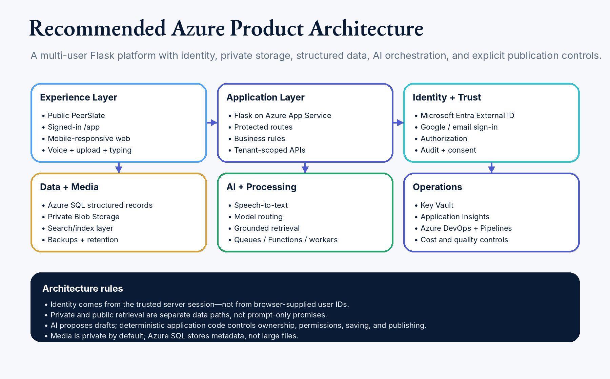

<!--
Controlled Markdown authority materialized from frozen owner-approved DOCX.
Source: docs/governance/PeerSlate_Product_Strategy_and_Architecture_Roadmap_v2.8.docx
Source SHA-256: 612C23CF21CBA4A58905E77B067ADB82FF8A7BEA5A24A107742C973FE48495A1
Generated by tools/convert_authority_docx_to_markdown.py.
-->

PEERSLATE

# PeerSlate Product Strategy and Architecture Roadmap

## The evidence-based sequence aligned to the verified production foundation, current public refinements, and next backend convergence work

| VERSION | v2.8 - Work-first Slate Studio Slice 1 Sequence (CURRENT) |
| --- | --- |
| DATE | July 24, 2026 |
| STATUS | CURRENT AND LOCKED - APPROVED BY THE OWNER ON JULY 24, 2026; SUPERSEDES v2.7 |
| SOURCE SYNTHESIS | v2.7 Journal-system sequence + Bible v2.9 + Project Croatia work-first Studio direction and Slice 1 manager gate |

| DOCUMENT INTENT / This Roadmap preserves the evidence-based Journal, owner-shell, Community, return-value, AI, Story, Projects, and public-convergence sequence while activating one bounded cross-phase Studio shell/frame slice. It does not pull Board, editing, AI, practice grounding, publishing, rename, or public alignment forward. |
| --- |

Approval note: this v2.8 release preserves verified production and historical package evidence, the corrected Capture/Journal sequence, and the detailed architecture packages while adding the bounded work-first Slate Studio Slice 1 sequence. It keeps Journal canonical, treats Studio as the experiential center, and does not pull Board, editing, AI, practice grounding, publishing, rename, or public convergence forward. It changes no runtime status by itself. Pete approved and directed Azure activation on July 24, 2026, so it supersedes v2.7.

# Document control and operating assumptions

| CURRENT | Progress baseline: the July 18 handoff supplies sufficient evidence to advance specific packages and phases from Not Assessed. Authentication, owner isolation, Settings, private text Capture, release evidence, and Deep Navy Gold are reusable production assets. Broader phase completion is not assumed. |
| --- | --- |

| LOCKED | Roadmap authority: v2.8 is CURRENT and controlling. Pete approved and directed its Azure activation on July 24, 2026, so it supersedes v2.7. Historical package IDs and release evidence remain preserved. PS-JOURNAL-001 architecture remains active; PS-SLATE-STUDIO-SLICE-1-001 is activated only for its bounded default-off shell-and-frame wave; PS-RETURN-VALUE-001, PS-ASK-SLATE-AI-001, PS-MESSAGING-001, PS-STORY-COMPOSER-001, and PS-PROJECTS-001 remain staged as recorded and are not thereby live. |
| --- | --- |

| LOCKED | Planning unit: The unit of delivery is a vertical slice containing identity, data, authorization, behavior, UI, accessibility, tests, observability, rollout, rollback, and member value—not a finished-looking page. |
| --- | --- |

| LOCKED | Status rule: A phase becomes Complete only when its exit gate and evidence package pass. Missing evidence means In Progress or Not Assessed. |
| --- | --- |

## What this roadmap answers

- What PeerSlate must build next, in what architectural order, and why.

- How each stage changes the actual website and member experience.

- Which architecture and data foundations are required before each experience can be real.

- Which “shall” requirements, prototypes, tests, verification, validation, rollout, and rollback are needed.

- How the current Azure resource order on pages 68–70 fits into the product sequence.

- How Platform Vision ideas enter the program without creating another pile of disconnected concept pages.

| CURRENT-STATE POINTER / CURRENT_BASELINE.yaml, CURRENT_STATE.md, and ACTIVE_INITIATIVES.md carry the verified repository, pipeline, active-lane, and production truth. Fetch origin before work; this Roadmap does not freeze a SHA or live-status snapshot. |
| --- |

# Document map

Use this map to identify the governing section. Word’s Navigation pane can also jump directly between headings.

Executive roadmap

1. Product strategy at a glance

2. Target product and technical architecture

3. How requirements and architecture are developed

4. Roadmap phase map

5. Phase 0 — Program reset and current-state audit

6. Phase 1 — Website and language consolidation

7. Phase 2 — Identity, environments, and delivery safety

8. Phase 3 — Canonical data, migrations, authorization, and private media

9. Phase 4 — Owner shell and viewer modes

10. Phase 5 — Universal Capture and private Journal

11. Phase 6 — Onboarding and voice-to-value

12. Phase 7 — Use This Moment

13. Phase 8 — Two-member connection, publication, and finite Feed

14. Phase 9 — Slate Mirror, What PeerSlate noticed, and Replay

15. Phase 10 — Moment Lab, Story, Work, Projects, and connected views

15A. Future cross-phase initiative — Public Experience Visual Convergence

16. Phase 11 — Next Chapter and Qualification Alignment

17. Phase 12 — Scale, integrations, and business expansion

18. Work-package register

19. Release gates and status evidence

20. Immediate execution plan

21. Roadmap governance and review

Appendices (including mandatory startup and owner-understanding standard)

# Executive roadmap

| First make the owner loop real. Then make the intelligence useful. Then expand the network and career applications. |
| --- |

PeerSlate’s product idea is ahead of the live information architecture. The website contains strong visual and narrative material, but it still risks feeling like a portfolio, product laboratory, and simulated social platform sharing one shell. The roadmap therefore starts by consolidating the experience and proving the architecture—not by adding another concept page.

The architectural spine is: trusted identity → environment separation → migration discipline → canonical data → authorization before retrieval → private media → owner/viewer modes → Capture and Journal → voice → activation → connection/publication → governed member intelligence → deeper preparation and future-direction experiences → scale.

| PRIMARY MILESTONE A real two-member alpha in which Pete and Danielle use separate accounts, maintain separate private records, capture and review real Moments, deliberately share or publish selected items, correct AI, revisit history, and understand privacy without a product tour. |
| --- |

| Stage | Member outcome | Architecture outcome |
| --- | --- | --- |
| Foundation | A person can sign in, own private data, understand whose space they are in, and trust viewer boundaries. | Trusted identity, environments, migrations, canonical schema, server authorization, private storage, telemetry, rollback. |
| Core loop | A person can open Capture in context, choose Save Moment once, preserve original language, find the private Moment immediately in Journal, and later use its exact version deliberately. | Universal composer, source/version and canonical-Moment transaction, derived Journal retrieval, governed references, lifecycle, accessibility, and failure handling. |
| Activation | A member-saved canonical Moment is immediately available in Journal and can become useful without another dashboard or mandatory review gate. | Use This Moment shortcuts plus a complete accessible authorized-purpose chooser, action adapters, traceability, and outcome closure. |
| Connection | Two people can selectively share, view, and respond without leaking owner-only context. | Relationship grants, audience queries, publication state, finite Feed, isolation tests. |
| Member intelligence | The person sees source-linked patterns and Replay with humble controls and one useful next step. | Insight lifecycle, governed retrieval, evaluation, correction feedback, monitoring, V&V. |
| Expansion | The same Slate powers preparation, Story, Work, Next Chapter, exports, and future member-first applications. | Reusable projections, Studio, search abstraction, scale/cost controls, integrations, business gates. |

# 1. Product strategy at a glance

## The product objective

Turn the current website into one connected member-owned system with two clear modes: a private owner workspace and a public or permissioned Slate. The public experience should emerge from approved owner activity; it must not be the product’s center of gravity.

## The core loop

| 1 Capture action | 2 Save Moment | 3 One private Journal | 4 Understand | 5 Use by reference | 6 Share selectively | 7 Revisit + learn |
| --- | --- | --- | --- | --- | --- | --- |

## The product sequence

| Build first | Build next | Build later / gate |
| --- | --- | --- |
| Governance pointer sync; finish current-state audit; preserve auth/Settings/Capture/Deep Navy Gold; résumé compression; Interview Studio public gating; Capture lifecycle; canonical Moment review; placement references; owner-shell/viewer foundations | Universal Capture through shared contracts; Save Moment; immediate private Journal; Use This Moment; deliberate publication; two-member authorization; finite Feed; owner Home; curated/viewer Journal after its gates | Slate Mirror; Replay; deeper Moment Lab; Story/Work canonical integration; Next Chapter; Qualification Alignment; integrations; monetization; scale |
| Reuse verified production assets; no foundation rewrite | Useful intelligence and connected reuse | Scale only after validated member value |
| Journal architecture is active and runtime-gated; FitSlate remains tabled | Gated vertical slices | FitSlate remains tabled |

## Website transformation

The approved owner-experience storyboard components remain the controlling dark-theme quality bar, not a five-destination information architecture. Capture a Moment is an in-context composer reference rather than a page. Near-term packages shall map each relevant component to real states and separately approved routes; public projection convergence remains independently gated.

| From concept lab to coherent shell Remove contradictory recruiter-first copy, legacy Community fixtures, duplicate navigation, decorative activity modules, and misleading states. | From public profile center to owner engine The signed-in system becomes Journal-centered with a context-preserving Capture action; exact Home/Slate/Work/Studio/Settings route grouping remains an approved route-map decision. |
| --- | --- |
| From isolated pages to canonical projections Journal, Story, Work, résumé, Feed, and Studio draw from one source-linked Slate. | From AI demos to governed intelligence Member-facing interpretations use real authorization, source links, lifecycle, correction, evaluation, and failure behavior. |

# 2. Target product and technical architecture

| LOCKED | Architecture posture: Extend the current Flask/Azure modular monolith. Do not introduce premature microservices, Kubernetes, or a separate vector platform. |
| --- | --- |

## Target product domains

| Domain | Responsibilities | Key boundaries |
| --- | --- | --- |
| Experience shell | Marketing/public routes, authenticated /app shell, navigation, viewer context, mobile composition, honest states | No client-trusted ownership; no duplicate feature islands |
| Identity and authorization | External identity mapping, sessions, owner/viewer/relationship/audience decisions, grants | Authorization before every private retrieval |
| Capture and Journal | Text/voice/photo/file input, preserved source/version, Save Moment, one private canonical Moment, derived Journal, optional governed relationships | Private by default; AI cannot publish |
| Slate and projections | Journal, Story, Work, public/permissioned profile, résumé/export, audience-specific presentation | Canonical facts remain single-source and traceable |
| Connections and Feed | Relationships, selective sharing, comments/responses, finite relevant updates | No infinite-engagement architecture |
| Studio and activation | Use This Moment, Moment Lab, preparation, translation, rehearsal, outcomes | Actions operate on permitted canonical context |
| Member intelligence | What PeerSlate noticed, Slate Mirror, Replay, insight lifecycle, correction and evaluation | Interpretations separate from truth; governed retrieval |
| Platform operations | Migrations, private media, background work, telemetry, cost, feature flags, rollout, rollback, support | Environment separation and privacy-safe observability |

## Target data layers

| Data layer | Examples | Rule |
| --- | --- | --- |
| Source/original | Raw text, transcript, file, photo, audio, import payload | Preserve owner, provenance, consent, retention, and sensitivity. |
| Canonical | Users, identities, profiles, sources, Moments, Journal presentation metadata, roles, projects, outcomes, relationships, audience | Member-owned canonical truth and system of record; member-authored or explicitly accepted facts need no second promotion gate. |
| Interpretation | Insights, candidate links, summaries, questions, suggested actions, confidence, evaluations | Private, time-bounded, source-linked, correctable, revocable. |
| Projection | Story, Work, public Slate, Feed item, résumé export, manager brief, Studio draft | Purpose- and audience-specific; traceable to canonical truth. |
| Operational/evidence | Jobs, migrations, model metadata, test evidence, release, audit-safe events, monitoring | No private payload leakage; enough to verify behavior and incidents. |

Preserved v1.5.1 Azure reference architecture. The roadmap uses it as a baseline to audit and refine, not proof that each component is implemented.

## Architecture invariants

- Canonical Slate remains truth; AI interpretations never overwrite confirmed facts or state.

- Trusted server identity and authorization precede SQL, search, media, cache, and AI retrieval.

- Deterministic software controls trust decisions; AI proposes reviewable content and actions.

- Structured relationships and full-text retrieval precede embeddings; semantic retrieval is abstracted and justified by measured need.

- Every interpretation has trigger, scope, retrieval, proposal, validation, review, activation, and outcome states.

- Corrections, sensitivity, usefulness, contradiction, deletion, and revocation alter governed future behavior.

- AI, speech, queue, or provider failure cannot break core capture, review, privacy, export, deletion, or approved viewing.

# 3. How requirements and architecture are developed

## The answer to “architecture first or requirements first?”

| DEVELOP THEM TOGETHER Start with member needs, constraints, and risks. Draft measurable shall requirements. Create a candidate architecture. Allocate every requirement. Prototype high-risk assumptions. Revise both until every mandatory requirement has a home and every architecture element has a reason. Approve the requirements and architecture baselines together. |
| --- |

| 1 Need + constraints | 2 Draft shall requirements | 3 Candidate architecture | 4 Allocate + prototype risk | 5 Joint baseline | 6 Implement + verify + validate |
| --- | --- | --- | --- | --- | --- |

## What makes a good PeerSlate shall statement

| Quality | Rule | Example |
| --- | --- | --- |
| Necessary | It protects a member need, principle, risk, interface, or operating outcome. | Save Moment shall create one private member-saved canonical Moment and immediate derived owner-Journal membership before any optional publication. |
| Unambiguous | One measurable obligation; defined actor, behavior, condition, and outcome. | The server shall authorize viewer and audience before media retrieval. |
| Verifiable | A test or inspection can objectively pass or fail it. | At 200% zoom, no essential control shall be clipped or overlap. |
| Traceable | Unique ID and links to source need, architecture, implementation, tests, evidence, release. | PS-CAPTURE-FR-001 → service, migration, UI, tests, V&V. |
| Implementation-aware, not implementation-captured | State required behavior/constraint unless a locked architecture decision requires a technology. | Use trusted server session; do not prescribe an arbitrary UI framework. |
| Risk-complete | Cover privacy, security, AI, accessibility, performance, failure, migration, rollback, and monitoring—not only happy-path UI. | Deletion shall remove or revoke derived retrieval and output state according to policy. |

## Required phase artifacts

| Before build | During build | Before release |
| --- | --- | --- |
| Initiative brief; Bible alignment; user journey; scope/out of scope; shall requirements; prototype; architecture/data/privacy/security; traceability baseline; test/V&V plan; rollout/rollback | Code/configuration/migrations/infrastructure; requirement IDs in artifacts; automated tests; manual evidence; telemetry; updated risks; decision records | Acceptance pass; verification report; validation report; migration and rollback proof; accessibility/security sign-off; production verification plan; known limitations; release decision |

## Evidence-based phase status

| Status | Required meaning |
| --- | --- |
| Not Assessed | Existing assets may exist, but no current audit has compared them with the approved baseline. |
| Planned | Scope and dependencies are understood; baseline work has not begun. |
| In Definition | Requirements, prototype, architecture, and evidence plan are being developed. |
| Ready to Build | Joint baseline and entry gate approved. |
| In Build | Implementation is underway with live traceability. |
| In Verification | Implementation complete enough for objective test and review evidence. |
| In Validation | Real members are performing real tasks; the value/trust hypothesis is being tested. |
| Ready to Release | All release evidence and rollback conditions pass. |
| Complete | Production verification passed and evidence is recorded. |
| Blocked / Rework | A dependency, defect, trust risk, failed assumption, or missing evidence prevents progress. |

# 4. Roadmap phase map

| Phase | Name | Primary outcome | Depends on |
| --- | --- | --- | --- |
| 0 | Program reset and current-state audit | Know what is real; establish controlled baselines | All phases |
| 1 | Website and language consolidation | One coherent shell and truthful product story | 0 |
| 2 | Identity, environments, delivery safety | Real accounts and safe release foundation | 0 |
| 3 | Canonical data, migrations, authorization, private media | Owner-scoped system of record and trust boundary | 2 |
| 4 | Owner shell and viewer modes | Clear private workspace and permissioned Slate viewing | 1–3 |
| 5 | Universal Capture and private Journal | Default-off Save Moment and derived private-Journal core, then eligible-origin expansion | 3–4 |
| 6 | Onboarding and voice-to-value | Fast first value through resumable multimodal onboarding | 5 |
| 7 | Use This Moment | Immediate activation after capture | 5–6 |
| 8 | Two-member connection, publication, finite Feed | Real selective sharing and return loop | 4–7 |
| 9 | Slate Mirror, noticed, Replay | Governed longitudinal member intelligence | 5–8 |
| 10 | Moment Lab, Story, Work, Projects, connected views | Use the same Slate across preparation and expression | 7–9 |
| 11 | Next Chapter and Qualification Alignment | Future direction without a job marketplace | 9–10 |
| 12 | Scale, integrations, business expansion | Operational scale and monetization after proven value | All prior gates |

## Azure build-order crosswalk

| Bible pages 68–70 sequence | Roadmap phase | Interpretation |
| --- | --- | --- |
| 1. External identity | Phase 2 | Create and verify External ID configuration, callbacks, account linking, sessions, and isolation in separate environments. |
| 2. Database migration discipline | Phase 2 → Phase 3 | Install migration tooling before identity/profile schema and continue for every domain. |
| 3. Blob Storage | Phase 3 | Private containers, metadata, retention, authorization, upload scanning, delivery, deletion. |
| 4. Managed identity and Key Vault | Phase 2 → Phase 3 | Protect infrastructure and provider secrets; remove source/browser secrets. |
| 5. Speech | Phase 6 | Expand only after text source/version preservation, Save Moment, derived private Journal, provider-failure behavior, and accessibility are safe; Type and Speak remain first-class target inputs. |
| 6. Background processing | Phase 6 → Phase 9 | Imports/media/AI jobs with explicit state, retries, idempotency, monitoring, cancellation, and deletion. |
| 7. Monitoring and cost | Begin Phase 2; deepen every phase | Observability is not the last step. Establish privacy-safe release, latency, failure, provider, and cost telemetry early. |

# 5. Phase 0 — Program reset and current-state audit

| IN DEFINITION | Phase 0 is partially assessed. Repository authority, active commit, pipeline, production health, identity, Settings, Capture, theme, tests, and release evidence are known. Remaining route/state, full schema, environment, telemetry, private-media, and documentation-pointer audits must be completed. |
| --- | --- |

| CURRENT | Dependencies: None. This is the required entry point. |
| --- | --- |

| PHASE INTENT Establish what actually exists, what is simulated, what is deployed, what is safe, and which source is authoritative before declaring progress or extending the product. |
| --- |

## Why this phase exists

The current website and Bible contain strong work, but the planning record mixes implemented behavior, fixtures, mockups, browser-only states, Azure intentions, and overlapping roadmaps. Without a disciplined audit, the team can build on false assumptions, duplicate existing work, miss privacy gaps, or call a visual state complete while the real system remains unsafe.

## How the website changes

- No major new public page is added during the audit.

- Every route receives an honest state label: live, partial, fixture, browser-only, prototype, unavailable, or deprecated.

- Navigation, cross-links, CTA destinations, owner versus visitor rendering, mobile behavior, and product-language contradictions are cataloged.

- The website receives only urgent trust, security, broken-route, or misleading-state fixes until the audit baseline is approved.

## Architecture and data work

- Identify the authoritative repository, active branches, deployment pipeline, environments, Azure subscriptions/resource groups, and current configuration sources.

- Inventory routes, templates/components, database schema, migrations, storage, identity/session behavior, data-access patterns, queues/jobs, external providers, feature flags, telemetry, and secrets handling.

- Map current pages and fixtures to canonical objects, owners, audience rules, persistence, and source of truth.

- Run dependency, test, migration, access-control, private-media, logging/privacy, and backup/rollback discovery.

- Create the initial architecture context diagram, data inventory, route/permission matrix, and technical-debt register.

## Minimum shall requirements

PS-AUDIT-GOV-001 The program shall identify one authoritative repository, one proposed current roadmap, and one controlled location for initiative and evidence packages.

PS-AUDIT-STATE-001 Every user-visible route and major state shall be classified as live, partial, fixture, browser-only, prototype, unavailable, or deprecated based on deployed evidence.

PS-AUDIT-DATA-001 Every persisted or simulated record shall be mapped to owner, canonical object, storage location, visibility, retention, and deletion behavior.

PS-AUDIT-SEC-001 The audit shall identify all current identity, authorization, cross-user isolation, secret, private-media, and payload-logging risks before implementation authorization.

PS-AUDIT-VNV-001 No prior work package shall be marked Complete unless its requirements, implementation, tests, verification, validation, deployment, and production evidence can be located and reviewed.

## Prototype and design evidence

- Create a clickable inventory or annotated capture of every public and authenticated route at target desktop and mobile widths.

- Run the owner/visitor journeys with the current Pete and Danielle states and record every ambiguity.

- Prototype only the audit outputs and status-label pattern; do not use the audit to invent new product surfaces.

## Verification

- Repository and deployment trace from source commit to live route.

- Database/schema/migration inspection; sample data classification; ownership query review.

- Identity/session and cross-user negative tests where current behavior permits.

- Automated test inventory with pass/fail/flaky/absent classification.

- Azure resource/configuration inventory reconciled with documentation.

- Privacy-safe log inspection for payload, token, identifier, and media leakage.

## Validation

- Pete and Danielle walk the current product without guidance and identify what they believe is real, private, public, saved, or simulated.

- Both explain the product’s purpose, owner mode, public mode, and primary next action; confusion becomes an audit finding.

- The owner reviews the audit and agrees on what is reusable, what is unsafe, what is contradictory, and what should be retired.

## Primary risks and controls

| Risk | Control |
| --- | --- |
| Audit becomes a redesign exercise | Freeze new concept work; capture findings and route them to later packages. |
| Current code access is incomplete | Record unknowns explicitly and keep affected phases Not Assessed. |
| Visual polish is mistaken for implementation | Require repository, persistence, authorization, test, deployment, and production evidence. |

## Exit gate

| PHASE EXIT A signed current-state report exists with route/status inventory, architecture context, data/ownership map, permission matrix, Azure inventory, test/evidence inventory, contradiction register, reusable-asset list, risk register, and recommended phase-status updates. No unverified package is Complete. |
| --- |

## Controlled work packages

| ID | Package | Output |
| --- | --- | --- |
| PS-MIA-PLAN-001 | Read-only program audit | Current-state report and evidence index |
| PS-AUDIT-WEB-001 | Website route and state inventory | Route/CTA/navigation/mobile/status matrix |
| PS-AUDIT-TECH-001 | Repository and architecture audit | Context, modules, data, providers, environments, debt |
| PS-AUDIT-TRUST-001 | Privacy/security/identity audit | Trust risk and isolation baseline |
| PS-AUDIT-EVID-001 | Requirements and evidence audit | Status correction and traceability gaps |

# 6. Phase 1 — Website and language consolidation

| IN BUILD | Phase 1 is active. Deep Navy Gold is shipped. The public Living Résumé refinement and Interview Studio public-gate/layering packages are authorized. Broader navigation, language, Community/Feed, and viewer-state consolidation remains incomplete. |
| --- | --- |

| CURRENT | Dependencies: Phase 0 audit. May proceed in parallel with early Phase 2 architecture definition after audit boundaries are known. |
| --- | --- |

| PHASE INTENT Make the existing website tell one truthful product story and establish the mobile/desktop shell before adding another feature destination. |
| --- |

## Why this phase exists

The Platform Vision found that the product’s idea is ahead of the live information architecture. Contradictory recruiter-first copy, repeated “evidence” language, legacy Community/Daily Slate fixtures, competing navigation layers, and prototype states weaken trust and make strong experiences feel disconnected. This phase reduces noise and creates the shell into which later vertical slices can fit.

## How the website changes

- Homepage and Why PeerSlate clearly state the member-first promise: capture real work and life, understand it, and deliberately choose what to share.

- Public and authenticated navigation use one coherent model. Journal is core and Capture is a persistent action, never a destination; exact desktop/mobile routes, labels, grouping, and order remain an owner-approved route-map gate.

- Capture actions open the same context-preserving universal composer in place; they do not navigate to a Capture destination, Feed, or concept shell.

- Legacy Daily Slate, public streak pressure, matched-people rails, trends, high-five popularity, decorative polls/quotes/news/jobs, and misleading simulated states are removed, gated, or honestly labeled.

- Living Résumé, My Story, Interview Studio, Slate Board, Feed preview, and Community are simplified around owner/viewer modes and progressive depth.

- The owner workspace and public/permissioned Slate are visually and verbally distinct.

## Architecture and data work

- Create a route and navigation target map with owner, selected-person, connection, authenticated-member, and public modes.

- Define URL and redirect behavior for consolidated or deprecated routes; preserve useful deep links where possible.

- Create reusable shell components for context, audience, status, primary action, mobile bottom navigation, and finite content states.

- Replace local fixture assumptions with explicit adapters or feature flags so later real data can enter without another redesign.

- Create content tokens/canonical feature names and remove duplicate labels for the same behavior.

## Minimum shall requirements

PS-IA-001 Every primary route shall identify whose space is being viewed, the viewer context, the privacy/audience state, and the primary safe action within five seconds.

PS-IA-002 The mobile authenticated shell shall keep Journal central and expose a persistent/contextual Capture action without making Capture a destination. Exact route labels, grouping, and order remain an owner-approved route-map gate; mobile shall not merely shrink desktop navigation.

PS-IA-003 The website shall not represent fixtures, browser-only state, mock AI, fake sharing, queued work, or unavailable functions as live or complete.

PS-IA-004 Member-intelligence experiences shall be integrated into existing domains and shall not add a new top-level global destination.

PS-IA-005 Deprecated or consolidated routes shall provide intentional redirect, archival, or unavailable behavior and shall not leave broken or contradictory paths.

## Prototype and design evidence

- Responsive shell prototype across homepage, signed-in Journal-centered domains, the in-context Capture composer, My Slate/viewer projections, Studio, and Settings; exact route map remains open.

- Five-second comprehension states for owner, signed-in visitor, and public visitor.

- Mobile one-hand prototype with safe areas, keyboard, large text, 200% zoom, reduced motion, and offline-safe draft messaging.

- Prototype labels for live, prototype, processing, failed, complete, and unavailable states.

## Verification

- Route/link/redirect tests across public and authenticated contexts.

- Snapshot or visual-regression tests for target widths and viewer modes.

- Keyboard, focus, landmarks, labels, color contrast, zoom, reduced-motion, and screen-reader checks.

- No owner controls or private-content placeholders in visitor/public rendering.

- Content scan for stale recruiter-first, Evidence-as-brand, duplicate canonical names, and misleading status copy.

## Validation

- Five-second comprehension with Pete and Danielle in owner and visitor modes.

- Mobile one-hand test: sign in, orient, open Capture, find Journal, preview Slate, return Home.

- Privacy-confidence test: each participant explains what is private, public, connection-only, or simulated.

- Tree/path test: participants find Capture, a past Moment, My Slate preview, another member’s permitted profile, and Settings.

## Primary risks and controls

| Risk | Control |
| --- | --- |
| Removing useful material instead of relocating it | Use Editorial Review; archive or gate before deletion; preserve source history. |
| Shell prototype diverges from production | Use production-intent components/contracts and requirement IDs from the start. |
| Navigation debate delays trust foundation | Approve a reversible target IA and test it; do not wait for every future feature. |

## Exit gate

| PHASE EXIT The target navigation and mode model pass comprehension and accessibility validation; contradictory language and misleading fixture states are removed/gated; all consolidated routes have approved behavior; no new top-level destination was introduced. |
| --- |

## Controlled work packages

| ID | Package | Output |
| --- | --- | --- |
| PS-MIA-IA-001 | Website and language consolidation | Approved target IA and coherent shell |
| PS-IA-NAV-001 | Navigation and route consolidation | Public/auth/mobile/desktop route map |
| PS-IA-COPY-001 | Canonical language cleanup | Approved content and naming pass |
| PS-IA-STATE-001 | Honest product states | Reusable state/status components |
| PS-IA-A11Y-001 | Shell accessibility | Responsive and accessibility evidence |

# 7. Phase 2 — Identity, environments, and delivery safety

| IN VERIFICATION | Phase 2 is partially implemented. PS-AUTH-001 is closed with real identity and two-owner isolation. Delivery pipeline evidence exists. Environment separation, Key Vault/managed identity, telemetry, callback, and operations controls require targeted reconciliation before the phase can close. |
| --- | --- |

| CURRENT | Dependencies: Phase 0. Target-shell details from Phase 1 may proceed in parallel. |
| --- | --- |

| PHASE INTENT Create real separate accounts and a safe path from source code to production before private member data or AI workflows expand. |
| --- |

## Why this phase exists

The product cannot prove ownership, privacy, sharing, or the two-person loop while Pete and Danielle are fixtures or while environment, session, secret, migration, and rollback practices are ambiguous. Identity and delivery safety are prerequisites for every later experience.

## How the website changes

- Create My Slate and Sign In lead to real external identity flows in development/staging; production activation is controlled by a release gate.

- Pete and Danielle enter the same authenticated /app shell through separate accounts and receive independent owner context.

- Visible session-expired, account-linking, sign-out, error, and unavailable states are understandable and recoverable.

- No private owner page is reachable by changing a slug, query parameter, cached browser value, or client-side state.

## Architecture and data work

- Create or reconcile Microsoft Entra External ID tenant/user flow/app registrations, callbacks, domains, local/staging/production configuration, and account-linking rules.

- Implement trusted server-side session resolution, internal user IDs, external identity mapping, profile/onboarding bootstrap, session expiry, CSRF protection, and audit-safe auth events.

- Separate local, development, staging, and production data, identities, storage, secrets, callbacks, telemetry, and deployment permissions.

- Add migration tooling before identity/profile schema changes; establish forward/rollback process and seed/test data policy.

- Configure managed identity and Key Vault where practical; inventory and rotate secrets; eliminate browser/source secrets.

- Create CI/CD gates, feature-flag approach, deployment record, smoke test, rollback command, and environment-health visibility.

- Begin privacy-safe Application Insights or equivalent telemetry now—not after the rest of the product is built.

## Minimum shall requirements

PS-AUTH-001 The server shall resolve the signed-in member from a trusted external identity and internal user mapping and shall not trust browser-supplied ownership identifiers.

PS-AUTH-002 Pete and Danielle shall be able to maintain independent accounts, sessions, profiles, and private data using the same reusable product logic.

PS-ENV-001 Local, development, staging, and production shall use separated identity registrations, data, storage, secrets, callbacks, telemetry, and deployment permissions.

PS-MIG-001 Every database change shall be delivered through a versioned migration with tested forward and rollback behavior.

PS-SECRET-001 Durable application and provider secrets shall not be present in browser code, repository history, or unprotected configuration.

PS-REL-001 Every deployment shall identify source version, configuration, migration state, smoke results, release decision, and rollback path.

## Prototype and design evidence

- Authentication state prototype: first sign-in, returning sign-in, expired session, provider failure, account collision/link, sign-out, and owner bootstrap.

- Environment banner/status pattern for nonproduction without leaking configuration.

- Owner context and “View As” context indicators in the shell.

## Verification

- Unit/integration tests for identity mapping, session lifecycle, CSRF, callback validation, profile bootstrap, and sign-out.

- Cross-user negative tests for route, API, and data-access ownership.

- Environment configuration diff and secret scan; no production credentials in lower environments.

- Migration forward/rollback test from representative current schema.

- Deployment to staging from a known commit; smoke test; rollback rehearsal; telemetry verification without private payloads.

- Threat review for account linking, session fixation, callback manipulation, token leakage, and user enumeration.

## Validation

- Pete and Danielle independently create/sign in to accounts, recover from a session-expired state, and identify that they are in their own workspace.

- Each attempts to navigate to the other’s owner routes and confirms that the product does not expose private data or confusing owner controls.

- The owner can explain which environment is under test and which behaviors are not yet production-authorized.

## Primary risks and controls

| Risk | Control |
| --- | --- |
| Authentication choice becomes an endless architecture debate | Time-box alternatives; record ADR; choose the smallest pattern that meets control and repository needs. |
| Lower environments accidentally touch production data/resources | Explicit resource separation, deny-by-default permissions, configuration tests, and banners. |
| Rollback exists only on paper | Rehearse migration and application rollback in staging before exit. |

## Exit gate

| PHASE EXIT Two real staging accounts work through trusted server identity; environment separation, migrations, secrets, CI/CD, telemetry, smoke, and rollback evidence pass; cross-user owner-route tests pass; no production expansion occurs without gate approval. |
| --- |

## Controlled work packages

| ID | Package | Output |
| --- | --- | --- |
| PS-AUTH-001 | External identity and sessions | Real account flow and trusted owner context |
| PS-ENV-001 | Environment separation | Isolated configuration and resource plan |
| PS-MIG-001 | Migration discipline | Versioned schema and rollback process |
| PS-SECRET-001 | Managed identity and Key Vault | Protected secret and resource access |
| PS-DELIVERY-001 | CI/CD and rollback | Controlled staging/prod delivery evidence |
| PS-OBS-FOUND-001 | Foundational observability | Privacy-safe release/auth/health telemetry |

# 8. Phase 3 — Canonical data, migrations, authorization, and private media

| IN BUILD | Phase 3 is partially implemented. Migration discipline and owner-scoped dbo.captures exist. The full canonical Slate schema, authorization policy layer, private media, provenance model, export/delete propagation, and operational lifecycle remain incomplete. |
| --- | --- |

| CURRENT | Dependencies: Phase 2. Uses target IA from Phase 1. |
| --- | --- |

| PHASE INTENT Create the member-owned system of record and enforce authorization before retrieval for every private record, media object, search result, and future AI context. |
| --- |

## Why this phase exists

Capture, Journal, Story, sharing, and member intelligence cannot be trustworthy while data ownership, canonical objects, lifecycle, provenance, audience, media authorization, and deletion are informal. This phase builds the data and trust spine that later experiences reuse.

## How the website changes

- The owner workspace can create and retrieve real owner-scoped records even before every polished feature is present.

- My Slate preview and viewer routes request an explicit viewer context and return only permitted projections.

- Uploads show private state, progress, review, failure, retry, retention explanation, and deletion behavior.

- No page or API loads private content and hides it only in the browser.

## Architecture and data work

- Define canonical schema and migrations for users, identities, profiles, settings, onboarding, sources/revisions, Moments, Journal presentation metadata without copied facts, roles/projects/outcomes, relationships, audience grants, publication state, AI drafts/insights, messages when activated, jobs, activity/audit-safe events, and deletion/revocation.

- Create a server-side policy/authorization layer that accepts trusted owner, viewer, relationship, audience, purpose, sensitivity, and workflow context before query execution.

- Create query patterns/views/repositories for owner, selected-person, connection, authenticated-member, and public retrieval.

- Provision private Azure Blob Storage containers for resumes/source files, profile media, Journal media, temporary audio, and Studio media with metadata in Azure SQL.

- Implement secure upload, content/type/size validation, malware or safety scanning strategy, server-authorized delivery, retention, revocation, deletion, and orphan cleanup.

- Define canonical-versus-interpretation-versus-projection separation and lifecycle state machines.

- Establish data export and deletion architecture before high-volume derived data is created.

## Minimum shall requirements

PS-DATA-001 PeerSlate shall store confirmed canonical member records separately from original sources, AI interpretations, and audience-specific projections.

PS-AUTHZ-001 The server shall authorize owner, viewer, relationship, audience, consent, sensitivity, and workflow purpose before any SQL, search, media, cache, or AI retrieval.

PS-PROV-001 Every promoted canonical record and generated factual draft shall retain provenance sufficient for the member to inspect the supporting source or original capture.

PS-MEDIA-001 Private media shall be delivered only through server-authorized access and shall not be exposed through guessable public URLs or client-trusted paths.

PS-LIFE-001 Captures, drafts, records, publications, interpretations, jobs, revocations, and deletions shall use explicit lifecycle states and valid deterministic transitions.

PS-DELETE-001 Deletion and revocation shall propagate to dependent projections, retrieval indexes, caches, and derived outputs according to the approved policy.

## Prototype and design evidence

- Data/state prototype showing original source, canonical record, interpretation, projection, audience, and lifecycle without exposing internal complexity to the member.

- Upload/review/delete prototype for resume, photo, and audio including failed scan, unsupported file, interrupted upload, retry, and retention choice.

- Exact viewer-mode examples for owner, selected person, connection, member, and public.

## Verification

- Migration tests from current representative data; forward and rollback; constraints/indexes; idempotency where required.

- Cross-user, cross-audience, direct-object-reference, slug/path, cache, search, media, and API negative tests.

- Property/state-transition tests for draft, approval, publication, revocation, and deletion.

- Upload validation, malicious file, large file, MIME mismatch, interrupted transfer, unauthorized delivery, deletion, orphan cleanup, and retention tests.

- Export completeness and deletion propagation tests.

- Database/query performance baseline and privacy-safe telemetry validation.

## Validation

- Pete and Danielle create separate records and media, then verify that each can retrieve only owner or explicitly permitted data.

- Each member previews what the other and a public visitor can see and explains why.

- Each inspects an original source, corrects a structured record, revokes a share, deletes an item, and understands the resulting state.

## Primary risks and controls

| Risk | Control |
| --- | --- |
| Schema tries to model every future idea | Model the minimum canonical foundation and use migrations; avoid speculative complexity. |
| Authorization is scattered across routes | Centralize policy and require all repositories/services to accept authorization context. |
| Blob URLs bypass policy | Private containers, server-mediated access, short-lived authorized delivery, and negative tests. |

## Exit gate

| PHASE EXIT Canonical schema and state models are approved; all retrieval goes through server authorization; private media, migration/rollback, export/deletion, provenance, and cross-user/audience tests pass; Pete/Danielle validation confirms understandable ownership and control. |
| --- |

## Controlled work packages

| ID | Package | Output |
| --- | --- | --- |
| PS-DATA-001 | Canonical Slate schema | Versioned data and relationship model |
| PS-AUTHZ-001 | Authorization policy layer | Pre-retrieval enforcement and query contracts |
| PS-MEDIA-001 | Private Blob Storage | Secure upload/delivery/retention/deletion |
| PS-PROV-001 | Sources and provenance | Original-source linkage and inspection |
| PS-LIFE-001 | Lifecycle and publication state | Deterministic state machines |
| PS-EXPORT-DELETE-001 | Member data rights | Export, revoke, delete, derived-state controls |

# 9. Phase 4 — Owner shell and viewer modes

| IN BUILD | Phase 4 has protected Settings and Capture surfaces. Finite Home, canonical owner navigation, My Slate preview, viewer modes, and complete session/account states remain to be built and validated. |
| --- | --- |

| CURRENT | Dependencies: Phases 1–3. |
| --- | --- |

| PHASE INTENT Turn identity and canonical data into a quiet signed-in workspace and a trustworthy audience-specific Slate view before social features depend on them. |
| --- |

## Why this phase exists

Members need to know whether they are editing their own space, previewing it, viewing another member as a connection, or seeing a public Slate. This phase makes those modes explicit and reusable so every later surface inherits the correct permissions and mental model.

## How the website changes

- Signed-in Home may be a finite owner orientation point with a Capture action, recent/resurfaced Moment, one permitted update, and one next step. It shall not become a required Capture destination or expose a separate draft-to-Journal promotion gate.

- Journal management, My Slate preview, viewer profile, and Settings become real owner-scoped routes.

- Owner, selected-person, connection, authenticated-member, and public modes render the same member differently according to server-computed permissions.

- Pete can view Danielle’s permitted Slate without seeing edit controls, raw captures, private Journal, source files, private insights, Studio sessions, settings, or unpublished items.

- Mobile shell and desktop workshop share canonical routes, states, and permissions.

## Approved owner visual baseline

- Use the five approved July 18 owner storyboards as the controlling design reference for the dark-theme owner shell, finite Home, Capture access, My Slate context, and desktop/mobile composition.

- Implement Deep Navy Gold through shared tokens and components rather than page-specific copies. Preserve black/deep-navy structure, warm ivory working surfaces, restrained metallic-gold accents, clear viewer/privacy states, and selective cinematic imagery.

- Treat the mockup content as illustrative; implement real member identity, routes, privacy, permissions, lifecycle states, and repository-backed data.

- Defer the light theme. Responsive and accessibility adaptations are required, but the intended visual hierarchy and premium quality may not be reduced to a generic dashboard.

## Architecture and data work

- Create server-resolved viewer context and reusable audience-filtered projection services.

- Create authenticated shell, navigation, context indicators, owner/preview/view-as behavior, and secure return paths after sign-in.

- Implement settings for profile, visibility defaults, consent/retention choices, export/delete entry points, and account state.

- Create finite Home aggregation from permitted canonical data with empty/loading/error/offline states.

- Implement My Slate preview using the same authorization and projection contracts as real viewers.

- Add route/API contract tests so mode differences cannot rely on CSS hiding.

## Minimum shall requirements

PS-SHELL-001 The authenticated shell shall identify the owner, current viewer context, privacy state, and primary action without exposing another member’s owner controls.

PS-HOME-001 Home shall present a finite set of useful owner items and shall not require infinite scroll or simulated activity.

PS-VIEW-001 Viewer routes shall render only server-authorized projections for the current relationship and audience mode.

PS-PREVIEW-001 My Slate preview shall use the same authorization and projection logic as the selected real viewer mode.

PS-SETTINGS-001 The member shall be able to understand and manage visibility defaults, account/privacy choices, export, deletion, and relevant retention choices.

## Prototype and design evidence

- Owner Home and viewer-mode responsive prototype with real empty, loading, error, restricted, unpublished, and revoked states.

- Exact audience preview for public, member, connection, and selected-person contexts.

- Settings prototype for privacy, sources/media, AI choices, export/deletion, and account lifecycle.

## Verification

- Contract and integration tests for every route/API in owner and each viewer mode.

- Negative tests ensure private fields are absent from response payloads—not merely hidden in UI.

- Navigation, sign-in return, preview, and context-switch tests.

- Home finite-query and performance baseline; empty/error/retry behavior.

- Accessibility and responsive tests across shell, Home, Journal list, preview, and Settings.

## Validation

- Pete and Danielle independently identify owner versus viewer mode and complete the same navigation tasks without guidance.

- Pete views Danielle as connection/member/public where configured and accurately explains what he can and cannot see.

- Danielle changes a visibility default, previews the result, and verifies the real viewer outcome.

- Both find export/deletion/privacy controls and explain what each will do.

## Primary risks and controls

| Risk | Control |
| --- | --- |
| Viewer mode is implemented with client-side hiding | Inspect response payloads and query contracts; server filters before retrieval. |
| Home becomes another feature dashboard | Enforce finite content budget and one-next-step rule. |
| Preview diverges from real audience behavior | Use identical projection service and integration tests. |

## Exit gate

| PHASE EXIT Owner shell, finite Home, Settings, My Slate preview, and all viewer modes use real server authorization and pass payload-level isolation, accessibility, responsive, comprehension, and privacy-confidence validation. |
| --- |

## Controlled work packages

| ID | Package | Output |
| --- | --- | --- |
| PS-SHELL-001 | Authenticated owner shell | Home/navigation/context/settings |
| PS-VIEW-001 | Viewer and permission modes | Owner/selected/connection/member/public rendering |
| PS-HOME-001 | Finite Home | Useful owner orientation and return state |
| PS-PREVIEW-001 | My Slate exact preview | Real audience projection preview |
| PS-SETTINGS-001 | Owner control center | Privacy/data/account controls |

# 10. Phase 5 — Universal Capture and private Journal

| IN BUILD | Phase 5 has verified private text/Voice source, Moment, and Placement foundations. The owner has lifted the Journal hold and approved universal Capture plus derived one-Journal architecture; runtime orchestration, Journal UI, curation/audience views, migration, and validation remain incomplete and gated. |
| --- | --- |

| CURRENT | Dependencies: Phases 3–4. |
| --- | --- |

| PHASE INTENT Prove Capture anywhere → one idempotent Save Moment operation → immediate private owner Journal, with Type and Speak first-class, source/version preservation, accessibility, and AI/provider fallback. |
| --- |

## Why this phase exists

Nothing else matters as much if a member cannot open Capture in context, preserve the authorized source/version, Save Moment once in their own language, find it immediately in the private Journal, and optionally use it later. Applicable transcript correction and optional AI proposals stay inline and non-blocking. This slice becomes the reference architecture for voice, intelligence, Story, Work, Studio, and sharing.

## How the website changes

- A persistent Capture action is visible in eligible authenticated mobile and desktop shells and opens the context-preserving universal composer without becoming a destination.

- The member can type a win, lesson, decision, project update, question, or personal Moment without choosing a destination first.

- PeerSlate preserves authorized source input and lets member-authored text Save Moment immediately as one private canonical Moment. Applicable voice/transcript correction and optional structured or AI proposals stay inline, editable, and separately identified; they cannot delay or replace Save Moment. Publication remains a separate explicit action.

- After Save Moment, the member can connect an exact saved canonical Moment version to a role, project, goal, person, skill, earlier Moment, or leave it unplaced.

- Journal provides private list/detail/search/filter/edit/delete states and preserves source/original language.

- Optional projection is shown as a separate deliberate next step, not part of capture completion.

## Architecture and data work

- Implement Capture and Journal modules/services/routes using canonical schema, trusted owner context, transactions, provenance, and lifecycle states.

- Create proposal contracts for candidate title/type/date/context/relationships/destinations and uncertainty without overwriting original input.

- Add deterministic validation for ownership, allowed state transitions, required fields, audience, and publication constraints.

- Create idempotent save/retry behavior and conflict handling for duplicate submission or interrupted network.

- Implement private Journal retrieval, search/filter on structured data and full text, relationship links, edits, deletion, and history as required.

- Add privacy-safe capture and workflow telemetry without recording private content.

## Minimum shall requirements

PS-JRN-MOM-001 Save Moment shall atomically preserve the authorized source/version, create one private member-saved canonical Moment, and make it immediately available through derived owner-Journal membership before any optional placement, sharing, or publication.

PS-CAPTURE-002 Capture shall preserve original input and support inline transcript correction where applicable. Member-authored text may Save Moment immediately; optional structured or AI proposals shall not become a mandatory pre-save promotion gate.

PS-CAPTURE-003 The member shall be able to approve, edit, split, defer, cancel, keep private, connect, and delete as applicable.

PS-JOURNAL-001 The owner's one Journal shall derive membership from every eligible member-saved canonical Moment and provide source/original language, versions, relationships, lifecycle, search/filter, edit, curation, export, and deletion without a copied Journal body or Add to Journal gate.

PS-CAPTURE-004 Capture and Journal shall remain fully usable through text when speech or AI is unavailable.

PS-CAPTURE-005 Optional public or permissioned projection shall require a separate explicit member action and exact audience preview.

## Prototype and design evidence

- Mobile-first in-context Type/Speak composer prototype with private-state reassurance, applicable inline transcript correction, cancel/retry, one Save Moment action, origin return, and post-save optional next-use actions.

- Journal list/detail prototype with original words, polished proposal, source, relationships, privacy, edit, remove-from-projection, and delete.

- Failure prototypes: AI unavailable, network interruption, duplicate submission, validation error, stale edit, deletion conflict, and insufficient information.

- Accessibility prototype with keyboard, screen reader, large text, 200% zoom, reduced motion, and no-microphone path.

## Verification

- Unit tests for parsing contracts, state transitions, deterministic validation, relationships, audience defaults, and deletion.

- Integration tests from in-context composer through idempotent Save Moment, source/version preservation, immediate derived owner-Journal retrieval, edit/version, archive/restore, export, deletion, provider failure, and two-member isolation; optional proposal failure cannot block or replace the saved Moment.

- Transaction/idempotency/network retry/duplicate submission/conflict tests.

- Cross-user isolation and negative publication tests.

- Search/filter/provenance/original-input tests.

- Accessibility, responsive, performance, AI-outage, and privacy-safe telemetry tests.

## Validation

- Pete and Danielle each capture a real work/life Moment by text without a tour.

- Each explains that the Moment is private, preserves/corrects original language as needed, chooses Save Moment once, and finds it immediately in their own Journal without an Add to Journal step.

- Each links a Moment to an existing context or deliberately leaves it unplaced.

- Each finds, edits, and deletes a past item and understands what changed.

- Each completes the flow during simulated AI unavailability and still receives a usable private record.

## Primary risks and controls

| Risk | Control |
| --- | --- |
| Capture asks too much before saving | Save the member-authored private Moment when Save Moment is chosen; ask only non-blocking questions that materially improve value or safety, and never require optional AI enrichment before save. |
| AI proposal becomes canonical automatically | Explicit Save Moment, source/version, optional-proposal, and negative side-effect tests. |
| Journal becomes another public feed | Private-first owner retrieval; projection is separate and deliberate. |

## Exit gate

| PHASE EXIT A default-off text-first Save Moment and derived private-Journal slice passes identity, ownership, provenance, lifecycle, isolation, accessibility, retry/failure, performance, deletion, and two-member gates. Universal Capture is not claimed until the eligible-origin matrix passes; Type and Speak remain first-class reference paths for later intelligence. |
| --- |

## Controlled work packages

| ID | Package | Output |
| --- | --- | --- |
| PS-CAPTURE-001 | Released private text-source foundation | Owner-scoped source create/list, validation, audit-safe persistence, migration, and release evidence reused behind the universal composer |
| PS-JOURNAL-001 | Universal composer and private Journal core | Idempotent Save Moment, source/version plus canonical Moment, immediate derived owner list/detail/search/lifecycle, and no copied Journal body |
| PS-RELATE-001 | Moment relationships | Project/role/goal/person/skill/Moment links |
| PS-CAPTURE-A11Y-001 | Accessible capture fallback | Text/keyboard/assistive/failure parity |
| PS-CAPTURE-EVID-001 | Vertical-slice evidence | Traceability, V&V, production-intent readiness |

# 11. Phase 6 — Onboarding and voice-to-value

| PLANNED / HOLD | Phase 6 is not authorized for implementation yet. Non-text capture follows PS-CAPTURE-002 and PS-MOMENT-001 so voice, photo, video, and document sources reuse the same ownership, provenance, review, failure, and lifecycle contracts. |
| --- | --- |

| CURRENT | Dependencies: Phase 5; private storage and jobs from Phase 3. Speech follows the safe text reference path. |
| --- | --- |

| PHASE INTENT Help a new member reach one truthful, useful private result quickly through a resumable path that supports voice, text, upload, and optional sources without forcing every input mode. |
| --- |

## Why this phase exists

PeerSlate is voice-first because speaking can lower capture friction and preserve natural language, but voice must enter the same trusted pipeline as text. Onboarding should establish enough context to deliver value, not tour every feature or demand a complete professional biography before the member can begin.

## How the website changes

- Create My Slate begins a resumable onboarding flow: purpose, profile basics, optional resume/photo, guided conversation or typed input, review, and one clear next action.

- The member can choose voice, text, document upload, photo, or skip; no single optional source blocks progress.

- Listening, transcript, correction, cancel, retry, permission, retention, and failure states are visible and calm.

- Voice and text are first-class paths through the same in-context Save Moment, source/version, immediate private Journal, lifecycle, audience, failure, and accessibility architecture.

- Onboarding ends with one useful reviewed Moment or profile foundation—not a product tour or empty dashboard.

## Architecture and data work

- Create resumable onboarding state and step/version schema using the canonical profile, source, Capture, and Journal services.

- Integrate Azure Speech or approved provider behind a server-governed abstraction with clear client/server boundaries, credentials, retention, and failure handling.

- Add temporary audio storage only when required, with explicit retention choice, encryption/access policy, job state, deletion, and provider-transfer disclosure.

- Implement live or near-live transcript, correction, phrase-list/custom vocabulary hooks, cancellation, retry, timeout, and text fallback.

- Create background job and retry foundations for document extraction, transcription, and media as needed; use explicit queued/processing/needs-review/complete/failed/cancelled/deleted states.

- Use imported resume/context to propose candidate facts and questions; do not silently promote them.

- Capture latency, failure, correction rate, provider/model, and cost telemetry without storing unnecessary private payloads.

## Minimum shall requirements

PS-ONBOARD-001 Onboarding shall be resumable and shall let the member reach a useful private reviewed result without completing every optional source or feature.

PS-VOICE-001 Voice and text shall remain first-class paths through the same owner-scoped privacy, provenance, inline correction where applicable, Save Moment, canonical Moment, derived Journal, audience, and failure architecture. Voice transcription review shall not turn member-authored text into a mandatory promotion gate.

PS-VOICE-002 Voice shall provide visible listening, editable transcript, correction, cancel, retry, permission, retention, and text-fallback behavior.

PS-IMPORT-001 Imported documents and extracted candidate facts shall remain private proposals until the member reviews and confirms them.

PS-JOB-001 Long-running processing shall expose explicit state, idempotency, retry, cancellation, failure, deletion, and monitoring behavior.

PS-VOICE-003 Provider or microphone failure shall not prevent the member from completing the essential onboarding or Capture outcome by text.

## Prototype and design evidence

- Twenty-minute onboarding prototype with alternate paths: voice-first, text-first, resume-assisted, minimal profile, interrupted/resumed, and provider unavailable.

- Microphone-permission denied, no-device, noisy audio, technical name correction, partial transcript, cancel, retry, and delete-audio states.

- One-question-at-a-time mobile composition and clear “why we ask” explanations.

- End-state prototype showing one private reviewed Moment and one next action.

## Verification

- Onboarding state/resume/version tests; duplicate/cross-device/retry behavior.

- Speech contract, transcript correction, timeout, cancellation, provider-failure, and text-fallback tests.

- Audio/source authorization, retention, deletion, provider transfer, and no-public-URL tests.

- Document upload/extraction, malicious upload, unsupported file, candidate-fact review, and deletion tests.

- Job idempotency/retry/dead-letter/cancellation/monitoring tests.

- Accessibility, keyboard, captions/transcript, mobile safe area, latency, and cost telemetry tests.

## Validation

- Pete and Danielle each complete onboarding through a different input path and stop/resume once.

- Each creates at least one useful private reviewed record, corrects a transcript or extracted fact, and explains what was stored and what remains private.

- Each recovers from a microphone/provider failure and completes the task by text.

- Measure time to first reviewed value, hesitation, correction, trust, perceived usefulness, and whether the next action is clear.

## Primary risks and controls

| Risk | Control |
| --- | --- |
| Voice becomes a separate product architecture | Reuse source, Voice, Moment, Placement, provenance, revision, and lifecycle foundations behind one universal composer and Save Moment orchestration; Journal membership is derived, not promoted by a second action. |
| Onboarding asks for a complete life history | Require only enough context for one useful result; make all enrichment resumable. |
| Raw audio retention creates hidden risk | Explicit choice, minimum retention, authorized storage, deletion, provider disclosure, and tests. |

## Exit gate

| PHASE EXIT Onboarding and voice produce the same trusted Capture/Journal outcome as text; resume, interruption, correction, retention, provider failure, job state, accessibility, latency, cost, and member-validation evidence pass; one useful private result is reached without feature-tour dependence. |
| --- |

## Controlled work packages

| ID | Package | Output |
| --- | --- | --- |
| PS-ONBOARD-001 | Resumable onboarding | Purpose/profile/source/review/next-action flow |
| PS-VOICE-001 | Voice Capture | Listening/transcript/correction/retry/text parity |
| PS-IMPORT-001 | Resume and source intake | Private candidate facts and review |
| PS-JOB-001 | Background processing foundation | State, retry, cancellation, monitoring |
| PS-VOICE-EVAL-001 | Speech quality and cost evaluation | Errors, vocabulary, latency, failure, cost evidence |

# 12. Phase 7 — Use This Moment

| PLANNED | Phase 7 remains planned after the canonical Moment and placement framework. Do not build broad activation before one source-to-Moment-to-use path is real. |
| --- | --- |

| CURRENT | Dependencies: Phases 5–6. Some action targets may remain prototype-only until their later domain phase, but status must be honest. |
| --- | --- |

| PHASE INTENT Deliver immediate, truthful value after a reviewed Moment by offering a small number of context-aware actions that operate on the same canonical record. |
| --- |

## Why this phase exists

Use This Moment is the fastest way to make the website click as one product. It proves that Capture is not merely archiving and that Journal, Story, Work, résumé, Studio, sharing, and future intelligence can activate one source without duplicating facts or adding another global destination.

## How the website changes

- After review, the member sees two or three relevant actions such as connect to project, draft manager update, practice an explanation, save for review, suggest Story/Work placement, or share selectively.

- Actions appear in Capture completion, Journal detail, relevant Home items, and connected domains—not on a separate top-level page.

- Every action states what it will use, what it will create/change, whether AI is involved, and who can see the result.

- The member can inspect, edit, cancel, defer, or choose another action; nothing publishes automatically.

- Completed actions link back to the source Moment and can later record whether they helped.

## Architecture and data work

- Define an activation/action contract with action ID, eligibility, authorized context, required sources, deterministic preconditions, proposal/output type, target projection, audience, lifecycle, telemetry, and outcome closure.

- Build action adapters for the first narrow set: connect relationship, manager/update draft, interview/example candidate, Story/Work suggestion, private reminder/next step, and selective share entry point.

- Use rules and structured context for eligibility before AI; use AI only for reviewable language or questions.

- Store drafts/projections separately from canonical facts and retain source links and action history.

- Add evaluation and monitoring for unsupported claims, irrelevant actions, latency, failure, cancellation, completion, correction, and later usefulness.

## Minimum shall requirements

PS-MOMENT-001 Use This Moment shall present a small, relevant set of actions after a reviewed Moment without requiring a new global destination.

PS-MOMENT-002 Each action shall identify permitted source context, intended output/change, audience, AI involvement, and member approval point before execution.

PS-MOMENT-003 Generated action outputs shall remain traceable proposals or projections and shall not overwrite canonical facts or publish automatically.

PS-MOMENT-004 Action eligibility and trust decisions shall be deterministic; AI may generate reviewable content only after authorized context is established.

PS-MOMENT-005 The member shall be able to cancel, defer, edit, dismiss, or choose another action and shall not lose the source Moment.

PS-MOMENT-006 PeerSlate shall support optional outcome closure so future recommendations can learn whether the action was useful.

## Prototype and design evidence

- Integrated prototype on Capture completion, Journal detail, and Home—not a separate feature page.

- Prototype action cards with eligibility explanation, source preview, audience, draft review, cancel, failure, and completion states.

- Test actions on technical, personal, ambiguous, sensitive, incomplete, and low-value Moments.

- Prototype “not enough information,” “too personal,” “not now,” and AI unavailable behavior.

## Verification

- Action eligibility and authorization unit/property tests.

- Integration tests from source Moment through proposal, edit, approval, target projection, cancellation, and trace link.

- Negative tests for automatic publication, unsupported fact creation, cross-user context, private-source leakage, invalid audience, and stale/deleted source.

- AI grounding/evaluation tests for factual support, voice preservation, harmful/irrelevant suggestions, and provider failure.

- Accessibility, responsive, latency, telemetry, and outcome-closure tests.

## Validation

- Pete and Danielle each capture or open a real Moment and identify a useful next action within 30 seconds.

- Each explains what the action will use, create, and share; edits the draft; cancels one action; completes another.

- Each can find the original Moment and supporting source after the action completes.

- Later, each records whether the action helped; assess relevance, trust, and return intention.

## Primary risks and controls

| Risk | Control |
| --- | --- |
| Too many actions recreate a dashboard | Use strict relevance threshold and a maximum small set plus “more options.” |
| AI turns a Moment into unsupported résumé language | Source-linked constraints, deterministic validation, member review, and rejection tests. |
| Action outputs fork facts | Separate projection/draft records and preserve canonical trace. |

## Exit gate

| PHASE EXIT At least one complete activation action passes requirements, architecture, grounding, authorization, traceability, accessibility, failure, outcome, verification, and member-validation gates. The experience is useful without a separate destination or automatic publication. |
| --- |

## Controlled work packages

| ID | Package | Output |
| --- | --- | --- |
| PS-MIA-MOMENT-001 | Use This Moment vertical slice | Integrated post-capture activation |
| PS-ACTION-CORE-001 | Activation action framework | Eligibility/source/output/audience/lifecycle contract |
| PS-ACTION-MANAGER-001 | Manager/update draft | Source-linked private communication draft |
| PS-ACTION-CONNECT-001 | Connect this Moment | Project/role/goal/person/Moment relationship |
| PS-ACTION-STUDIO-001 | Practice this Moment | Studio handoff using permitted context |

# 13. Phase 8 — Two-member connection, publication, and finite Feed

| NOT ASSESSED | Phase 8 remains Not Assessed. Existing Community/Feed visuals are not evidence of real relationships, publication, or audience grants. |
| --- | --- |

| CURRENT | Dependencies: Phases 4–7. |
| --- | --- |

| PHASE INTENT Prove real selective sharing and relationship-aware viewing between Pete and Danielle before broader community features or public growth. |
| --- |

## Why this phase exists

The next social milestone is not simulated scale. It is a complete trust loop between two real people: independent private spaces, deliberate audience choice, exact preview, server-enforced viewing, meaningful response, revocation, and return. This phase converts the public profile and Feed from visual concepts into outputs of the owner system.

## How the website changes

- Members can request/accept a connection or establish the minimum approved relationship state.

- A member can select a reviewed Journal/Slate projection, choose public/member/connection/selected-person audience, preview the exact result, and publish/share deliberately.

- Pete sees Danielle’s approved Slate and items according to relationship; no edit controls or private context appear.

- A finite Feed shows relevant approved updates with audience labels and links back to the person and source context.

- Members can comment or use approved meaningful responses, save where appropriate, and revoke or change audience with understandable consequences.

- Empty states honestly reflect a two-person alpha and do not simulate community density.

## Architecture and data work

- Implement relationship states and grants, audience policies, publication transactions, projection snapshots or live views as decided, comment/response ownership, notifications or return cues, and revocation behavior.

- Use server-authorized projection services for profile and Feed; do not duplicate private records into an uncontrolled social table.

- Implement exact preview from the same audience query and serialization used by the real viewer.

- Define edit-after-publication, source deletion, relationship change, block/revoke, comment visibility, notification, and audit-safe event behavior.

- Create finite Feed ranking/order based on explicit relationships and recency/context, not engagement optimization.

- Add abuse/safety minimums appropriate to the alpha: report/block or owner controls, rate limits, content ownership, and support path.

## Minimum shall requirements

PS-CONNECT-001 PeerSlate shall represent connection and selected-person relationships explicitly and shall use them in server authorization.

PS-PUBLISH-001 Publication or sharing shall require explicit member choice, exact audience preview, deterministic validation, and a recorded state transition.

PS-PUBLISH-002 AI shall not publish, broaden audience, accept a connection, comment, or respond on the member’s behalf.

PS-FEED-001 Feed shall display a finite set of server-authorized approved updates with clear audience and source-person context.

PS-REVOKE-001 Audience, relationship, revocation, deletion, and source changes shall update viewer access and dependent Feed/profile projections according to policy.

PS-COMMUNITY-001 Community shall exclude punitive reset/loss mechanics, public consistency comparison, trends, vanity popularity, infinite scroll, job/news rails, filler polls, and simulated density. Private truthful Momentum belongs to the owner return-value system, not Community ranking.

## Prototype and design evidence

- Two-account end-to-end prototype: connect, view profile, choose item, exact preview, share, receive, respond, revoke, and verify disappearance/change.

- Finite Feed and member-profile responsive states including zero updates, restricted item, deleted source, changed audience, blocked/revoked relationship, and signed-out visitor.

- Comment/response content, safety, notification, and return-path prototypes.

## Verification

- Relationship and audience state-transition tests.

- Cross-user/audience/profile/Feed/comment/media payload-level isolation tests.

- Exact-preview parity tests compare preview and real viewer serialization.

- Publication transaction, duplicate submit, edit, rollback, revoke, delete, source-change, and cache invalidation tests.

- Rate limit, malicious content/input, CSRF, IDOR, block/revoke, and support/audit-safe event tests.

- Accessibility, responsive, finite-feed performance, notification, and production-monitoring tests.

## Validation

- Danielle shares one item to Pete only; Pete sees the intended projection and no private context.

- Danielle changes audience and revokes; Pete’s access changes exactly as explained.

- Pete responds meaningfully and both can return to the shared context.

- Each can explain profile, Feed, owner workspace, and exact audience differences without guidance.

- Observe whether the loop feels supportive and useful rather than performative or empty.

## Primary risks and controls

| Risk | Control |
| --- | --- |
| Public profile expands before owner value | Keep profile as projection; require complete owner loop and exact preview. |
| Feed drives architecture toward engagement metrics | Finite content budget, no engagement ranking, member-value guardrails. |
| Revocation leaves cached or derived exposure | Define cache/index/projection invalidation and verify across all viewer paths. |

## Exit gate

| PHASE EXIT The real two-person alpha loop passes connection, exact preview, publication, viewer, Feed, response, revocation, deletion, isolation, accessibility, safety, and validation gates. No simulated scale is required. |
| --- |

## Controlled work packages

| ID | Package | Output |
| --- | --- | --- |
| PS-CONNECT-001 | Connections and grants | Real two-member relationship states |
| PS-PUBLISH-001 | Deliberate publication and share | Audience state and exact preview |
| PS-PROFILE-001 | Permissioned Slate viewer | Server-authorized profile projections |
| PS-FEED-001 | Finite Feed | Approved updates and return paths |
| PS-RESPOND-001 | Meaningful responses/comments | Low-pressure interaction |
| PS-TRUST-ALPHA-001 | Two-person trust evidence | Isolation, revocation, comprehension, value |

# 14. Phase 9 — Slate Mirror, What PeerSlate noticed, and Replay

| NOT ASSESSED | Phase 9 remains Not Assessed. No governed longitudinal-intelligence release is authorized until source, canonical, correction, and authorization foundations mature. |
| --- | --- |

| CURRENT | Dependencies: Phases 5–8. Full release requires mature authorization, provenance, correction, and member trust. |
| --- | --- |

| PHASE INTENT Add governed longitudinal intelligence that helps the member see useful patterns, understand why they appeared, correct them, and take one safe next action. |
| --- |

## Why this phase exists

This is the brand-defining intelligence layer, but it must come after canonical data, authorization, correction, the capture loop, and real member trust. Otherwise it becomes a polished AI claim generator disconnected from the member’s authority and actual history.

## How the website changes

- What PeerSlate noticed appears inside finite Home, Journal, Slate, Work, and relevant contexts—not as a global bot page.

- Each insight shows observation, reason, permitted supporting records, uncertainty, and actions: confirm, correct, dismiss, too personal, not useful, inspect, or Use This Moment.

- Slate Mirror provides a coherent pattern view across confirmed history without defining the person or overwriting facts.

- Slate Replay provides weekly/monthly/quarterly/year or chosen-period narrative with a few meaningful Moments, movement, missing context, and one next action.

- No punitive reset/loss streak, guilt, public popularity pressure, fabricated certainty, or automatic publication is introduced. Optional member-chosen daily or non-daily private Momentum and sparse truthful acknowledgements remain permitted.

## Architecture and data work

- Implement insight model, trigger, authorization scope, source set, retrieval policy, proposal, deterministic validation, confidence/uncertainty, review state, activation, outcome, staleness, revocation, and deletion.

- Create governed retrieval abstraction using canonical relationships, dates, provenance, activity, and full text first; evaluate semantic retrieval only for documented unmet tasks.

- Create insight policies/evaluations for support, contradiction, sensitivity, novelty, usefulness, repetition, recency, and voice/tone.

- Record model/provider, policy/prompt version, source set, output state, evaluation, latency, and cost; keep private payloads out of logs.

- Implement correction signals that alter future governed behavior and invalidate stale/contradicted insights.

- Implement Replay selection and narrative contracts with member control over period, source scope, omissions, and saved/published output.

- Add asynchronous processing only where necessary, with state, retry, cancellation, idempotency, cost limits, fallback, and monitoring.

## Minimum shall requirements

PS-NOTICE-001 Every insight shall be private, source-linked, time-bounded, and represented as an interpretation rather than a fact about the member.

PS-NOTICE-002 Every insight shall explain why it appeared, which permitted records support it, what is uncertain, and which review or activation actions are available.

PS-NOTICE-003 The member shall be able to confirm, correct, dismiss, mark too personal, mark not useful, inspect, and activate an insight.

PS-NOTICE-004 Correction, contradiction, staleness, deletion, revocation, sensitivity, and usefulness signals shall affect future insight behavior according to governed policy.

PS-REPLAY-001 Replay shall summarize an approved period or scope into a finite narrative and one useful next action without streak or guilt mechanics.

PS-AI-EVAL-001 Member intelligence shall meet approved support, privacy, safety, relevance, uncertainty, latency, cost, and failure thresholds before release.

## Prototype and design evidence

- Integrated “What PeerSlate noticed” prototype across Home/Journal/Slate with source inspection, uncertainty, correction, dismissal, sensitivity, activation, and empty/insufficient-information states.

- Slate Mirror prototype that groups patterns without declaring identity or competence as fact.

- Replay prototypes for week, month, quarter, year, project, and transition with member-controlled scope and omission.

- Adversarial prototypes: contradictory records, sensitive source, deleted source, stale result, low confidence, repeated insight, provider failure, and no useful pattern.

## Verification

- Authorization-before-retrieval and cross-user/context tests for every insight source path.

- Grounding/support/contradiction/sensitivity/uncertainty/relevance/novelty/repetition evaluation suite with human-reviewed cases.

- Prompt injection, malicious upload/content, source poisoning, private-context leakage, unsupported claim, and automatic-publication negative tests.

- Lifecycle tests for trigger, review, correct, dismiss, sensitive, activate, stale, revoke, delete, and outcome.

- Replay period/source/omission consistency tests; canonical facts unchanged.

- Latency, cost, queue/retry, provider outage, fallback, observability, accessibility, and responsive tests.

## Validation

- Pete and Danielle each review real insights and can explain fact versus interpretation, why the item appeared, which records support it, and what remains uncertain.

- Each corrects or dismisses an insight and later observes that the system does not repeat the same mistake in the same way.

- Each completes a Replay and identifies whether it helped them remember, understand, prepare, or choose a next action.

- Each can leave with no action and no guilt. Measure trust, usefulness, surprise, correction burden, sensitivity, and return intent.

## Primary risks and controls

| Risk | Control |
| --- | --- |
| Insight is perceived as a fact or diagnosis | Interpretation language, uncertainty, source inspection, correction, and validation. |
| Retrieval crosses audience or sensitivity boundaries | Pre-retrieval authorization, source-scope records, adversarial tests, and no client filtering. |
| Replay becomes a streak product | No guilt or completion pressure; finite narrative; member-controlled cadence and dismissal. |

## Exit gate

| PHASE EXIT The insight lifecycle, retrieval authorization, source support, correction propagation, AI safety/evaluation, Replay, accessibility, failure, cost, and real-member comprehension/usefulness gates pass. Unsupported or sensitive high-risk behavior blocks release. |
| --- |

## Controlled work packages

| ID | Package | Output |
| --- | --- | --- |
| PS-MIA-FOUND-001 | Member-intelligence foundation | Insight lifecycle, retrieval, evaluation, correction |
| PS-MIA-NOTICE-001 | What PeerSlate noticed | Integrated reviewable insight surface |
| PS-SLATEMIRROR-001 | Slate Mirror | Connected pattern capability |
| PS-MIA-REPLAY-001 | Slate Replay | Periodic narrative and next action |
| PS-AI-EVAL-001 | Member-intelligence evaluation | Support/safety/relevance/cost evidence |

# 15. Phase 10 — Moment Lab, Story, Work, Projects, and connected views

| IN DEFINITION | Phase 10 contains strong existing public assets. Current work is limited to PS-INTERVIEW-PUBLIC-GATE-001 and PS-RESUME-PUBLIC-REFINE-001. Full canonical connected-view integration remains later and must not be implied by public visual polish. |
| --- | --- |

| CURRENT | Dependencies: Phases 7–9. Some Story/Work foundations may be present earlier but remain Not Assessed until verified. |
| --- | --- |

| PHASE INTENT Use the same canonical Slate to help members prepare for real professional moments, keep Project work connected, and tell curated stories without duplicating identity or overwhelming the website. |
| --- |

## Why this phase exists

The current website already contains strong Interview Studio, My Story, Living Résumé, Slate Board, and historical Project material. This phase does not revive isolated replacements. It creates the private Projects system and connects approved views so one reviewed Moment can support preparation, Story, Work, Projects, résumé exports, and selected public expression without fact copies.

## How the website changes

- Moment Lab expands Studio to manager updates, difficult feedback, briefings, conflict, technical explanation, promotion case, interview, and other real moments.

- Story becomes editorial curation: concise home, year view, month view, and individual Moment—not a duplicate Journal or recent-activity stream.

- Work connects roles, projects, contributions, decisions, outcomes, media, and skills in practice from canonical records.

- Living Résumé and purpose-specific exports draw from confirmed records and source-linked projections rather than a separate résumé truth.

- Slate Board uses a list-first mobile default and deeper desktop relationship views where useful.

- Members can remove from Story while keeping in Journal, hear/view original content when allowed, and preview exact audience.

- Authenticated members compose their own Story presentation: supported notes, text, images, and media can be moved, resized, emphasized, and layered. AI may suggest a starting arrangement, but the member controls the final responsive and audience-visible result.

## Architecture and data work

- Create Studio session/prompt/response/feedback/outcome models using authorized member context and explicit modes.

- Create reusable projection/curation architecture for Story, Work, résumé/export, and selected public Journal without copying canonical facts.

- Implement Story selection, ordering, emphasis, period/year/month, media, explanation, owner-only footnotes, and audience behavior.

- Implement a Story Composer with pointer/touch move and resize, keyboard and structured-editor equivalents, layer controls, alignment guides, collision warnings, undo/redo/restore, breakpoint previews, exact audience preview, and separate private-draft and publication actions.

- Store owner-scoped Story layout revisions separately from canonical content and projection wording. Layout metadata references exact projection items and content versions, supports desktop/tablet/mobile profiles, and uses optimistic concurrency or an equivalent stale-write guard.

- Implement Work/project relationship views, contribution/outcome links, skills-in-practice, and safe technical-context translation.

- Create export generation with template/version/purpose, confirmed-source trace, privacy review, file security, and deletion/retention.

- Consolidate old Interview Studio, My Story, Living Résumé, and Slate Board concepts into approved domains and deprecate duplicate state only after migration.

- Record outcome and correction feedback from Studio and exports without treating AI coaching as truth.

## Projects Workspace and Project Projections

Projects receive a dedicated future package inside Phase 10. The first product is an authenticated private workspace that connects exact confirmed Moments and other governed records to one durable Project. A later Project Projection creates a purpose- and audience-specific case study or progress story only after exact preview and explicit publication.

- Do not revive the retired Pete-only Projects routes or promote historical fixtures into canonical member data without review, provenance, audience, and migration rules.

- Do not treat Slate Board Project notes, résumé Project summaries, or public cards as the system of record.

- The first slice is owner-only Project creation, lifecycle, exact-version Moment placement, and the accepted Project Ledger. Public projection, collaboration, task management, and homepage work remain separate later gates.

## Minimum shall requirements

PS-LAB-001 Moment Lab shall use only authorized member-selected or policy-permitted Slate context and shall identify whether output is best-practice, member-history-based, or a comparison.

PS-LAB-002 Studio output shall remain a private reviewable draft and shall not alter canonical history or become public automatically.

PS-STORY-001 Story shall be a curated projection from canonical records and shall allow removal from Story without deleting the Journal source.

PS-STORY-002 Story shall provide progressive depth and exact audience behavior for home, period, and Moment views.

PS-STORY-003 The authenticated Story Composer shall let the member move, resize, emphasize, and layer supported Story objects through direct manipulation and equivalent keyboard and structured controls.

PS-STORY-004 Story layout shall be owner-scoped, versioned projection metadata separate from canonical content, with responsive profiles, stale-write protection, private draft save, exact audience preview, and explicit publication.

PS-STORY-005 AI layout suggestions shall remain optional reviewable proposals and shall not silently apply, overwrite, save, publish, or control the member's final composition.

PS-PROJECTS-001 The Projects system shall provide an owner-scoped private Project Workspace with explicit lifecycle, exact-version canonical links, progressive Project history, and no automatic publication.

PS-PROJECTS-002 Project relationships shall reference exact governed records and shall not copy authoritative Capture, Moment, source, role, outcome, Story, résumé, or publication content.

PS-PROJECTS-003 Project Workspace, connected-domain summaries, and Project Projections shall remain separate purpose, revision, audience, and publication states.

PS-PROJECTS-004 AI may propose Project structure, relationships, reflection, and wording but shall not create, change lifecycle, share, publish, archive, delete, or add collaborators without explicit deterministic member action.

PS-WORK-001 Work views shall connect roles, organizations, contributions, decisions, outcomes, skills, sources, and related Projects or Moments without duplicate facts.

PS-EXPORT-001 Résumé and document exports shall use confirmed records, disclose purpose/version, preserve traceability, and provide secure generation, download, retention, and deletion behavior.

## Prototype and design evidence

- The authenticated Interview Studio / Moment Lab implementation shall use the approved Scene 5 board as its design anchor while the public gate receives a separate progressive storyboard and route design.

- Connected Story and Living Resume work shall preserve their distinct editorial/document character while meeting the quality and design-system relationship shown in the approved Scene 4 board.

- Moment Lab single-question mobile and deeper desktop prototype for at least three real professional situations.

- Story home/year/month/Moment prototype with unequal weight, original words, media, source context, “why selected,” remove-from-Story, same-month-different-year, and exact audience preview.

- Story Composer prototype covering freeform desktop composition, touch, keyboard, structured editing, mobile reflow, 200-percent zoom, long text, missing media, overlap/collision, undo/restore, stale-version conflict, save failure, and publication failure.

- The prototype shall prove Pete can shrink or move the “I went back at 36” card so it does not obscure the sailboat in the Maui image, then preview and publish only through explicit actions.

- Work/project prototype connecting decisions, contributions, outcomes, skills in practice, and related Moments.

- Project Workspace prototype with create, private state, empty/long ledgers, exact Moment links, lifecycle, stale edits, missing sources, archive/delete, mobile reflow, and one dominant action.

- Later Project Projection prototype with purpose/audience selection, source-linked curation, exact responsive preview, private draft save, publish, revoke, and correction/deletion propagation.

- Résumé/export review prototype with confirmed records, purpose-specific wording, source links, privacy check, and download/delete states.

## Verification

- Studio authorization, mode, source-set, grounding, feedback, outcome, and AI-failure tests.

- Projection consistency tests: edits/corrections/deletion/audience changes propagate without fact forks.

- Story curation/order/period/media/audience/original-source tests; remove-from-Story does not delete Journal.

- Story composition tests cover owner isolation, move/resize/layer persistence, keyboard/touch/structured equivalence, semantic order, responsive profiles, undo/restore, stale-write conflicts, collision and overflow, draft-versus-published versions, exact audience preview, no canonical-content duplication, and no AI auto-apply or auto-publication.

- Work/Project relationship and query tests; two-owner isolation; exact-version Placement reuse; lifecycle and stale-write safety; no canonical-text copy; no automatic publication; technical/sensitive context enforcement.

- Export factual support, template/version, private file delivery, retention/deletion, accessibility, and format tests.

- Responsive, keyboard, screen reader, large-text, performance, and visual-regression tests across all views.

## Validation

- Pete uses Moment Lab to prepare a real technical explanation or manager conversation and says whether the output preserves his voice and history.

- Danielle curates a Story period, removes an item from Story while keeping it in Journal, previews Pete/public views, and explains the difference.

- Pete adjusts the “I went back at 36” card so the sailboat remains visible, and Danielle independently composes her own Story using the same reusable controls. Each can explain draft versus published layout and complete the task without relying on drag alone.

- Each creates a private Project, links one exact confirmed Moment, explains Project versus Work/Slate Board/Projection, changes lifecycle safely, and reuses approved context in a purpose-specific draft without rewriting facts.

- Each scans the mobile Story/Work surface in seconds and chooses to go deeper only when useful.

## Primary risks and controls

| Risk | Control |
| --- | --- |
| Each view becomes a separate data model | Projection services and canonical traceability; no fact duplication. |
| Studio overclaims member capability | Explicit source mode, uncertainty, comparison labels, and member review. |
| Story recreates content overload | Editorial selection, progressive depth, mobile finite composition, and validation. |
| Freeform composition breaks mobile flow, accessibility, or important media | Separate semantic order from spatial layout; constrained responsive profiles; keyboard/structured alternatives; safe zones, collision/overflow checks, exact preview, and validation. |

## Exit gate

| PHASE EXIT Moment Lab and at least one Story/Work/export connected reuse path pass source authorization, projection consistency, privacy, accessibility, AI grounding, failure, member-controlled Story composition, responsive/audience preview, and real-member value validation. Duplicate legacy surfaces have approved migration/deprecation plans. |
| --- |

## Controlled work packages

| ID | Package | Output |
| --- | --- | --- |
| PS-MIA-MOMENTLAB-001 | Moment Lab | Professional preparation beyond interviews |
| PS-STORY-001 | Story system | Curated period/Moment projections |
| PS-STORY-COMPOSER-001 | Member-directed Story Composer | Accessible move/resize/layer controls, versioned responsive layout drafts, and explicit publication |
| PS-WORK-001 | Work and role views | Connected role/contribution/outcome history |
| PS-RESUME-001 | Résumé and document exports | Purpose-specific confirmed projections |
| PS-SURFACE-MIGRATE-001 | Legacy surface consolidation | Interview/Story/Résumé/Board migration |
| PS-PUBLIC-VISUAL-001 | Public visual convergence | Deferred logged-out homepage and public-projection quality convergence after entry gate |

Planned future package: PS-PROJECTS-001 — Projects Workspace and Project Projections — private Project foundation first; public projection and collaboration remain later gates.

# 15A. Future cross-phase initiative — Public Experience Visual Convergence

## Status

PLANNED / DEFERRED. This is not an immediate redesign package. It is authorized for roadmap preservation so the public website eventually establishes the same quality, trust, and product expectation as the approved owner experience.

## Why this initiative exists

The approved owner experience is substantially sharper and more coherent than several current public surfaces. A visitor should see the same level of confidence before sign-in and when viewing an approved public Slate or projection. That convergence should occur only after the real owner shell, state model, shared components, and essential private workflows are stable enough to support it.

## Scope

- Logged-out product and pitch homepage that accurately explains the private-first owner system and shows representative real product states.

- Public member Slate/profile, Story, Work, project, selected projection, and public audience-preview states.

- Public explanation and demonstration shells for gated products such as Interview Studio without exposing private member data or creating false personal state.

- Shared visual language with the owner system: Deep Navy Gold tokens, typography, spacing, layered depth, premium content treatment, responsive composition, and explicit viewer/audience context.

- Migration from page-specific public treatments to shared components only when the change does not create a second data source or interrupt active owner-loop delivery.

## Out of scope until entry gate

- No wholesale public redesign during PS-GOV-001, PS-BASELINE-001, PS-CAPTURE-002, PS-MOMENT-001, or PS-PLACEMENT-001.

- No replacement of the focused Living Resume refinement or Interview Studio gate packages already authorized.

- No simulated member density, fake product activity, invented AI results, or public promise unsupported by implemented authenticated capability.

- No light-theme dependency; the dark-theme convergence may precede a future separately designed light system.

## Entry gate

- Phase 4 owner shell and approved shared dark-theme component system are implemented and pass responsive, accessibility, and visual-regression verification.

- Capture and at least one complete reviewed Moment/use path are stable in production or production-equivalent staging.

- The public route/viewer-mode audit is complete and public/private identity boundaries are explicit.

- Production-intent mockups for the logged-out homepage and representative public Slate, Story, Work, and gated-product views are validated against the implemented owner product.

- The initiative can proceed without delaying higher-priority trust, lifecycle, owner-data, or authentication work.

## Minimum shall requirements

PS-PUBLIC-VIS-001 The logged-out product experience shall accurately communicate the private-first owner system and shall visually establish the quality, hierarchy, and trust model members encounter after sign-in.

PS-PUBLIC-VIS-002 Public Slate, Story, Work, project, and gated-product surfaces shall use shared design tokens and approved components while enforcing the exact viewer, audience, and data boundary for each route.

PS-PUBLIC-VIS-003 Public visual convergence shall not introduce simulated functionality, duplicate canonical content, fabricated activity, or visual claims unsupported by deployed behavior.

PS-PUBLIC-VIS-004 The redesign shall preserve five-second orientation, approximately thirty-second product understanding, mobile-first readability, keyboard and screen-reader access, 200-percent zoom, reduced motion, and honest loading/error/unavailable states.

## Controlled work package

- PS-PUBLIC-VISUAL-001 — Public Experience Visual Convergence

# 16. Phase 11 — Next Chapter and Qualification Alignment

| PLANNED | Phase 11 remains planned. FitSlate remains tabled. |
| --- | --- |

| CURRENT | Dependencies: Phases 9–10. Requires mature canonical history and governed retrieval. |
| --- | --- |

| PHASE INTENT Help members understand transferable strengths, real gaps, and small next experiments without turning PeerSlate into a job marketplace or opaque fit-score product. |
| --- |

## Why this phase exists

Once the Slate is trustworthy and longitudinal intelligence is useful, PeerSlate can help a member reason about what comes next. The member supplies the direction, opportunity, role, standard, or question. The product should clarify direct experience, transferable experience, missing evidence, genuine gaps, constraints, values, and next experiments—not recommend jobs or manufacture confidence.

## How the website changes

- Next Chapter appears inside Slate and uses confirmed history, chosen direction, constraints, goals, and member corrections.

- Qualification Alignment can compare a member-supplied role description, promotion standard, certification, or project need to confirmed Slate history.

- Outputs separate direct match, transferable experience, missing information, genuine gap, and suggested small experiment.

- No generic fit score, job feed, employer ranking, or automatic application workflow is introduced.

- The member can inspect every basis, correct the source history, remove the external document, and decide whether the analysis deserves attention.

- FitSlate remains tabled unless separately authorized after this phase proves value and trust.

## Architecture and data work

- Create member-supplied target/opportunity object with owner, purpose, sensitivity, retention, deletion, allowed retrieval scope, and processing lifecycle.

- Implement transparent requirement/qualification extraction as private proposals with source spans and review.

- Create explicit alignment categories and rationale linked to confirmed Slate records; distinguish direct, transferable, missing information, and gap.

- Use structured relationships/full text first; evaluate semantic retrieval behind the existing abstraction only if measured recall requires it.

- Create targeted follow-up/Proof Interview or Moment Lab handoff to gather missing context without inventing proof.

- Create small experiment/Proof Mission suggestions with member choice and outcome closure; do not automate application volume.

- Implement deletion/revocation propagation from external target to derived alignment, caches, indexes, and exports.

## Minimum shall requirements

PS-NEXT-001 Next Chapter shall begin with the member’s confirmed Slate and chosen direction and shall identify existing strengths, transferability, genuine gaps, and small member-controlled experiments.

PS-QUAL-001 Qualification Alignment shall operate only on a member-supplied target and authorized confirmed history and shall show the basis for every match, transfer, missing-information, or gap conclusion.

PS-QUAL-002 The experience shall not replace explicit qualification mapping with an opaque fit score or present an employment outcome as certain.

PS-QUAL-003 The member shall be able to correct source history, reject unsupported alignment, remove the target, and delete derived outputs.

PS-QUAL-004 AI shall not apply, contact an employer, publish, share, or modify the member’s canonical Slate without explicit separate approval.

PS-FITSLATE-001 FitSlate shall remain TABLED and shall receive no design or build authorization unless an explicit future decision supersedes this requirement.

## Prototype and design evidence

- Next Chapter prototype for chosen direction, strengths, transferability, gaps, constraints, values, and small experiments.

- Qualification Alignment prototype with pasted/uploaded target, extraction review, transparent mapping, supporting records, missing information, targeted follow-up, and delete behavior.

- Adversarial cases: vague description, conflicting requirements, sensitive/private experience, unsupported similarity, missing source, deleted target, AI unavailable, and no meaningful match.

- No FitSlate sharing/public prototype in the current phase.

## Verification

- Target ownership, private storage, retention, deletion, and cross-user retrieval tests.

- Extraction source-span, qualification mapping, direct-versus-transferable, unsupported claim, contradiction, missing-information, and gap evaluation tests.

- Prompt injection/malicious target/private-context leakage/score substitution/automatic-action negative tests.

- Correction and deletion propagation through derived output, indexes, caches, and exports.

- Accessibility, responsive, latency, cost, provider outage, and observability tests.

## Validation

- A member can understand why each match or gap was identified and find the supporting Slate record.

- A member distinguishes direct experience from transferable experience and missing information.

- The experience helps the member decide whether a direction or opportunity deserves time and identifies one truthful next action.

- The member corrects or deletes the assessment without losing trust or corrupting the Slate.

- Validation explicitly tests usefulness outside active job search, such as promotion, certification, project assignment, or career experiment.

## Primary risks and controls

| Risk | Control |
| --- | --- |
| Product drifts into job recommendation marketplace | Member-supplied target only; no feed, listings, sponsored jobs, or application volume. |
| Similarity becomes a misleading score | Explicit category mapping, rationale, sources, uncertainty, and no single opaque score. |
| FitSlate scope sneaks into current build | Hard tabled requirement and separate approval gate. |

## Exit gate

| PHASE EXIT Next Chapter and a private Qualification Alignment slice pass transparent support, authorization, correction, deletion, AI safety, accessibility, value, and no-marketplace gates. FitSlate remains tabled unless separately approved through Bible and roadmap change control. |
| --- |

## Controlled work packages

| ID | Package | Output |
| --- | --- | --- |
| PS-MIA-NEXT-001 | Next Chapter | Strengths, transferability, gaps, experiments |
| PS-QUAL-001 | Qualification Alignment | Transparent member-supplied target mapping |
| PS-TARGET-001 | Private target object | Retention, deletion, retrieval scope |
| PS-QUAL-EVAL-001 | Alignment evaluation | Support, transferability, gap, safety evidence |
| PS-MIA-DECISION-001 | Decision Replay | Later—separate gated package if prioritized |

# 17. Phase 12 — Scale, integrations, and business expansion

| PLANNED | Phase 12 remains planned and separately gated by evidence of member value, reliability, cost, and trust. |
| --- | --- |

| CURRENT | Dependencies: All relevant prior phases and a separate business/scale decision. |
| --- | --- |

| PHASE INTENT Improve reliability, cost, integration reach, and sustainable business value only after the owner loop and member-intelligence experiences are proven. |
| --- |

## Why this phase exists

Scaling an unvalidated product multiplies confusion and trust risk. This phase is intentionally late. It expands infrastructure, source connections, selected mobile/PWA behavior, broader community, and monetization based on measured recurring member value—not on the availability of Azure services or speculative recruiter demand.

## How the website changes

- Members receive more reliable performance, clearer synchronization/offline behavior, broader approved source connections, and selected convenience features.

- Broader connections/community are introduced only with finite, trustworthy interaction patterns and moderation/support readiness.

- Paid capabilities are attached to recurring member outcomes such as trusted preparation, advanced curation/export, or deeper member-controlled intelligence—not artificial scarcity or public visibility.

- Recruiter/manager/collaborator views, if pursued, remain owner-controlled downstream projections and never become the system’s governing customer.

## Architecture and data work

- Capacity, performance, reliability, backup/recovery, cost, provider-routing, quota, multi-region/availability, and incident-response planning based on measured load and business requirements.

- Evaluate service extraction only where modular-monolith boundaries, scale, ownership, reliability, or team needs justify it; record ADRs.

- Add selected source integrations through explicit consent, least privilege, import scope, provenance, refresh, revocation, deletion, failure, and provider policy.

- Evaluate semantic/vector retrieval, advanced media/video, PWA/offline synchronization, notification, and broader search through measured task value and risk.

- Create subscription/entitlement/billing architecture only after pricing and member-value validation, with graceful downgrade/export/delete behavior.

- Establish operational support, incident, privacy request, security, moderation, abuse, and model/provider governance processes appropriate to scale.

## Minimum shall requirements

PS-SCALE-001 Scale architecture shall be driven by measured reliability, performance, cost, security, ownership, and team needs rather than premature service decomposition.

PS-INTEGRATE-001 Every source integration shall use explicit member consent, least privilege, clear scope, provenance, refresh/revocation, failure, and deletion behavior.

PS-BUSINESS-001 Paid capabilities shall be selected from validated recurring member value and shall not degrade ownership, export, deletion, accessibility, or core private control.

PS-DOWNSTREAM-001 Employer, recruiter, manager, or collaborator value shall remain a member-controlled downstream projection and shall not redefine the primary product beneficiary.

PS-OPS-001 Operational scale shall include documented reliability targets, backup/recovery, incident response, privacy requests, security monitoring, support, and rollback.

## Prototype and design evidence

- Prototype only the highest-risk scale/integration/business assumptions tied to measured user demand.

- Consent/revocation/source-sync prototypes for each integration.

- Pricing/value and downgrade/export/delete journey prototypes before billing implementation.

- Broader community and public viewer prototypes with safety/support/moderation states before invitation growth.

## Verification

- Load, performance, resilience, backup/restore, disaster recovery, quota, cost, and provider failover tests against approved objectives.

- Integration consent, scope, token storage, refresh, revocation, rate limit, provider outage, provenance, deletion, and data-drift tests.

- Entitlement, billing, downgrade, cancellation, export, deletion, refund/support, and accessibility tests if monetization is approved.

- Operational incident, privacy request, security alert, abuse/moderation, and rollback exercises.

## Validation

- Members demonstrate that the proposed integration or paid capability saves meaningful time or delivers a valued outcome.

- Members understand consent, source scope, refresh, revocation, price, downgrade, and data rights.

- Broader community validation confirms connection value without pressure, popularity distortion, or privacy confusion.

- Business expansion proceeds only when product value, trust, support burden, unit cost, and retention evidence are coherent.

## Primary risks and controls

| Risk | Control |
| --- | --- |
| Premature scale consumes runway | Require measured load, value, risk, and economics before architecture expansion. |
| Integrations silently expand data access | Least privilege, explicit consent, scope preview, revocation, and deletion. |
| Monetization distorts member-first behavior | Guardrail metrics and owner rights; paid value must strengthen—not constrain—the member system. |

## Exit gate

| PHASE EXIT Scale or business expansion is authorized only by a separate evidence-backed decision. Reliability, security, privacy, support, cost, value, and rollback gates pass; core member rights and product principles remain intact. |
| --- |

## Controlled work packages

| ID | Package | Output |
| --- | --- | --- |
| PS-SCALE-001 | Reliability and capacity | Measured scale architecture |
| PS-INTEGRATE-001 | Source integrations | Consent/provenance/revocation connectors |
| PS-PWA-001 | Selected mobile/PWA behavior | Offline/sync/installability if justified |
| PS-COMMUNITY-EXP-001 | Broader community | Finite trusted expansion |
| PS-BUSINESS-001 | Member-value monetization | Entitlement/billing/support if approved |
| PS-OPS-001 | Operational maturity | Incident/privacy/security/support governance |

# 18. Work-package register

This register is the starting controlled backlog. Phase 0 may merge, split, rename, or retire packages based on the repository and deployed-state audit. Every package receives an initiative brief, requirement set, architecture allocation, prototype as needed, traceability, tests, V&V, rollout, rollback, and evidence index.

| Package ID | Phase | Name | Primary output |
| --- | --- | --- | --- |
| PS-MIA-PLAN-001 | 0 | Current-state program audit | Routes, repository, data, permissions, Azure, tests, status, contradictions |
| PS-AUDIT-WEB-001 | 0 | Website route/state audit | Public/auth/mobile/desktop route and state inventory |
| PS-AUDIT-TECH-001 | 0 | Technical architecture audit | Modules, schema, migrations, providers, environments, debt |
| PS-AUDIT-TRUST-001 | 0 | Trust audit | Identity, authorization, media, secrets, logs, deletion/export risks |
| PS-MIA-ARCH-001 | 0–2 | Requirements and architecture baseline | Allocated requirements, models, test/V&V, rollout/rollback |
| PS-MIA-IA-001 | 1 | Website and language consolidation | Canonical IA, copy, routes, honest states |
| PS-MIA-UX-001 | 1 | Integrated production-intent prototype | Responsive accessible target shell and signature states |
| PS-AUTH-001 | 2 | External identity and sessions | COMPLETE — real member identity, owner bootstrap, fail-closed trust boundary, two-owner isolation |
| PS-ENV-001 | 2 | Environment separation | Local/dev/staging/prod isolation |
| PS-MIG-001 | 2–3 | Migration discipline | Versioned schema and rollback |
| PS-SECRET-001 | 2–3 | Managed identity and Key Vault | Protected secrets/resource access |
| PS-DELIVERY-001 | 2 | CI/CD and release safety | Build, deploy, smoke, record, rollback |
| PS-DATA-001 | 3 | Canonical Slate schema | Sources, records, relationships, interpretations, projections |
| PS-AUTHZ-001 | 3 | Authorization policy layer | Pre-retrieval viewer/audience/purpose enforcement |
| PS-MEDIA-001 | 3 | Private media | Blob upload, delivery, retention, delete |
| PS-PROV-001 | 3 | Sources and provenance | Original-language and supporting-source inspection |
| PS-EXPORT-DELETE-001 | 3–4 | Member data rights | Export, revocation, deletion, derived-state propagation |
| PS-SHELL-001 | 4 | Authenticated owner shell | Finite Home, navigation, context, Settings |
| PS-VIEW-001 | 4 | Viewer modes | Owner/selected/connection/member/public |
| PS-CAPTURE-001 | 5 | Private text Capture source — completed historical slice | Owner-scoped private text create/list, validation, audit-safe persistence, tests, migration, deployment evidence |
| PS-JOURNAL-001 | 5 | Private Journal | List/detail/search/edit/delete and relationships |
| PS-ONBOARD-001 | 6 | Resumable onboarding | Purpose, profile, optional sources, first value |
| PS-VOICE-001 | 6 | Voice Capture | Listening, transcript, correction, retention, fallback |
| PS-JOB-001 | 6–9 | Background processing | State, retry, cancellation, monitoring, cost |
| PS-MIA-MOMENT-001 | 7 | Use This Moment | Integrated activation vertical slice |
| PS-CONNECT-001 | 8 | Connections and grants | Real relationship permissions |
| PS-PUBLISH-001 | 8 | Deliberate publication/share | Exact preview and audience state |
| PS-FEED-001 | 8 | Finite Feed | Approved updates and meaningful return paths |
| PS-MIA-FOUND-001 | 9 | Member-intelligence foundation | Insight lifecycle, retrieval, evaluation, correction |
| PS-MIA-NOTICE-001 | 9 | What PeerSlate noticed | Reviewable source-linked insight surface |
| PS-SLATEMIRROR-001 | 9 | Slate Mirror | Longitudinal pattern capability |
| PS-MIA-REPLAY-001 | 9 | Slate Replay | Periodic narrative and next action |
| PS-MIA-MOMENTLAB-001 | 10 | Moment Lab | Preparation for real professional moments |
| PS-STORY-001 | 10 | Story system | Curated home/year/month/Moment projections |
| PS-STORY-COMPOSER-001 | 10 | Member-directed Story Composer | Owner-controlled accessible composition with separate versioned responsive layout metadata and explicit publication |
| PS-WORK-001 | 10 | Work and Projects | Contributions, decisions, outcomes, skills, sources |
| PS-RESUME-001 | 10 | Résumé/document exports | Purpose-specific confirmed outputs |
| PS-MIA-NEXT-001 | 11 | Next Chapter | Strengths, transferability, gaps, experiments |
| PS-QUAL-001 | 11 | Qualification Alignment | Transparent member-supplied target mapping |
| PS-MIA-DECISION-001 | 11+ | Decision Replay | Later gated decision-history experience |
| PS-FITSLATE-001 | Tabled | FitSlate | Preserved only; no current authorization |
| PS-SCALE-001 | 12 | Reliability and capacity | Measured scale architecture |
| PS-INTEGRATE-001 | 12 | Source integrations | Consent, provenance, revocation, deletion |
| PS-BUSINESS-001 | 12 | Member-value monetization | Paid capability only after validation |
| PS-GOV-001 | 0 | Documentation authority and pointer sync | START_HERE, Bible/Roadmap pointers, CURRENT_STATE, ACTIVE_INITIATIVES, guardrail version reconciliation |
| PS-BASELINE-001 | 0 | Production-aligned current-state audit | Complete route/state/data/environment/evidence matrix without rebuilding verified assets |
| PS-OWNER-001 | 4 | Owner workspace foundation | Slice 1 COMPLETE — protected Settings; future owner-shell slices remain separate |
| PS-RESUME-PUBLIC-REFINE-001 | 1 / 10 | Living Résumé compression and hierarchy | 8–9% perceived desktop compression; progressive depth; preserve content, PDF, Ask Pete AI, Resume 2 |
| PS-INTERVIEW-PUBLIC-GATE-001 | 1 / 4 / 10 | Interview Studio gating and layering | Public demonstration, authenticated private workspace boundary, progressive states, honest browser-only/video behavior |
| PS-CAPTURE-002 | 3 / 5 | Capture lifecycle and data rights | Revision-aware correction, archive, delete, export, original preservation, derived-state propagation |
| PS-MOMENT-001 | 3 / 5 | Save Moment orchestration over released source and canonical Moment foundations | Preserved source/version + member-authored or reviewed language → Save Moment → one private source-linked canonical Moment; optional proposal remains separate |
| PS-PLACEMENT-001 | 3 / 5 / 7 | Create-once/place-many reference framework | Reference canonical records into approved destinations without authoritative-text duplication |
| PS-CAPTURE-MEDIA-001 | 3 / 6 | Non-text source intake | Voice, photo, video, and document sources through shared owner/provenance/review/lifecycle contracts |
| PS-PUBLIC-VISUAL-001 | 10A / cross-phase | Public Experience Visual Convergence | Logged-out product/pitch homepage and public Slate/Story/Work/gated surfaces aligned to approved owner-system quality |
| PS-PUBLIC-CONNECTIVE-001 | 1 / 10 / cross-phase | Public connectedness pilot | CANDIDATE - not authorized, unassigned. Connected-room orientation on selected public Resume, Story, and Studio states; three to five Resume Backstory Drawers; public-safe practice bridges; a Studio Return Ticket truthful to browser-local behavior. |
| PS-CONNECTIVE-COMPONENT-001 | 10 / cross-phase | Shared connective component foundation | CANDIDATE - blocked behind the public pilot. One reusable server-rendered component contract that accepts a resolved authorized view model. |
| PS-RETURN-VALUE-001 | 9 / 10 | Private return-value engine | CANDIDATE - blocked behind the Owner Home frontend and real confirmed history. One Capture action, one small prompt, one recent and one resurfaced Moment, one source-linked observation when warranted, one next step, and welcome-back behavior with no loss framing. |

Planned governed extension: PS-PROJECTS-001 | Phase 10 | Projects Workspace and Project Projections | private owner Project, exact-version links, lifecycle, Project Ledger, and separately gated projections.

Appendix G carries the priority bands and entry conditions for the three candidate connective packages above. Presence in this register is not authorization: none has a manager, writer, branch, entry gate, schema, accepted mockup, or start date.

## Package folder standard

| File / section | Minimum content |
| --- | --- |
| 00-README / Initiative brief | Problem, member moment, principles, outcome, scope/out of scope, status, owner, dependencies, risks. |
| 01-Requirements | Unique shall IDs, rationale/source, priority, acceptance, verification method, validation method. |
| 02-Experience | Journeys, content, responsive states, accessibility, privacy/audience, prototype, failure states. |
| 03-Architecture and data | Context, components, APIs, schema, authorization, lifecycle, providers, observability, rollout, rollback, ADRs. |
| 04-Traceability | Need → requirement → architecture → implementation → test → verification → validation → release. |
| 05-Test and verification | Automated/manual plan and objective results, including migrations, security, accessibility, AI, resilience. |
| 06-Validation | Participants, tasks, observations, comprehension, trust, outcome, decision. |
| 07-Release | Deployment, configuration, migrations, production verification, known limitations, rollback, release decision. |
| evidence/ | Machine and human evidence indexed by requirement/test/release ID. |

# 19. Release gates and status evidence

## Gate A — Direction and scope

- Real member problem and outcome are defined.

- Applicable Bible principles and top-level requirements are cited.

- Scope, out of scope, dependencies, risks, success measures, and tradeoffs are approved.

- The initiative strengthens an existing domain or explicitly justifies a new one.

## Gate B — Requirements and architecture baseline

- All mandatory shall requirements are unique, measurable, necessary, verifiable, and traceable.

- Every requirement is allocated to architecture, data, authorization, design, monitoring, and test as applicable.

- Every architecture element is justified by a requirement, risk, constraint, or operating need.

- State, data, privacy, security, AI, accessibility, performance, reliability, rollout, and rollback are defined.

- Open decisions and ADRs are recorded; no hidden implementation assumptions remain.

## Gate C — Prototype and build readiness

- The riskiest member journey and trust/failure states are prototyped with production-intent content and contracts.

- The prototype is responsive and accessible and distinguishes real, prototype, processing, and unavailable states.

- Validation of comprehension, privacy, and core value supports the proposed direction.

- Implementation plan, migration, feature flags, telemetry, testing, release, and rollback are ready.

## Gate D — Implementation verification

- Traceability links code/config/migrations/infrastructure and tests to every mandatory requirement.

- Acceptance, unit, integration, contract, migration/rollback, isolation/audience, media, security, AI safety/grounding, accessibility, responsive, performance, resilience, observability, export/deletion, and regression evidence pass as applicable.

- No critical or high unaccepted trust defect remains; private payloads are absent from unsafe logs.

- Rollback is rehearsed; staging smoke and environment evidence pass.

## Gate E — Member validation

- Pete and Danielle use separate staging accounts and complete the real task without a product tour.

- They understand what is private, what changed, what is fact versus interpretation, which sources support it, and what an action will do.

- They can correct, dismiss, cancel, revoke, export, or delete as required without losing trust.

- The intended member outcome and return value are demonstrated; failed assumptions produce revise or remove decisions.

## Gate F — Release and production verification

- Approved release decision, source version, configuration, migrations, feature flags, known limitations, monitoring, support, and rollback are recorded.

- Production smoke verifies identity, authorization, primary workflow, telemetry, and no private exposure.

- Early production health and member outcome signals remain within thresholds; rollback triggers are active.

- The evidence package is complete and the status may become Complete. Otherwise it remains In Progress.

| AUTOMATIC RELEASE BLOCKERS Any untraced mandatory requirement; failed acceptance criterion; cross-user exposure; accidental-publication risk; private payload leakage; critical unsupported AI claim; unresolved high-risk privacy/security defect; accessibility blocker; unsafe migration; missing rollback proof; or missing production verification. |
| --- |

## Traceability status board

| Field | Example / rule |
| --- | --- |
| Initiative | PS-CAPTURE-001 — Universal Capture |
| Roadmap phase | Phase 5 |
| Status | Not Assessed / In Definition / Ready to Build / In Build / In Verification / In Validation / Ready to Release / Complete / Blocked |
| Entry gate | Evidence links for prior gate |
| Requirement coverage | Mandatory IDs: total / allocated / implemented / verified / validated |
| Open blockers | Risk/defect/decision IDs with owner and required evidence |
| Last evidence update | Date, artifact, reviewer; never inferred from document modification date alone |
| Next decision | Specific gate question, not a vague task list |

# 20. Immediate execution plan

| LOCKED | Starting point: do not restart from Phase 0 and do not assume the broad phases are complete. Preserve verified production slices, close the remaining audit gaps, then converge Capture source → canonical Moment → approved placements while résumé and Interview Studio receive controlled public refinements. |
| --- | --- |

## First decision package

| Order | Action | Output / decision |
| --- | --- | --- |
| 1 | Merge PS-GOV-001 first: update CLAUDE.md, AGENTS.md, guardrail tests, START_HERE.md, Bible/Roadmap pointers, CURRENT_STATE.md, ACTIVE_INITIATIVES.md, and decision history. | Every computer and agent starts from the same authority chain. |
| 2 | Complete PS-BASELINE-001 only for unresolved areas. Reuse and cite PS-AUTH-001, PS-OWNER-001 slice 1, PS-CAPTURE-001, PR 58, pipeline 78, and release evidence. | No restart; a precise remaining-gap matrix. |
| 3 | Build PS-RESUME-PUBLIC-REFINE-001 as the first low-risk public refinement. | Tighter résumé with preserved meaning and no backend-source fork. |
| 4 | Define PS-CAPTURE-002 requirements and architecture while résumé work proceeds in a separate branch and file lane. | Approved lifecycle, revision, export/delete, migration, tests, and rollback baseline. |
| 5 | Build PS-INTERVIEW-PUBLIC-GATE-001 after repository inspection confirms route and identity boundaries. | Public demonstration separated from authenticated owner practice; progressive layering. |
| 6 | Implement and release PS-CAPTURE-002. | Safe correction/archive/delete/export over the existing private source. |
| 7 | Build PS-MOMENT-001. | Canonical Moment and source/version foundations preserved; target Save Moment removes mandatory promotion from the member journey. |
| 8 | Build PS-PLACEMENT-001. | Create once, place many through references rather than copied text. |
| 9 | The Journal restart is complete. Sequence PS-JOURNAL-001 audit/allocation and private core without overlapping active Owner Home or Capture Media writers; keep media enablement and homepage parity separately gated. | One evidence-backed next decision, not a new concept pile. |
| 10 | After owner-shell and core-loop entry gates pass, define PS-PUBLIC-VISUAL-001 using production-intent homepage and public-projection storyboards. | Public quality converges with the authenticated product without interrupting trust and backend work. |

## First execution cycle

- Create the controlled repository structure for Bible, Roadmap, system standards, initiatives, evidence, and decision register.

- Run route/state, data/ownership, identity/authorization, Azure/configuration, test/evidence, and product-language audits.

- Produce the target context diagram, canonical object model, viewer/audience matrix, and lifecycle models.

- Draft the Phase 1–5 requirement baseline using unique IDs and verification/validation methods.

- Prototype the target mobile/desktop shell and default-off text-first in-context composer/private-Journal slice with honest states; do not claim universal coverage until every approved eligible-origin matrix entry passes.

- Choose and record the authentication pattern, migration tool, authorization policy shape, private media pattern, and environment plan.

- Create the traceability checker and release-evidence index before large implementation work begins.

- Update each phase status from evidence: reusable, partial, missing, unsafe, blocked, or complete.

## What not to do next

- Do not add another top-level AI, career, community, or Story destination.

- Do not assume current public pages, fixtures, or Azure resources satisfy the underlying requirements.

- Do not expand speech before the safe text source/version, idempotent Save Moment, immediate derived private-Journal, provider-failure, and accessibility path is proven; Type and Speak remain first-class target inputs.

- Do not add semantic/vector infrastructure before a measured valuable retrieval task requires it.

- Do not build FitSlate, a job feed, recruiter marketplace, or opaque fit score.

- Do not revive retired Projects pages, treat Slate Board notes as canonical Projects, or build a task-management suite from this direction package.

- Do not call work Complete because the happy-path page looks polished.

- Do not build a generic “related content,” “explore more,” or “you may also like” rail in place of a meaningful, authorized relationship.

- Do not build daily-reset/loss-framed streaks, public rank, meaningless points/levels, scarcity, or trophy spam. Private non-resetting Momentum and sparse purposeful acknowledgements with disclosed truthful criteria are permitted.

- Do not start a connective pattern before the public pilot's entry gate, production-intent mockups, and an assigned manager and writer exist.

- Do not implement Then and Now before sufficient trusted member-saved history, source authorization, contradiction handling, and correction behavior are mature.

## Tomorrow’s review checklist

- Confirm the Bible is a constitution and approve the separate artifact structure.

- Confirm the canonical product sequence and feature hierarchy.

- Confirm that architecture and requirements are co-developed and jointly baselined.

- Approve the top-level shall IDs or record needed wording changes.

- Confirm Phase 0 audit scope and authoritative repository/environment access.

- Choose which proposed relocations/cuts are approved, deferred, or rejected.

- Assign the first current-state evidence and architecture decisions; do not debate every later feature.

# 21. Roadmap governance and review

## Roadmap update rule

The roadmap is updated when evidence changes status, dependencies, risk, priority, scope, or sequence. It is not rewritten simply because a new idea is exciting. New ideas enter as an initiative brief or Later/Tabled candidate and must show which current work they displace.

## Review cadence and agenda

| Review | Agenda |
| --- | --- |
| Working review | Status evidence, blockers, requirement/traceability gaps, test findings, risks, next gate. |
| Release review | Gate evidence, defects, validation, migration/rollback, production plan, explicit release decision. |
| Roadmap review | Member outcomes, dependencies, architecture capacity, costs, learning, remove/revise/continue decisions. |
| Bible review | Only mission, principle, boundary, canonical model, member covenant, or mandatory assurance changes. |

## Change questions

- What evidence changed?

- Which member outcome, requirement, risk, or dependency is affected?

- Which phase or package moves, splits, consolidates, pauses, or is removed?

- What work is displaced?

- Does the change require a Roadmap update, system-standard update, ADR, initiative update, or Bible change?

- What validation or production evidence will confirm the new direction?

# Appendix A — Roadmap requirement example

PS-JRN-MOM-001 Save Moment shall atomically preserve the authorized source/version, create one private member-saved canonical Moment, and make it immediately available through derived owner-Journal membership before any optional placement, sharing, or publication.

| Allocation | Example |
| --- | --- |
| Member need | Capture a real Moment quickly without deciding where it belongs or risking accidental publication. |
| Experience | In-context Capture; private state; Type/Speak; applicable inline transcript correction; cancel; one Save Moment action; origin return; optional post-save next action. |
| Architecture | Trusted-session owner; universal-composer adapter; source/version plus canonical-Moment transaction; idempotent Save Moment; derived Journal query; optional proposal isolation. |
| Data | Authorized original input/source version, owner, canonical Moment and version, timestamps, private audience default, optional proposal, and exact-reference relationships; no copied Journal body. |
| Security/privacy | Server-derived owner; no cross-user retrieval; no public state; payload-safe telemetry. |
| Verification | Unit and transaction tests; immediate derived Journal retrieval; duplicate/retry and partial-failure safety; two-owner isolation; negative publication; optional-proposal/provider outage; accessibility. |
| Validation | Pete and Danielle open Capture in context, explain privacy, choose Save Moment once, return to origin, and find the saved Moment immediately in only their own Journal without Add to Journal. |
| Release | Trace complete; staging and production smoke; rollback; no blockers. |

# Appendix B — Phase status worksheet

| Phase | Current status | Evidence reviewed | Reusable assets | Missing / unsafe | Next gate |
| --- | --- | --- | --- | --- | --- |
| 0 | In Definition | Handoff, main/pipeline, production health, release evidence | Repo/pipeline/auth/capture/theme records | Full route/data/env/telemetry/pointer reconciliation | Approve PS-GOV-001 and PS-BASELINE-001 |
| 1 | In Build | Deep Navy Gold; live public résumé and Studio reviewed | Theme system; current public pages | Résumé hierarchy; Studio gating; broader IA cleanup | Release résumé refine; then Studio gate |
| 2 | In Verification | PS-AUTH-001 closure; two-owner isolation; pipeline | Entra External ID; owner bootstrap; fail-closed auth | Remaining environment/secret/telemetry/ops audit | Close residual Phase 2 controls |
| 3 | In Build | dbo.captures migration/procs/isolation/evidence | Migration runner; owner-scoped source persistence | Lifecycle, canonical model, media, provenance, export/delete propagation | Baseline and build PS-CAPTURE-002 |
| 4 | In Build | Protected Settings and Capture routes | Owner CSS; protected shell components | Finite Home, viewer modes, My Slate preview | Decide after Moment/placement or in parallel lane |
| 5 | In Build | PS-CAPTURE-001 private text intake complete | Create/list UI, service, DB, tests, release | Released source/Moment/Placement foundations; Journal architecture active, runtime gated | PS-CAPTURE-002 → PS-MOMENT-001 → PS-PLACEMENT-001 |
| 6 | Planned / Hold | Foundations noted | voice_drafts/file_assets foundations reported | Shared lifecycle/review contracts not ready | Wait for PS-CAPTURE-002 and PS-MOMENT-001 |
| 7 | Planned |  | Possible action targets in existing pages | No canonical Moment activation contract | After placement framework |
| 8 | Not Assessed | Public Community/Feed visuals only | Visual concepts | Real grants/publication/two-user connection absent | Later |
| 9 | Not Assessed |  | Concept and Bible definitions | Governed insight lifecycle absent | Later |
| 10 | In Definition | Live résumé and Interview Studio content | Strong public surfaces | Canonical integration and authenticated history | Current public refine packages only |
| 11 | Planned |  | Concept definitions | Dependencies not mature | Later; FitSlate tabled |
| 12 | Planned |  | Azure foundation | Validated scale/business gate absent | Later |

# Appendix C — Approval record

| Roadmap decision | ____________________________________________________________ |
| --- | --- |
| Approved version | ____________________________________________________________ |
| Phase status corrections | ____________________________________________________________ |
| Authorized Phase 0 scope | ____________________________________________________________ |
| Authorized architecture decisions | ____________________________________________________________ |
| Deferred / removed work | ____________________________________________________________ |
| Decision Register entry | ____________________________________________________________ |

# Appendix D — Current production baseline and package reconciliation

| BASELINE DATE | July 18, 2026. This is a snapshot; repository CURRENT_STATE.md supersedes it after the next production-changing merge. |
| --- | --- |

## Verified current state

| Capability / package | Status | Evidence summarized | Roadmap consequence |
| --- | --- | --- | --- |
| PS-AUTH-001 | Complete | Email/password, email OTP, Google, Microsoft personal; owner bootstrap; opaque UUID; private default; opt-out discovery; forged-header rejection; two-owner isolation. | Do not rebuild identity. Audit remaining environment and operations controls only. |
| PS-OWNER-001 slice 1 | Complete | Protected /app/settings with account information and sign-out. | Reuse as owner-shell foundation; broader Phase 4 remains partial. |
| PS-CAPTURE-001 | Complete as released slice | Protected private text composer; recent owner list; dbo.captures; owner-resolving procedures; validation; audit-safe logs; tests; migration; production verification. | Preserve package history. New broader work uses PS-CAPTURE-002, PS-MOMENT-001, and PS-PLACEMENT-001. |
| Deep Navy Gold / PR 58 | Complete | Shared owner theme and rules shipped without breaking Capture or Settings. Five July 18 owner storyboard boards are now approved as the controlling owner dark-theme visual baseline. | Implement owner shell and authenticated workspaces against the approved boards; keep light theme deferred; schedule broad public convergence later through PS-PUBLIC-VISUAL-001. |
| PS-JOURNAL-001 | Architecture current / runtime writer unassigned | Owner decision July 20, 2026. | Begin only with the bounded default-off private core; public/audience Journal and return services remain separate later gates. |
| PS-RESUME-PUBLIC-REFINE-001 | Authorized next | Live résumé has strong content but repeated hierarchy and long default scan. | Proceed first as low-risk public refinement. |
| PS-INTERVIEW-PUBLIC-GATE-001 | Authorized next | Live public page exposes “Preparing as Pete Carter,” simultaneous modes, and browser-only history. | Separate public demo from authenticated private practice and layer states progressively. |

## The key architectural correction

| DO NOT SKIP | The next backend step is not direct placement of raw input into every surface. The safe target is an in-context Capture action → Save Moment with preserved source/version and one private canonical Moment → derived owner Journal → optional exact-reference placement/projection. Applicable correction is inline; optional proposals cannot delay save. |
| --- | --- |

- This preserves the already shipped Capture work while bringing it into the new canonical-layer model.

- It prevents Journal, Projects, Story, Work, Résumé, Feed, and Studio from becoming separate copies of the same statement.

- It allows corrections, deletion, export, source inspection, and future AI behavior to propagate through governed relationships.

- It preserved reusable foundations; the owner has now lifted the Journal hold and activated the controlling universal-Capture/one-Journal architecture without claiming runtime completion.

## Three coordinated lanes

| Lane | Now | Then | Do not cross |
| --- | --- | --- | --- |
| Governance | PS-GOV-001 and PS-BASELINE-001 | Maintain pointers, current state, active initiatives, evidence, and roadmap status on every merge. | No local-only authoritative roadmap or handoff. |
| Public experience | Résumé refinement | Interview Studio public gate and progressive layering. | No second résumé dataset; no private history on the public Studio route. |
| Backend convergence | Define and build Capture lifecycle | Released canonical Moment and placement-reference foundations, then bounded non-text-source or owner-Home work; Journal private-core work is separately assigned. | No raw-text duplication; Journal work only through the PS-JOURNAL-001 private-core and later audience gates; no auth rewrite. |
| Future public convergence | Preserve current public pages except Resume and Interview Studio focused work. | Run PS-PUBLIC-VISUAL-001 after owner shell, core private loop, route audit, and validated prototypes. | No premature wholesale redesign; no fake capability; no second data source. |

# Appendix E — Immediate governance and owner-translation activation

## PS-GOV-001 is the first merge gate

Before additional feature branches are treated as fully aligned, the repository shall activate one shared authority and reporting system. This is a small governance implementation, not a product rebuild.

1. Merge START_HERE.md as the single root entry point.

2. Update AGENTS.md and CLAUDE.md to require START_HERE.md before work.

3. Publish CURRENT_BASELINE.yaml, CURRENT_STATE.md, and ACTIVE_INITIATIVES.md in the repository.

4. Point those files to the approved Bible, Roadmap, design baseline, initiative packages, and evidence locations.

5. Add the mandatory startup checklist and dual-layer owner-report template.

6. Add guardrail tests for stale pointers, missing initiative packages, and missing required status/evidence updates.

7. Record the exact production commit, pipeline, theme, completed packages, holds, active work, and next gate.

## Required report gate for every later package

- Technical completion record: implementation, architecture allocation, migrations, authorization, tests, deployment, rollback, evidence, and known limitations.

- Owner translation: what changed, what it means, what now works, how it fits the platform, what remains incomplete, and the next recommended action.

- Roadmap position: current phase/package, dependencies satisfied, next gate, and safe parallel work.

- Owner action: approvals or real-member validation needed, or an explicit statement that no owner action is required.

## Reconfirmed immediate sequence

1. PS-GOV-001 — activate repository authority, startup enforcement, and owner-reporting templates.

2. PS-BASELINE-001 — close only unresolved baseline questions and update the current-state record.

3. Run PS-RESUME-PUBLIC-REFINE-001 and PS-CAPTURE-002 in parallel under separate file ownership.

4. Run PS-INTERVIEW-PUBLIC-GATE-001 after its public/protected route and identity boundaries are verified.

5. Historical sequence completed PS-MOMENT-001 to establish the source-linked canonical Moment foundation. New member-facing work follows Save Moment and one-Journal authority rather than recreating the promotion gate.

6. Run PS-PLACEMENT-001 to create once and place many through governed references.

7. At the next gate, allocate the private Journal core around active Owner Home and Capture Media lanes, assign one writer, and preserve separate visual, migration, rollback, and enablement gates.

## Roadmap requirements

PS-GOV-001-R01 The repository shall provide one mandatory START_HERE entry point for every supported human and AI delivery lane.

PS-GOV-001-R02 CI guardrails shall identify stale document pointers and missing required initiative or current-state records.

PS-GOV-001-R03 Every material package shall use the approved dual-layer completion and handoff template.

PS-GOV-001-R04 Every package closeout shall state its plain-language product effect, roadmap connection, evidence level, limitations, and next recommended step.

PS-GOV-001-R05 PS-GOV-001 shall not be marked complete until a fresh-machine or fresh-session test proves an agent can locate the current authority chain without verbal guidance from Pete.

# Appendix F - Projects system direction amendment

PS-PROJECTS-001 is planned Phase 10 expansion. It is not an active implementation lane and does not change current Project redirects, fixtures, Slate Board behavior, schema, or website capability.

## Required sequence

- Validate the Project/Work/Slate Board boundaries and select one exact production-intent Project Workspace authority.

- Jointly baseline requirements and architecture for the owner-scoped Project aggregate, Slate entity registration, exact-version Moment placements, lifecycle, authorization, concurrency, migration, rollback, and data rights.

- Implement and release the private Project foundation and accepted Project Ledger before any public Project Projection or homepage promise.

- Add connected reuse through separately bounded Work, Story, Resume, Studio/Moment Lab, Replay, and export consumers.

- Authorize Project Projection and any collaboration only through later packages with exact audience, revision, publication, revocation, and access contracts.

## Current control

The controlling requirements, experience direction, architecture, traceability, test plan, exclusions, and entry gate are maintained in docs/initiatives/PS-PROJECTS-001/.

# Appendix G - Connected-system and return-value direction amendment

| SEQUENCING ONLY The connected-system direction is a sequencing amendment, not a new phase and not a new product tree. Every item below is documentation-stage work or a candidate package. Nothing here is authorized, assigned, scheduled, started, deployed, enabled, or live. |
| --- |

## Priority 0 - Do now: documentation and authority synchronization

| # | Action | State |
| --- | --- | --- |
| 1 | Create candidate Bible v2.7 with the connected-system constitutional language. | Delivered by PS-GOV-CONNECTED-SYSTEM-001 and activated as CURRENT on July 20, 2026. |
| 2 | Update the Roadmap candidate for connected-system priorities without changing live statuses. | Delivered by this document and activated as CURRENT on July 20, 2026. |
| 3 | Add the high-level architecture map to the Bible appendix and the detailed logical contract to the Architecture and Data Standard. | Delivered: Bible Appendix N is CURRENT; package file 03 remains PROPOSED and package-local. |
| 4 | Add the six connective patterns to the Experience System. | Delivered as PROPOSED and package-local: package file 04. |
| 5 | Add a Decision Register entry with rationale, alternatives, risks, and supersession language. | Staged for append at activation: package file 05. |
| 6 | Create the research to principle/requirement to phase/package to artifact crosswalk. | Delivered: package file 06. |

## Priority 1 - First bounded implementation candidates after explicit assignment

A. Public connectedness pilot, candidate PS-PUBLIC-CONNECTIVE-001. Shared Slate Spine or connected-room orientation for selected public Resume, Story, and Studio states; three to five Resume Backstory Drawers for anchor achievements only; “Practice telling this” bridges from selected Resume claims to the exact live Studio route and its current public behavior; a public-safe “Behind this answer” relationship in Studio where support already exists; and a post-review Studio Return Ticket appropriate to public and browser-local truth.

Out of scope. Account-backed Studio history; private Journal or owner history; new persistence; new database schema unless separately approved; broad public redesign; generic related-content rails; and more than one primary and two secondary actions per state.

Entry gate. The repository confirms current Resume and Studio routes and active initiative boundaries; production-intent mockups are accepted; every relationship is public-safe and either curated or sourced from an approved projection; and no current package is silently reopened or modified without owner assignment.

B. Homepage Interview convergence. PS-HOME-INTERVIEW-PARITY-001 remains a separate bounded package under its own manager and writer. This amendment does not expand, absorb, reassign, accelerate, or alter it. It must continue to map the accepted homepage walkthrough to the exact live Studio without changing Studio behavior or implying private history.

C. Shared connective component foundation, candidate PS-CONNECTIVE-COMPONENT-001. Create one reusable server-rendered, Jinja-compatible component contract only after the public pilot is approved. It must accept resolved authorized view models rather than query arbitrary data in the template or the browser.

## Priority 2 - Build next: canonical relationship foundation

The connected or proof graph is an acceptance outcome of packages that already exist. It is not a new package, aggregate, or destination.

| Package | Contribution | Current recorded state |
| --- | --- | --- |
| PS-CAPTURE-002 | Lifecycle and original preservation | Complete; PR 63 / pipeline 85 |
| PS-MOMENT-001 | Member-confirmed canonical Moment | Complete; PR 66 / pipeline 91 |
| PS-PLACEMENT-001 | Exact-version create-once / place-many references | Backend foundation live; PR 68 / pipeline 93; no UI consumer |
| PS-ACTION-CORE-001, PS-ACTION-STUDIO-001 | Truthful continuation actions | Candidate IDs; not defined, assigned, or authorized |

Required outcomes before the graph may be claimed:

- Correction, deletion, revocation, and audience changes propagate.

- Relationships never grant access by themselves.

- Relationship labels derive from governed types, not copied prose.

- Connected rooms request authorized context through shared services.

- Public and owner payloads use the same grammar with different permitted context.

## Priority 3 - Build after Owner Home frontend and real confirmed history

PS-RETURN-VALUE-001 architecture is committed and runtime staged. Build preferences/pause/suppression/provenance first, then one safe resurfaced Moment, one optional prompt/check-in, private non-resetting Momentum, one next step, and welcome-back without loss. Add member-invoked Replay next; add source-linked Noticed/Mirror only after sufficient trusted history. Purposeful private acknowledgements are permitted under disclosed real criteria; punitive reset/loss/public-ranking mechanics are not.

Then and Now. Implement as a Replay or Home/Story/Studio pattern only after confirmed history, source authorization, contradiction handling, and correction behavior are mature.

Replay. PS-MIA-REPLAY-001 remains the preferred finite weekly, monthly, or period narrative. It must show movement, a few Moments, missing context, and one next action rather than a dashboard of scores.

Blocking dependency. PS-HOME-FRONTEND-001 is activated with a writer branch pending and Owner Home remains default-off. Nothing in this band may begin while that is true.

## Priority 4 - Later experiments after the return loop is proven

Focus Themes as a private cross-room overlay; Progress Keepsakes as references rather than copied records or a new destination; voice delight rituals after transcript, review, privacy, retention, and failure behavior are proven; Future Voice Mail, Duet With Your Past Self, Voice Keepsakes, and private growth reels; Prompt DNA and Signal Cards after enough history and model-governance evidence exists; and optional challenge-free journeys with no failure state.

## Priority 5 - On the fence: preserve for later evaluation

Companion or worldbuilding layer; a private constellation, archive, path, room, garden, or trail that evolves; Buddy Reflection or trusted-person accountability; small private circles or prompt swaps; soft consistency visualization; future-self messages; soundscape pairing; and celebration readback.

| PRESERVED, NOT AUTHORIZED Each Priority 4 and Priority 5 idea requires an explicit hypothesis, prototype, trust review, and evidence that it strengthens the private owner loop without infantilization, distraction, privacy burden, or engagement pressure. |
| --- |

## Verification expectations for any derived package

Route and payload tests for owner, selected person, connection, authenticated member, and public modes; cross-user negative tests and no-client-filtering evidence; exact-version reference and no-content-copy tests; deleted, revoked, stale, restricted, and unavailable source behavior; AI unsupported-claim and provider-outage behavior; browser-local versus server-persistent truth tests; mobile, keyboard, screen-reader, 200-percent zoom, reduced-motion, long-content, empty, error, and retry states; privacy-safe telemetry tests proving no private payload, transcript, answer, source content, or relationship detail leaks into logs; visual comparison to the named production-intent authority; and rollback and feature-flag behavior where applicable.

## Validation scenarios

- A public visitor opens a Resume Backstory, understands how it relates to Story or Studio, and sees no private material.

- A public Studio user finishes Review and receives a truthful Return Ticket that does not imply account-backed persistence.

- An owner sees the same component grammar with private authorized context and understands who can see the result.

- Pete and Danielle cannot retrieve each other's private relationships, prompts, history, or Returns.

- A deleted or revoked source disappears from downstream connection modules and Keepsakes according to policy.

- A user can ignore or dismiss a resurfaced item with no pressure.

- A user returns after an absence and completes one useful action without seeing loss language.

- A user can explain in plain language how the current room relates to the larger Slate.

- A user completes the primary room task at least as quickly as before the connective layer.

- AI or speech failure leaves the essential room, source inspection, and safe next action usable.

## Current control

The connected-room logical contract is maintained in docs/initiatives/PS-GOV-CONNECTED-SYSTEM-001/03_ARCHITECTURE_AND_DATA_STANDARD_CONNECTED_SYSTEM.md. The connective patterns are maintained in the same package's 04_EXPERIENCE_SYSTEM_CONNECTIVE_PATTERNS.md. Both are PROPOSED. No connective package is active, and no live status in this Roadmap changed.

# Appendix H - Universal Capture, One Journal, and Trusted Return Execution Amendment

Authority: The July 20, 2026 v2.7 Journal-system sequence is preserved and carried forward under current Roadmap v2.8.

## Superseding sequence correction

This amendment supersedes the inherited Capture destination, Journal hold, separate canonical Journal-entry, deliberate Add to Journal, direct Feed/ résumé fact pipeline, and categorical badge/streak-ban language. Historical release evidence remains unchanged.

The new core sequence is:

1. activate the universal-Capture/one-Journal architecture and authority;

2. audit/allocate exact routes, shell ownership, source/Moment services, derived Journal retrieval, migration, rollback, visual authority, and tests;

3. build the private owner slice: context-preserving Type/Speak composer, one idempotent Save Moment operation, immediate owner Journal list/detail, search/source/version/lifecycle, AI-outage survival, and no publication;

4. expand universal composer origins and Use This Moment reference/projection paths without direct Feed/résumé canonical creation; retain finite shortcuts but expose a complete accessible chooser of every currently supported and authorized destination/purpose;

5. after the private Journal foundation, allow bounded Return foundations and owner-only typed Ask My Slate to proceed as separately managed packages; neither waits for public Journal;

6. add curation and audience-resolved public/permissioned Journal only after authorization-before-retrieval, payload isolation, exact preview, moderation/contact, accessibility, and legal/security gates;

7. expand Return into Replay and later Noticed/Mirror only after enough trusted history; expand Ask Slate into voice/uploads or specialist side effects only through their separate gates;

8. implement My Story Composer and each downstream consumer in separate packages over governed references; and

9. implement messaging only after Connection/consent, block/report/mute, lifecycle, notification, moderation, legal, and security operations pass.

## Package allocation

PS-GOV-JOURNAL-SYSTEM-001 — Complete governance activation. Reconciles

constitutional and operational authority; no runtime.

PS-JOURNAL-001 — Active architecture, runtime writer unassigned. Owns

universal Capture, Save Moment, one Journal, curation/audience views, Journal/My Story boundary, and implementation sequence.

PS-RETURN-VALUE-001 — Planned, architecture committed. Owns Replay/

resurfacing, Momentum, Prompt/Ritual, Noticed/Mirror, Keepsakes/Focus Themes, and the Revisit Register.

PS-ASK-SLATE-AI-001 — Planned, architecture committed. Owns signed-in

intelligence and private multimodal/specialist expansion.

PS-ASK-PETE-AI-001 — Planned public refinement. Remains public

Pete-specific Ask [Name] instance; private expansion removed.

PS-MESSAGING-001 — Planned committed future. Owns consent-based member

communication.

PS-STORY-COMPOSER-001 — Planned future. Owns authored Story composition,

distinct from public/curated Journal.

## Implementation waves

### Wave A — Authority and allocation

Activate Bible v2.8/Roadmap v2.7 and detailed packages. Resolve active-writer overlap, routes, migration, data contracts, legal/site L0, and visual authority.

### Wave B — Private Journal core

Implement J1 behind a default-off feature flag. Preserve released source, Moment, Placement, Voice, and Owner Home foundations. Prove two-owner isolation, idempotency, derived membership, lifecycle/export/delete, responsive/ accessibility/failure states, rollback, and signed-in validation.

### Wave C — Capture anywhere and governed reuse

Expand composer origins and selected Use This Moment consumers. Do not start a new direct Feed/resume truth pipeline. Finite shortcuts may prioritize context, but the complete accessible authorized-purpose chooser may not hide a supported eligible destination. Complete same-wave or explicitly sequenced homepage parity.

### Wave D — Return value first slices

Build preferences/pause/suppression/provenance, then one safe resurfaced Moment, one optional prompt, private factual Momentum, and welcome-back. Add member- invoked Replay next. Noticed/Mirror follows enough history and a trust pilot.

### Wave E — Curation and audience Journal

Implement owner curation and one bounded audience mode before broad public Journal. Pass exact-audience, revoke/block, search/count/media/AI payload, moderation/contact, legal L2, security, accessibility, and visual gates.

### Wave F — Ask Slate and Story (independent gates)

The owner-only typed Ask My Slate find/explain slice may begin after Wave B's private Journal and authorization foundation; it does not wait for Wave E's public Journal. It uses member-saved canonical text Moments, exact citations, and no writes. Story Composer remains a separate package and publishes exact governed projection/layout versions; it does not gate owner-only Ask Slate.

### Wave G — Messaging

Start consent-based one-to-one text only after Connection and operational safety/legal gates. AI cannot send. Attachments, groups, calls, cold DMs, and automation stay out.

## Required measures

- Save Moment success and immediate Journal retrieval;

- duplicate/retry and partial-failure correctness;

- Moment reuse by reference without copied canonical facts;

- complete accessible Use This Moment choices without hidden eligible options;

- owner/viewer authorization and zero private-payload leakage;

- ability to explain Journal versus My Story;

- useful source-linked return continuation and suppression/trust rates;

- no reset/loss/public ranking/meaningless acknowledgement;

- Ask Slate source support and missing-context honesty;

- accessibility/task completion and two-member isolation;

- homepage truth/parity;

- legal/security/operational gate status reported separately; and

- exact Azure implementation, merge, deployment, and live evidence.

## Navigation and deferred items

Do not lock exact production navigation outside the approved Studio slice in this amendment. Capture is a global action; Journal is canonical memory infrastructure; Slate Studio is the work-first experiential center. The approved Slice 1 route and navigation are Workshop at /app, Build Your Future at /app/studio/build-your-future, and the current public Interview Studio handoff. The remaining desktop/mobile route map stays gated. Synthetic own-voice playback and Life Constellation/worldbuilding remain in Revisit. The Revisit Register preserves other research ideas without making them current work.

# Appendix I - Work-first Slate Studio activation amendment

Authority: Current and locked when activated through CURRENT_BASELINE.yaml. Owner approved July 24, 2026 through PS-SLATE-STUDIO-IA-001 document 11.

## Sequence correction

Journal preserves canonical member history. Slate Studio activates and shapes that history in private work. The public Slate presents approved output, and Community connects selected output.

PS-SLATE-STUDIO-SLICE-1-001 is a bounded cross-phase Phase 4/Phase 10 shell-and-frame slice. It may proceed after this governance activation because it adds no schema, storage, AI, publication, Board content, practice grounding, or public capability.

The Journal private core, released Owner Home/Community work, and Studio Slice 1 are independent lanes. None may overwrite another lane or reinterpret a flag-off/released boundary.

## Implementation wave S1 - Protected Studio shell and Build Your Future frame

1. Create a fresh branch from the exact post-governance Azure origin/main and assign one Codex writer.

2. Add a package-specific default-off flag, the protected /app/studio/build-your-future route, a route-local signed-in Studio shell, server-derived navigation and published-Slate status, and truthful not-connected, loading, admitted-empty, permission, and unavailable states.

3. Preserve /app, Owner Home, Journal, Community, Capture, public Interview Studio, public Slate, homepage, shared services, schema, migrations, and deployment configuration.

4. Prove flag-off neutral 404, safe signed-out return, two-owner isolation, private no-store response, no private payload in denied/unavailable states, no-JavaScript baseline, light/dark parity, 1440/tablet/390/320/short-landscape/200-percent reflow, keyboard, focus, screen reader, forced colors, reduced motion, long content, and recovery.

5. Return the real implementation to Pete and the Codex manager for visual/product acceptance, then complete independent review, same-writer corrections, Azure PR, pipeline, and production verification. Production enablement remains a separate explicit decision.

## Deferred Studio waves

S2: Board reads, cards, selection, and relationship display only after a server-owned supported-item contract and canonical boundary pass.

S3: member editing, history, stale-write behavior, and persistence only after the professional-record contract is approved.

S4 and later: experiments, Ask Slate, authenticated practice grounding, publishing, Community pulse, public visual alignment, and Interview Studio transition remain separate packages.

Interview practice may later become one scenario family inside a broader practice/rehearsal/review/coaching experience, but the current public Interview Studio name, route, behavior, and truth boundary remain unchanged until its separate transition package is released.

## Roadmap requirements

PS-RM-STUDIO-001: Slice 1 shall not start before the Bible v2.9/Roadmap v2.8 governance activation is merged to Azure origin/main.

PS-RM-STUDIO-002: Slice 1 shall use one manager, one writer, one fresh review-only reviewer, and same-writer corrections.

PS-RM-STUDIO-003: Slice 1 shall not create or migrate data and shall not consume private content beyond the finite server-derived frame contract.

PS-RM-STUDIO-004: Journal and Studio shall remain separate experiences over one canonical truth system: preservation/chronology versus active private building and practice.

PS-RM-STUDIO-005: No later Studio wave shall be inferred from Slice 1 release evidence.
