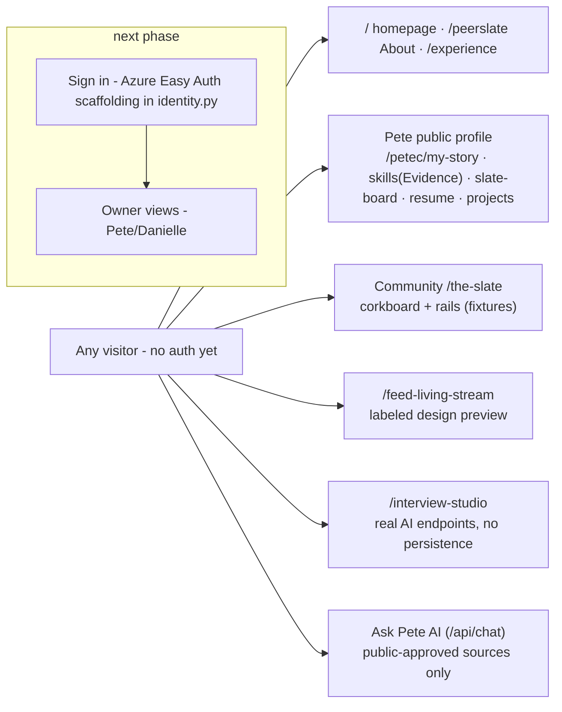
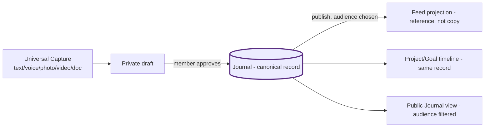
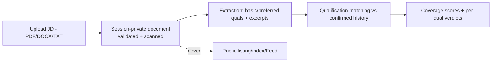
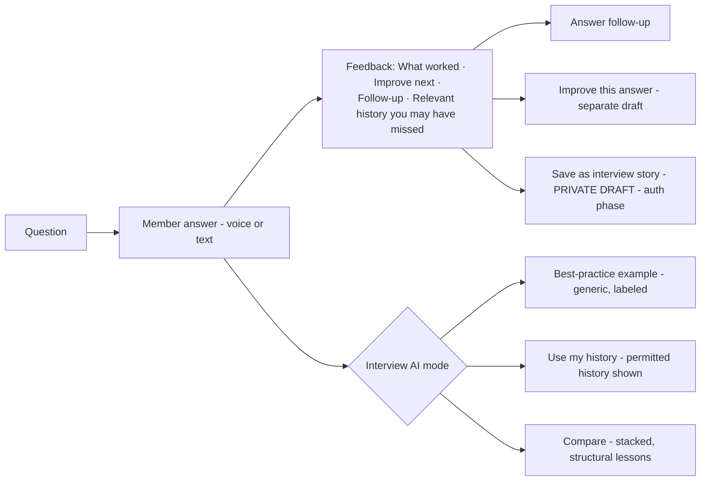
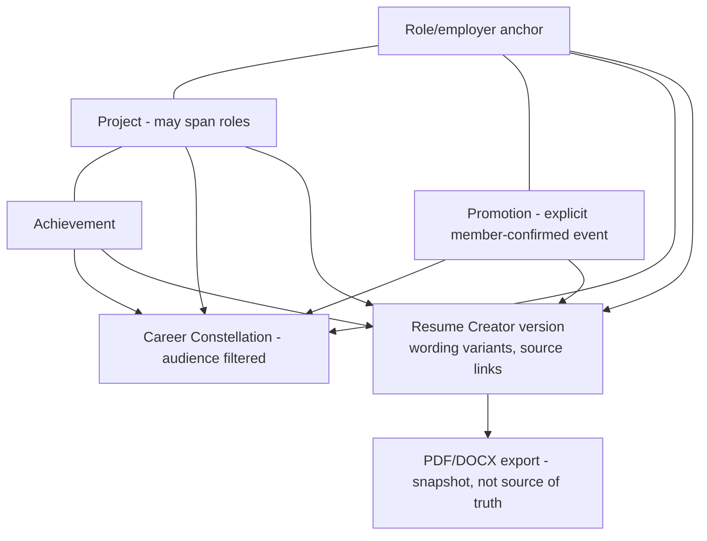

# Required diagrams (current state + v1.2 target)

## 1. Viewer modes and routes (current — pre-auth)

## 2. Capture → Journal → publication → Feed (v1.2 target; Journal HELD)

Current reality: no Journal store; corkboard + preview posts are fixtures.

## 3. Document upload → AI retrieval (v1.2 target; auth-gated)

## 4. Interview flow (v1.2 target; public-safe slice now)

## 5. Resume Creator / Constellation relationships (v1.2 target)

