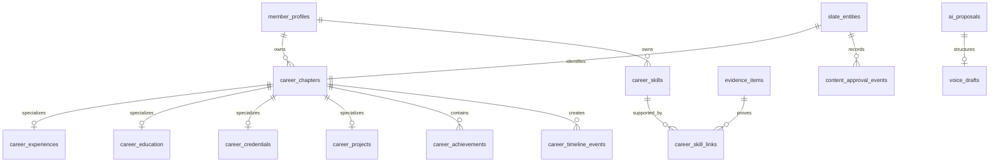

# PS-FEAT-001 Structured Career Data Contract v0.2

**Status:** In Progress — additive SQL implementation prepared; production use remains feature-flagged
**Date:** July 12, 2026
**Depends on:** PS-PLAT-001 through PS-PLAT-005

## 1. Decision

The Living Résumé Ledger, Career Constellation, skill evidence, public Slate, and owner editing tools will render from one tenant-owned career record. Pete's profile remains fixture data and is never a reusable schema assumption.

The shared platform tables remain responsible for identity, stable entity keys, audience grants, publication snapshots, evidence, AI proposals, and auditing. PS-FEAT-001 adds only the career-specific facts and relationships needed to render the résumé experience.

## 2. Entity model

## 3. Table responsibilities

| Table | Purpose | Stable/tenant key | Default trust state |
| --- | --- | --- | --- |
| `career_chapters` | Common chronological chapter fields for experience, education, credential, project, and future chapters | `chapter_key`, `owner_profile_id` | private, draft, unpublished |
| `career_experiences` | Employment-specific fields for an experience chapter | `chapter_id`, `owner_profile_id` | inherits chapter |
| `career_education` | Institution, program, degree, and education state | `chapter_id`, `owner_profile_id` | inherits chapter |
| `career_credentials` | Credential issuer, identifier, issue/expiry, and verification URL | `chapter_id`, `owner_profile_id` | inherits chapter |
| `career_projects` | Project role, status, and approved project URL | `chapter_id`, `owner_profile_id` | inherits chapter |
| `career_achievements` | Member-authored or approved accomplishment attached to exactly one chapter | `achievement_key`, `owner_profile_id` | private, draft |
| `career_skills` | Profile-owned skill definition | `skill_key`, `owner_profile_id` | private, draft |
| `career_skill_links` | Approved relationship from a skill to a chapter/achievement/project entity and optional evidence | composite owner key | proposed |
| `career_timeline_events` | Ledger/Constellation ordering and selection record referencing a real chapter | `timeline_event_key`, `owner_profile_id` | private, draft |
| `voice_drafts` | Private transcript capture linked to an optional structured AI proposal | `voice_draft_key`, `owner_profile_id` | private, captured |
| `content_approval_events` | Append-only history of proposal, approval, rejection, application, and publication decisions | `approval_event_id`, `owner_profile_id` | immutable history |

## 4. Shared column rules

- Numeric primary keys are internal joins; UUID keys are stable product identifiers.
- Every owned record contains `owner_profile_id` and uses composite foreign keys where a relationship could otherwise cross tenants.
- `entity_id` connects a career record to `slate_entities`; it is not an unstructured content store.
- User-entered wording is retained separately from approved or AI-proposed wording.
- `visibility`, `approval_status`, and `publication_status` are separate. Approval never implies publication.
- All timestamps are UTC. Member-local calendar presentation is derived from the profile/user timezone.
- Mutable primary records use `rowversion` for optimistic concurrency.
- Soft-deleted rows retain `deleted_at_utc`; they are excluded from public and default owner reads.

## 5. State transitions

### Approval

`draft → proposed → approved`

`draft/proposed → rejected`

`approved → draft` requires a new edit proposal; published snapshots remain immutable history.

### Publication

`unpublished → scheduled → published → withdrawn`

Publication requires `approval_status = approved`, an allowed audience, and a separate publication-version record.

### Voice

`captured → transcribed → interpreted → clarification_needed → previewed → approved → committed`

Any pre-commit state may move to `cancelled` or `failed`. Voice drafts are always private. Raw audio is optional and follows the file-asset retention policy.

## 6. Index and uniqueness plan

- One entity registry row per career chapter, achievement, skill, or timeline event.
- One typed detail row per chapter and a check that application code chooses the detail table matching `chapter_type`.
- Chapter owner/type/order index for Ledger reads.
- Timeline owner/featured/order index for Constellation reads.
- Achievement chapter/featured/order index for selected chapter details.
- Skill owner/name uniqueness and owner/approval index.
- Skill-link owner/skill/approval index and unique relationship path.
- Voice owner/status/created index for private draft recovery and retention jobs.
- Approval entity/time index for an auditable decision history.

## 7. Tenant-isolation test matrix

| Attempt | Required result |
| --- | --- |
| Link tenant A chapter to tenant B entity | Composite foreign key rejects it |
| Attach tenant A evidence to tenant B skill | Composite foreign key rejects it |
| Create timeline event under another profile's chapter | Composite foreign key rejects it |
| Read owner résumé using browser-provided profile ID | API ignores it and derives identity server-side |
| Public read of private/draft/unpublished record | Record is absent, including counts and errors |
| AI proposal targets another profile | Composite target-owner constraint rejects it |
| Voice draft uses another member's AI proposal | Composite proposal-owner constraint rejects it |

## 8. Retention policy

- Approved structured career facts and approval history are retained until member deletion policy is executed.
- Rejected/cancelled AI proposals and voice transcripts default to a 90-day retention window unless the member saves them.
- Raw audio is not required. When intentionally retained, it uses `file_assets`, remains private, and requires an explicit `retention_until_utc`.
- Publication snapshots are immutable until the approved account/data-retention policy permits removal.
- Audit and approval history are append-only; corrections are new events.

## 9. Six fixture profiles

1. Student: education, projects, credentials, future chapter; no employment.
2. Early career: two roles with short evidence history.
3. Mid-career: four roles with selected featured chapters.
4. Career changer: two professional paths and an explicit transition chapter.
5. Freelancer: overlapping engagements and concurrent timeline events.
6. Senior career: eight or more roles with earlier history grouped in the Constellation.

Fixtures must use invented organizations and claims. Pete's content may be loaded only as a separately identified demo profile after the generic fixtures pass.

## 10. Rollback and release

`PS-PLAT-006` is additive and may be rolled back while all new domain tables are empty. Once member data exists, rollback requires export, retention review, and confirmation that no publication snapshot, evidence link, AI proposal, or application code depends on these records.

The current public résumé continues using approved fixture JSON until owner/public stored procedures, tenant-isolation tests, and all six variable-content fixtures pass behind a feature flag.
